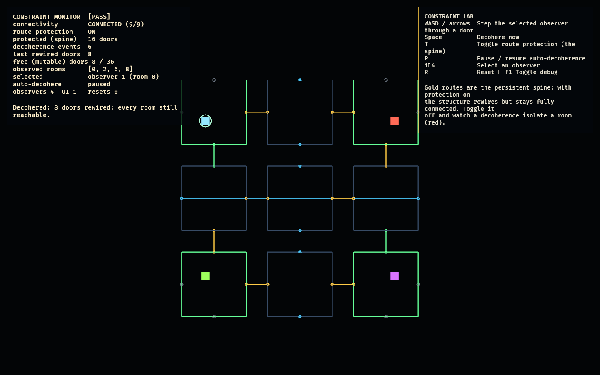

# Constraint Lab

The Constraint Lab is the second feasibility lab beyond the foundation. Phase 5
(`observation_lab`) proved connections rewire when unobserved — but an
unconstrained rewiring can isolate a room, which would make the megastructure
unplayable. This lab adds **mutable graph constraints**: a *persistent route
spine* that is never rewired, so the structure stays fully traversable however
the rest of it decoheres.

It **reuses `observed_observation`'s graph** (`ObservationWorld`) and layers the
constraint logic on top — the model lives in
[`crates/observed_facility`](../../crates/observed_facility) (promoted from this lab in
refactor R6; `constraint_lab` is now its projection): a protected spanning path through
all nine rooms. Because the spine alone connects every
room, the graph is connected regardless of how the free doors wire. Turn
protection off and the same rewiring can disconnect the graph — which is exactly
why the constraint exists.

## Functionality evidence



Captured from the running lab (`OBSERVED2_CAPTURE`): protection on, the interior
decohered six times. The **gold spine** persists and the four watched corners
stay frozen (green), while the rest has rewired (cyan) — and the monitor confirms
`CONNECTED (9/9)`, every room still reachable.

## What it demonstrates

- **Persistent route infrastructure** — a protected spine of connections that
  survives every decoherence (route persistence).
- **Connectivity rule** — with the spine protected, the structure is provably
  connected after any rewiring; reachability from room 0 covers all nine rooms.
- **The constraint matters** — toggle protection off and a decoherence can
  isolate a room (shown red, `DISCONNECTED`); a test confirms this can happen
  without the spine.
- **Still mutable** — non-spine, unobserved doors keep rewiring; observation
  still freezes watched rooms; rewiring stays deterministic.

## Controls

- `WASD` / arrows: step the selected observer through a door
- `Space`: decohere now
- `T`: toggle route protection (the spine)
- `P`: pause / resume auto-decoherence
- `1`–`4`: select an observer · `R`: reset · `F1`: toggle debug

## Debug visualization

- Connection / doorway colours: **gold** = protected spine, **green** =
  observed/frozen, **cyan** = free/mutable, grey = sealed wall
- Room borders: green when observed, **red when unreachable**
- Monitor panel: connectivity (`CONNECTED n/9`), protection state, protected door
  count, decoherence count, doors rewired last, free vs total doors, observed
  rooms, and a `[PASS]`/`[FAIL]` flag

## Success conditions

1. With protection on, every decoherence leaves the graph connected (all nine
   rooms reachable).
2. Spine connections never change across decoherence.
3. With protection off, some rewiring can disconnect the graph.
4. Observation still freezes watched rooms; rewiring is deterministic.
5. Repeated reset restores the connected authored structure with no leaks.

## Manual verification

1. Run `cargo run -p constraint_lab`.
2. Press `P` to pause auto-decoherence, then `Space` several times: the gold
   spine and green corners hold; the monitor stays `CONNECTED 9/9`.
3. Press `T` to drop protection, then `Space` repeatedly until a room turns red
   and the monitor reads `DISCONNECTED` — the reason the spine exists.
4. Press `T` again to restore protection, then `R` to reset.

## Regenerating the evidence screenshot

```powershell
$env:OBSERVED2_CAPTURE = "docs/evidence/constraint_lab.png"
cargo run -p constraint_lab
```
