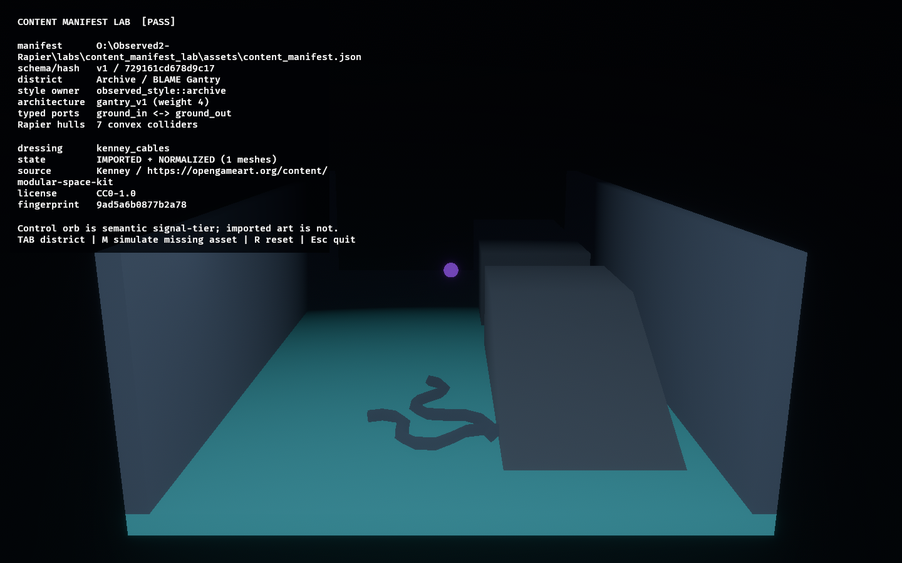
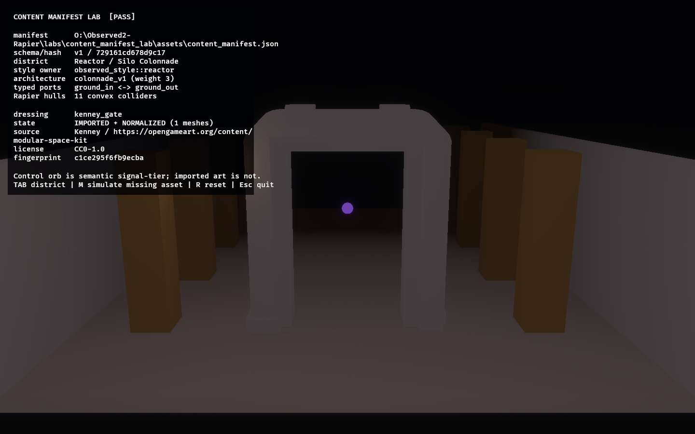

# Content Manifest Lab

This lab asks whether district presentation, authored architecture selection, WFC
metadata, and curated third-party dressing can move into a typed configuration file
without giving config or imported art authority over gameplay rules.




The lab parses [`assets/content_manifest.json`](assets/content_manifest.json) into a
deny-unknown-fields Serde schema, validates it, sorts stable IDs, and displays the
resulting deterministic manifest hash. The committed fixture defines two districts:

- Archive / BLAME selects the authored Gantry and Kenney cable dressing.
- Reactor / Silo selects the authored Colonnade and Kenney gate dressing.

The selected TrenchBroom module remains authoritative for typed ports and collision.
Every brush must still build a Rapier convex hull. The OpenGameArt GLBs are
presentation-only: their materials are replaced after scene loading with a shared
`observed_style` surface treatment. A semantic Control orb demonstrates that gameplay
signals remain owned by `observed_style`, never by an imported material.

The asset records include source URL, author, CC0 declaration, content fingerprint,
scale, allowed district, and named procedural fallback. `M` simulates a missing file
and renders that fallback without changing architecture or collision.

## Controls

- `Tab`: switch district/module/asset selection
- `M`: simulate a missing imported asset
- `R`: reset the projection
- `Esc`: exit

Run:

```powershell
cargo run -p content_manifest_lab
```

Capture both district projections:

```powershell
$env:OBSERVED2_CAPTURE = "docs/evidence/content_manifest_lab"
cargo run -p content_manifest_lab
```

## Success and failure conditions

Success requires the manifest to reject unknown schema fields and versions, resolve
stable references, keep atmosphere inside the Legibility Contract, verify committed
asset fingerprints, construct every selected Rapier collider, normalize imported
materials, and retain a procedural fallback.

The lab fails closed on duplicate IDs, unknown style/architecture roles, missing
references, zero WFC weights, invalid fog/practical ranges, non-CC0 intake, changed
asset bytes, or a missing asset without a fallback.

Promotion decision: the boundary works, but remains lab-local until the core overhaul
plan identifies the production owners for the immutable content manifest, authoring
catalog, and presentation-side asset adapter.
