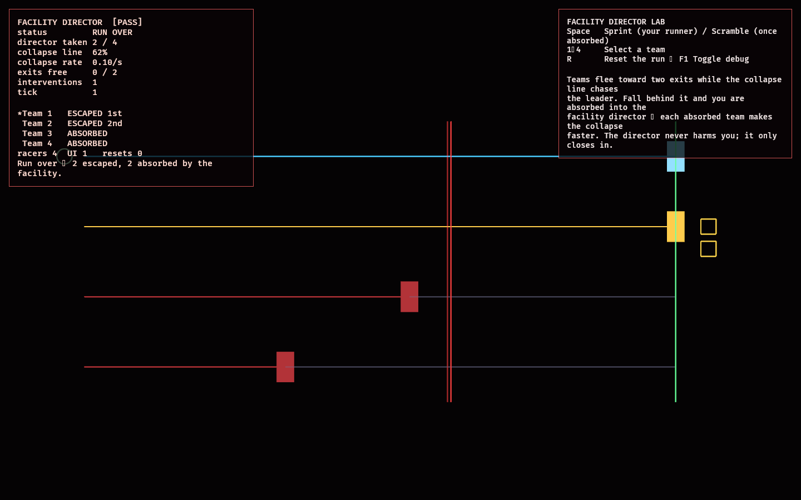

# Facility Director Lab

The fourth feasibility lab beyond the foundation probes the **facility director** —
the adversarial "house" that controls the megastructure, and which (per
`AGENTS.md`) **eliminated teams join**.

Teams race to escape through capacity-limited exits while a **collapse line**
chases the leader ([model.rs](src/model.rs)). Any team that falls more than a gap
behind is **absorbed** into the director — and each absorbed team makes the
collapse faster. That is the feedback loop the lab proves: falling behind feeds
the director, which hunts the rest harder. The director never touches a player
directly; its only effects are the environmental collapse and a `scramble` that
joined teams can use to advance it. Progress is monotonic, so interference is
purely indirect.

## Functionality evidence



A finished run (captured via `OBSERVED2_CAPTURE`): four teams, two exits. Teams 1
and 2 escaped; Teams 3 and 4 fell behind the collapse line and were **absorbed**
into the facility (`director taken 2 / 4`). The monitor shows the standings and
the collapse at 62%.

## What it demonstrates

- **Eliminated teams join the director** — a team that falls behind the collapse
  converts from runner to a director member.
- **Escalating director** — `collapse rate` scales with the number of absorbed
  teams, so the hunt accelerates as it claims more.
- **Capacity-limited escape** — only `EXIT_CAPACITY` teams can escape; the rest
  are taken.
- **The leader is safe** — the collapse only chases; whoever leads is never
  absorbed.
- **Indirect only** — no action lowers a runner's progress (a test asserts it);
  the threat is the environment, not an attack.

## Controls

- `Space`: sprint your selected runner (outrun the collapse); once your team is
  absorbed, `Space` instead **scrambles** (advances the collapse) as a director
- `1`–`4`: select a team · `R`: reset the run · `F1`: toggle debug

## Debug visualization

- One lane per team with a progress fill toward the exit gate
- The red **collapse line** sweeping after the leader; absorbed teams sit behind
  it and turn red
- Exit-capacity slots (filled gold as teams escape)
- Monitor panel: status, teams taken by the director, collapse position and rate,
  exits free, interventions, live standings, and a `[PASS]`/`[FAIL]` flag

## Success conditions

1. Some teams escape (capped at `EXIT_CAPACITY`); the rest are absorbed; every
   team is resolved.
2. Absorbing a team raises the collapse rate (the director escalates).
3. The leading team is never absorbed.
4. Only director members can scramble, and it advances the collapse.
5. No runner's progress ever decreases (indirect interference only).
6. Repeated reset restores a fresh run with no leaked entities.

## Manual verification

1. Run `cargo run -p director_lab`.
2. Watch a default run: the two fastest escape, the two slowest are caught by the
   accelerating collapse.
3. Select a trailing team and hold `Space` to sprint it clear of the collapse.
4. Let your team be absorbed, then tap `Space` to scramble and watch the collapse
   lurch toward the remaining runners.

## Regenerating the evidence screenshot

```powershell
$env:OBSERVED2_CAPTURE = "docs/evidence/director_lab.png"
cargo run -p director_lab
```
