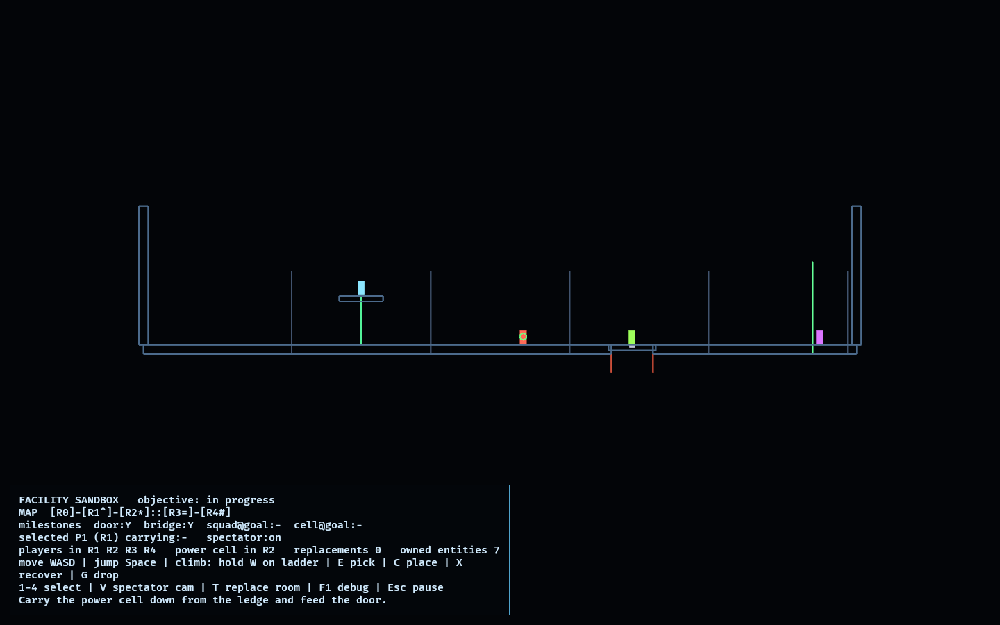

# Facility Sandbox

The Facility Sandbox is the **first integration target** — it combines the proven
systems into one playable scenario rather than testing a single mechanic:

> Move four players and one portable power source through a small modular facility
> to the exit.

It reuses `climbing_lab`'s kinematic + climbing controller directly (run, jump,
and ladder climbing in one), drives four players through it, and layers a
facility-specific model ([facility.rs](src/facility.rs)) for the modular rooms,
the carryable power cell, the deployable structural jack, the powered door, and
the objective — all keyed on the shared `observed_core` identifiers. App states
and entity cleanup follow the `menu_lab` lifecycle pattern.

There is intentionally **no competition and no quantum-graph behaviour** here —
those remain deferred to their own future feasibility labs.

## Functionality evidence



Captured from the running sandbox (`OBSERVED2_CAPTURE`, spectator camera): five
connected rooms with the squad spread through them — P1 up the R1 ladder on the
ledge, P2 at the R2 power socket, P3 on the deployed pit bridge in R3, and P4 at
the R4 goal — the powered door open, the pit bridged, and the HUD showing the
schematic map and milestone tracker.

## What it combines

- **Main menu + states** — Boot → Main menu → Loading → Sandbox → Paused, with
  full teardown of sandbox entities when returning to the menu.
- **Four players** with the shared `PlayerIntent`; the human drives the selected
  one and the rest escort it.
- **Run + jump + one climbing mechanic** — the reused `climbing_lab` controller
  (a ladder leads to the power cell on a ledge).
- **Five connected rooms** (`R0`–`R4`) with **one room replacement** (`T` toggles
  a room's authored layout and regenerates its collision geometry).
- **One carryable power source** (the power cell) and **one powered door** — the
  door is a wall until the cell is socketed.
- **One deployable structural tool** (the jack) — deploy it to bridge the pit in
  R3.
- **A basic schematic map** and a **debug / spectator camera**.

## The objective, end to end

1. Climb the R1 ladder and pick up the power cell from the ledge (`E`).
2. Carry it to the R2 socket and place it (`C`) — the powered door opens.
3. Pick up the jack in R2 and deploy it at the pit edge in R3 (`C`) — the pit is
   bridged.
4. Recover the power cell (`X`) and move the whole squad, cell included, across
   the bridge to the R4 goal.

The objective completes when the door has been powered, the pit bridged, and all
four players plus the power cell are in the goal room.

## Controls

- `WASD` / arrows: move the selected player; hold `W` on the ladder to climb
- `Space`: jump
- `E` pick up · `C` place (socket/deploy) · `X` recover · `G` drop
- `1`–`4`: select a player (others escort) · `V`: spectator camera · `T`: replace
  the current room · `F1`: debug geometry
- `Enter`: start (menu) · `Esc`: pause / back

## Success conditions

1. The objective is completable end to end via the steps above.
2. Entering and leaving the sandbox (to the main menu) despawns every
   sandbox-owned entity — no leaks across repeated runs.
3. The powered door blocks until the cell is socketed; the pit blocks until the
   jack is deployed.
4. No competition or quantum-graph behaviour is present.

## Manual verification

1. Run `cargo run -p facility_sandbox`; press `Enter` to start.
2. Drive P1 right to the ladder, hold `W` to climb, `E` to take the cell.
3. Carry it to the R2 socket, `C` to power the door; grab the jack, cross the
   door, `C` at the pit to bridge it.
4. `X` to recover the cell, move everyone into R4; confirm the HUD objective
   flips to `COMPLETE`.
5. Press `Esc` then `M` to return to the menu; the HUD `owned entities` count and
   the lifecycle tests confirm nothing leaks.

## Regenerating the evidence screenshot

```powershell
$env:OBSERVED2_CAPTURE = "docs/evidence/facility_sandbox.png"
cargo run -p facility_sandbox
```

With `OBSERVED2_CAPTURE` set, the sandbox skips the menus, arranges the
mid-objective showcase under the spectator camera, writes the PNG, and exits.
