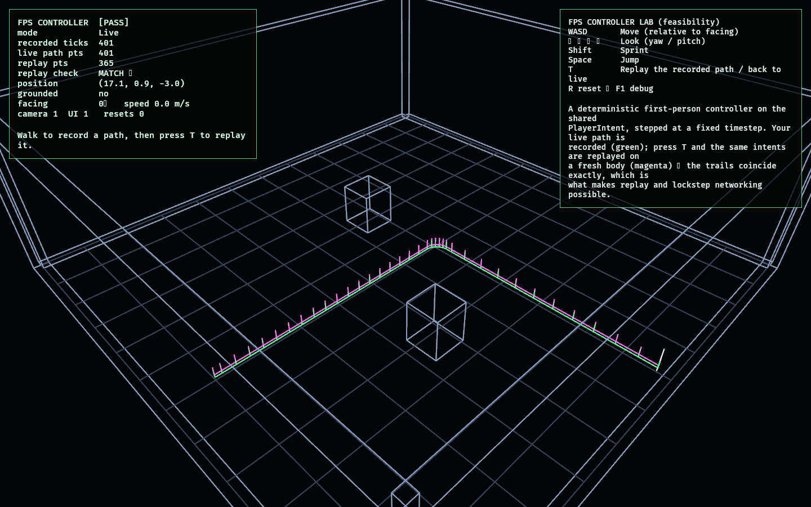

# FPS Controller Lab

Phase 20 of the FPS arc: a **deterministic first-person controller**. Phase 19
proved observation can be driven by the camera in 3D; this lab proves the *player*
can move through a 3D space first-person **without giving up determinism** — the
property that powers the replay tape (`replay_lab` / `match_replay`) and will power
lockstep networking (ROADMAP Phase 16).

It is the 3D analogue of [`movement_lab`](../movement_lab/README.md), built on the
same shared [`PlayerIntent`](../../crates/player_input/src/lib.rs) boundary and the
same discipline (the kernel lives in [`crates/observed_traversal`](../../crates/observed_traversal),
promoted from this lab in refactor R6; the lab re-exports it as `controller` and is its
projection): a pure `step_body` advanced at
a **fixed timestep**, with substep integration and axis-by-axis AABB collision
against the floor, walls, and pillars. Look (yaw/pitch), facing-relative movement,
sprint, and jump all come from `PlayerIntent`; nothing in the controller reads
hardware or renders.

## Functionality evidence



A scripted run — walk north, turn, sprint east, a couple of jumps — was recorded as
a tape of per-tick intents and then **replayed on a fresh body**. The recorded path
(green) and the replayed path (magenta) coincide exactly: `replay check MATCH ✓`,
365 recorded / 365 live / 365 replay points. The shot uses an elevated angle so both
trails are legible; the lab itself is first-person.

## What it demonstrates

- **Deterministic by construction** — `step_body` depends only on (body, intent,
  arena, dt). The same intent sequence always produces the same path; a test asserts
  two runs are bit-identical, and the lab's record→replay confirms it live.
- **The exit criterion** — a recorded first-person input sequence replays to an
  identical path (press `T` to watch the replay retrace your route exactly).
- **Reuses the input boundary** — movement/look/sprint/jump are the existing
  `PlayerIntent` fields, so bots, recordings, and future network clients drive the
  same controller (architectural rule #1).
- **3D kinematics, hand-rolled and testable** — fixed-timestep integration with
  substeps and AABB collision (floor, walls, pillars); jumping leaves the ground and
  gravity returns it; walls block; movement is relative to facing.

## Controls

- `WASD`: move (relative to facing)
- `←` `→` `↑` `↓`: look (yaw / pitch)
- `Shift`: sprint · `Space`: jump
- `T`: replay the recorded path (and back to live)
- `R`: reset · `F1`: toggle debug

## Debug visualization

- The arena as a 3D wireframe: floor grid, perimeter walls, and two pillars
- **Green** trail: the live recorded path; **magenta** trail: the replayed path
  (they coincide when deterministic)
- A vertical marker at the active body (white live, magenta during replay)
- Monitor panel: mode, recorded ticks, live/replay point counts, the replay check
  (`MATCH ✓` / `MISMATCH ✗`), position, grounded, facing, speed, entity health, and
  a `[PASS]`/`[FAIL]` flag

## Success conditions

1. Walking moves relative to facing; turning changes the direction of travel.
2. Jumping leaves the ground and gravity returns the body to it; walls and pillars
   block movement.
3. The controller is stepped only at the fixed timestep and is deterministic: the
   same intent sequence yields an identical path.
4. A recorded path replays exactly on a fresh body (`MATCH ✓`).
5. Reset clears the recording and returns to spawn with no entity leaks.

## Manual verification

1. Run `cargo run -p fps_controller_lab`.
2. Walk around with `WASD`, look with the arrows, `Shift` to sprint, `Space` to jump.
   The green trail traces your route.
3. Press `T`: a fresh body replays your exact inputs in first person, drawing the
   magenta trail on top of the green — the monitor reads `MATCH ✓`. Press `T` again
   to resume live control.
4. Press `R` to reset.

## Regenerating the evidence screenshot

```powershell
$env:OBSERVED2_CAPTURE = "docs/evidence/fps_controller_lab.png"
cargo run -p fps_controller_lab
```
