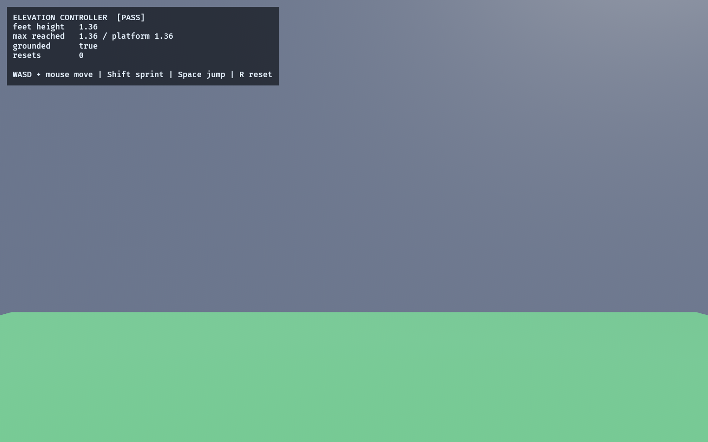

# Elevation Controller

A feasibility lab for **vertical traversal** — the first piece of the gameplay-depth
arc (map design + elevation + traps). Run:

```powershell
cargo run -p fps_elevation_lab
```

The proven first-person controller ([`fps_controller_lab`](../fps_controller_lab/README.md))
does flat-floor AABB collision: it stands on top of solids and lands when it falls,
but a stair riser just **blocks** it. This lab adds a deterministic **step-up** so the
controller traverses real height — stairs, raised platforms, ledges — and proves it on
an authored multi-level course.

It was built as an **isolated variant** of the controller, reusing `FpsBody` /
`FpsConfig` / `Aabb3` with its own `step_body_elev`, so elevation could be proven
without destabilizing replay or lockstep. The validated contact rules are now also
implemented by shared `step_body` and used by the generated maze.

The proven step-up behavior has now been promoted into the shared first-person
controller and integrated into `fps_maze_lab`, `fps_reroute_lab`,
`fps_hybrid_match_lab`, network snapshots, and the assembled game.

## How the step-up works

Each tick, for every solid the body touches horizontally, the controller classifies it
by how far its top rises above the feet:

- **Underfoot** (top at or below the feet, within a small epsilon) — the surface being
  stood on. Not a side obstacle. *(This epsilon is essential: a body resting flush on a
  step reads as a hair of self-overlap in float, which would otherwise make the step you
  stand on act like a wall.)*
- **Step-up** (a small rise ≤ `STEP_HEIGHT`, with clear headroom) — climb onto it.
- **Wall** (taller than `STEP_HEIGHT`, or no headroom) — block, as before.

Anything taller than `STEP_HEIGHT` still requires a jump, so walls and ledges stay
meaningful. The step depends only on `(body, intent, arena, dt)`, so the same inputs
yield the same path — the determinism the lockstep match and replay rely on.

## Functionality evidence



After walking forward up the staircase, the player stands on the raised platform:
`feet height 1.36`, `max reached 1.36 / platform 1.36`, `grounded true`, `[PASS]`.

## What it demonstrates

- **Stairs are climbable** — walking into the four-step staircase auto-climbs each
  rise onto the raised platform (a test asserts the feet reach the platform top).
- **Tall walls still block** — a block taller than `STEP_HEIGHT` is never climbed; the
  body stops at its face (only a jump clears it).
- **Edges drop** — walking off the platform's open edge falls back to the floor.
- **Deterministic** — the same intent sequence produces an identical path, so vertical
  traversal stays replay- and lockstep-safe.

## Controls

- `WASD` + mouse: move / look
- `Shift`: sprint · `Space`: jump
- `R`: reset to the spawn

## The course

A flat-floor room containing: a four-step staircase (each rise below `STEP_HEIGHT`)
climbing onto a raised platform, a too-tall red block that must be jumped, and the
perimeter walls.

## Known limitation

The `grounded` flag flickers on/off by one tick while at rest (inherited from the base
controller's micro-fall re-grounding); tests assert positions rather than the flag.
Ramps (sloped surfaces) are out of scope — AABB step geometry only; ramps would need a
slope-aware collider.

## Integration result

The generated maze now has three flat room levels joined by 0.3 m stair bands.
Rerouting preserves that height field, and replay/lockstep state includes it
exactly. The next gameplay-depth step is traps/hazards and risk-versus-safe routes.
