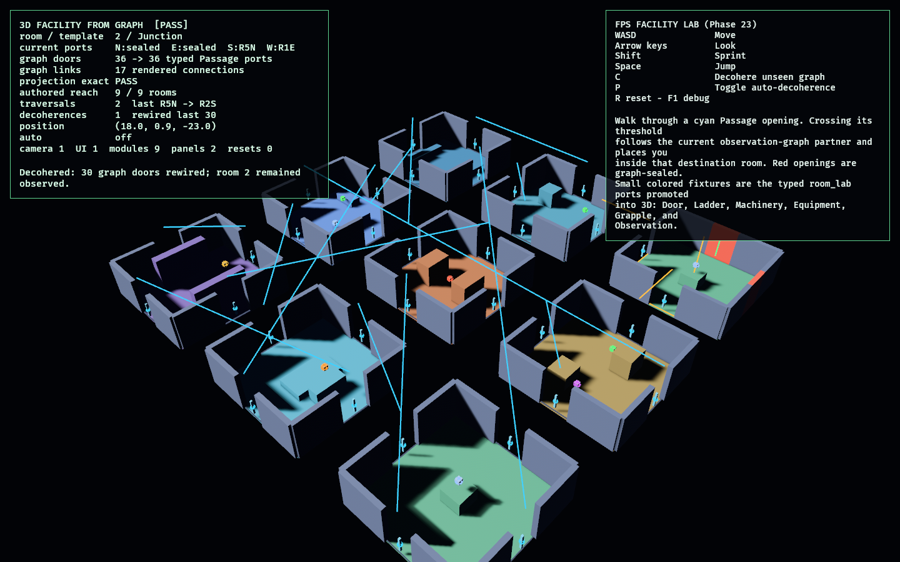

# FPS Facility Lab

Phase 23 turns the proven room graph into a navigable first-person 3D facility.
All nine stable `RoomId`s from `observation_lab` are instantiated as authored room
modules. Every graph `DoorId` maps one-to-one to a transformed 3D `Passage` port,
and walking through its opening follows the graph's current partner—even when
decoherence links it to a room that is nowhere near the physical grid position.

The module registry promotes the complete `room_lab` vocabulary. Alongside the
four graph-facing Passage ports, the authored templates retain typed Door, Ladder,
Machinery, Equipment, Grapple, and Observation fixtures. Quarter-turn transforms
apply to 3D port positions, facings, graph roles, collision solids, and rendering.

## Functionality evidence



The diagnostic overview shows all nine rendered modules, their distinct authored
obstacles and typed fixtures, and the current graph connections suspended above
the facility. The scripted player traversed room 4 east to room 5, then north to
room 2 using the authored graph before decoherence rewired 30 unseen doors. The
monitor confirms:

- `36 -> 36 typed Passage ports`
- the graph projection is exact
- the authored graph reaches all `9 / 9` modules
- 17 rewired connections are currently rendered
- camera, UI, module, and sealed-panel entity health passes

The elevated camera is capture-only. The interactive lab uses the Phase 20
first-person controller.

## Architecture

### Authored 3D modules

The eight `room_lab::RoomTemplate` values are promoted into 3D:

- Straight corridor
- Corner
- Junction
- Control room
- Machine chamber
- Freight room
- Shaft
- Platform room

Each definition has:

- 3D bounds
- four stable graph-facing Passage ports
- template-specific typed fixture ports
- authored collision solids and obstacles
- a rotatable 3D presentation hierarchy

The ninth graph room reuses the Junction template, demonstrating that stable room
identity is independent of module type.

### Exact graph projection

`GraphProjection3d` builds directly from `ObservationWorld`:

1. Each of the graph's 36 doors resolves to the module Passage port with the same
   world-facing side.
2. Every open graph pair becomes one rendered `ProjectedConnection`.
3. Both endpoints are validated as graph-role Passage ports.
4. Graph-sealed ports generate real collision panels and red rendered panels.
5. Decoherence rebuilds the projection, collision arena, and sealed-panel
   presentation from the same graph state.

### Navigation

Movement uses `fps_controller_lab`'s deterministic fixed-timestep controller.
When the body crosses an open Passage threshold:

1. The source `DoorId` is resolved from the current `RoomId` and side.
2. Its current `ObservationWorld::partner` is read.
3. The player is placed just inside that destination port.
4. Facing is rotated inward and the destination room becomes observed.

The current room's connections therefore freeze under decoherence, while unseen
rooms can rewire.

## Controls

- `WASD`: move
- Arrow keys: look
- `Shift`: sprint
- `Space`: jump
- `C`: decohere unseen graph connections
- `P`: toggle automatic decoherence
- `R`: reset
- `F1`: toggle diagnostics

## Debug visualization

- Cyan lines: current graph connections between typed 3D ports
- Gold lines and room beam: connections touching the observed/current room
- Red panels: graph-sealed ports with collision
- Port-type-colored markers: Passage, Door, Ladder, Machinery, Equipment,
  Grapple, and Observation
- Green player marker
- Monitor: current room/template, each current doorway destination, graph/port
  counts, projection status, authored reachability, traversal history,
  decoherence state, position, and lifecycle health

## Success conditions

1. All eight room templates load as 3D definitions with bounds, collision, four
   graph Passage ports, and the complete typed fixture vocabulary.
2. Quarter-turn rotation transforms 3D port positions, facings, roles, obstacles,
   and visual modules consistently.
3. All 36 graph doors map uniquely to 36 Passage ports.
4. Every open graph link has exactly one typed rendered connection.
5. The authored 2D graph reaches all nine rendered modules.
6. The fixed-timestep controller walks through open port geometry and is blocked
   by a sealed port's generated collision panel.
7. Traversal follows the exact current graph partner, including a rewired
   nonphysical destination.
8. Decoherence updates graph projection, collision panels, and rendering from the
   same state while the current room remains observed.
9. The same input and graph-action sequence reproduces identical state.
10. Repeated reset restores nine modules, the authored graph and spawn, one
    camera, one UI root, exact sealed panels, and stable mesh counts.

## Manual verification

1. Run `cargo run -p fps_facility_lab`.
2. Walk around the current authored room using `WASD`; collide with its walls and
   template obstacle.
3. Walk through a cyan opening. The monitor's room and template change to the
   graph destination, and the camera appears just inside its linked port.
4. Walk into a red opening and confirm its collision panel blocks you.
5. Press `C`, then inspect current doorway destinations. The current room's links
   stay fixed while unseen graph lines and red panels change.
6. Traverse after decoherence and confirm the doorway can lead to a non-adjacent
   physical module.
7. Press `R` repeatedly and confirm the monitor remains `[PASS]`.

## Regenerating the evidence screenshot

```powershell
$env:OBSERVED2_CAPTURE = "docs/evidence/fps_facility_lab.png"
cargo run -p fps_facility_lab
```
