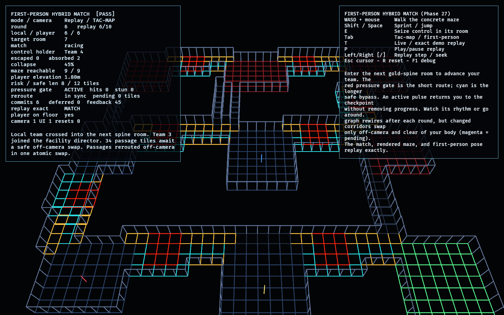

# First-Person Hybrid Match

Phase 27, the capstone of the Hybrid maze arc. It runs the full competitive
facility match in the concrete, rerouting maze:

- `competitive_facility` remains authoritative for observation, the protected
  spine, competition, capacity-limited exits, and the facility director.
- `fps_maze_lab` supplies deterministic room placement and real walkable
  corridors.
- The shared fixed-step controller, including the proven elevation step-up, moves
  the local player through three generated room levels.
- The Phase 26 rendered/target split keeps corridor reroutes atomic, off-camera,
  and clear of the player's collision footprint.
- Every protected leg has a direct pulsing pressure gate and a longer safe bypass.
- A deterministic action tape reconstructs the match, graph, rendered and target
  mazes, and canonical first-person pose exactly.

The integration boundary is spatial: the local team advances only when the
first-person body enters the next protected-spine room. Pressing a round-advance
key is not sufficient.

## Functionality evidence



The evidence view shows a replayed match in the overhead tac-map. Gold passages
are the protected spine, cyan branches are safe bypasses, bright red pads are
pressure gates, and dark red rooms are behind the collapse. The captured frame is
in sync after atomic reroute commits; magenta appears during live play when a
target reroute is waiting for a safe swap. The monitor reports `[PASS]`, a
navigable 9/9-room maze, and `replay exact MATCH`.

## What it demonstrates

- **A real first-person hybrid match**: the local player walks real corridors and
  must physically reach the next spine room to advance.
- **The complete competitive result**: bots, shared control, the director,
  collapse, capacity-limited exits, and deterministic placement all remain active.
- **Safe live rerouting**: graph changes update a target maze; presentation and
  collision switch to it only when every changed tile is out of view and clear of
  the player's body.
- **Exact replay**: round actions reproduce team state, graph links, corridor
  routes, rendered tiles, reroute commits, and the first-person pose bit-for-bit.
- **Multi-level match space**: rooms occupy 0.0 m, 0.9 m, and 1.8 m floors;
  generated corridors become stairs where they cross bands, and replay/network
  snapshots include the exact integer elevation field.
- **Risk versus safety**: red is the shorter direct route; cyan is the longer safe
  bypass. An active pressure pulse returns the body to the current-room checkpoint
  and briefly locks movement. It never removes progress or introduces health.
- **Reroutes are felt**: atomic corridor commits still occur only off-camera, but
  now drive an explicit route-shift feedback timer used by the assembled game's
  flash and camera jolt, alongside the existing sound cue.
- **Stable lifecycle**: repeated reset restores a fresh match without duplicating
  the camera or UI.

## Controls

- `WASD` + mouse: walk and look
- `Shift` / `Space`: sprint / jump
- `E`: seize the shared control while near the center of its room
- `Tab`: first-person / overhead tac-map
- `T`: live match / exact recorded replay
- `P`: play or pause replay
- `Left` / `Right`, `[` / `]`: replay step / seek
- `Esc`: release or capture cursor
- `R`: reset
- `F1`: toggle diagnostics

## Success conditions

1. Entering the next gold-spine room advances the local team; standing at spawn
   or pressing an unrelated key does not.
2. The match resolves deterministically with exactly the exit capacity escaping,
   the remaining teams absorbed, and Team 1 winning the demo.
3. Unobserved graph changes reroute actual corridor geometry. A visible or
   player-overlapping change is deferred; an unseen clear change commits atomically
   and leaves all nine rooms reachable.
4. Replay seek equals sequential playback for match state, maze state, and
   first-person pose.
5. Reset restores the initial match with one camera and one UI root.
6. Every protected leg exposes both route choices; the safe route is longer and
   avoids all pressure tiles.
7. Active gates set the player back without changing the competitive round or
   room progress; idle gates permit the shortcut.

## Manual verification

1. Run `cargo run -p fps_hybrid_match_lab`.
2. Follow the gold corridor and enter the highlighted next room. The round counter
   advances only after entry; bots and the collapse resolve at the same time.
3. At a red pressure gate, wait for the idle phase and take the shortcut; then
   deliberately touch it while active and confirm you return to the checkpoint
   without losing match progress. Walk the cyan bypass to avoid it entirely.
4. Watch a magenta pending reroute, then turn away. It commits only after leaving
   view and never changes the tile under the player.
5. Press `Tab` for the tac-map. Press `T` to replay the deterministic demo and use
   the replay controls to seek; the monitor must show `replay exact MATCH`.
6. Press `R` repeatedly and confirm the monitor remains `[PASS]`.

## Automated coverage

The lab has 17 model tests and 4 Bevy lifecycle/integration tests covering:

- contiguous floor-path advancement and spatial action gating;
- shared-control gating;
- visible and player-footprint reroute deferral;
- atomic off-camera commits and all-room reachability;
- deterministic match resolution and committed maze changes;
- exact seek/sequential replay including first-person pose;
- safe/risky path generation, pressure timing, checkpoint-only setbacks, and
  reroute-feedback signaling;
- boot, live/replay projection, and repeated reset lifecycle.

## Regenerating the evidence screenshot

```powershell
$env:OBSERVED2_CAPTURE = "docs/evidence/fps_hybrid_match_lab.png"
cargo run -p fps_hybrid_match_lab
```
