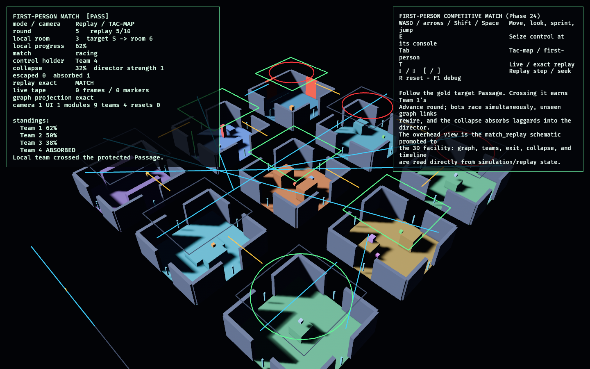

# First-Person Competitive Match

Phase 24 — the capstone of the FPS arc. It plays the **full competitive match** in
first person and proves it **records and replays exactly**, closing the loop from
the 2D proof-of-concept to a 3D first-person experience that reuses the entire
dimension-agnostic game brain.

It composes the proven labs as libraries:

- **Match brain** — [`competitive_facility`](../competitive_facility/README.md):
  observation + the protected spine + competition + the facility director
  (collapse, absorption, escalation), with deterministic placement. Authoritative.
- **3D facility + controller** — [`fps_facility_lab`](../fps_facility_lab/README.md)'s
  `FacilityStage`: the nine graph rooms as authored typed-port 3D modules, walked by
  the Phase 20 fixed-timestep first-person controller.
- **Replay tape** — the `replay_lab` / `match_replay` approach
  ([model.rs](src/model.rs)): a `MatchTape` of local round actions reconstructs both
  the match *and* the first-person state from a fresh session.
- **Tac-map / spectator** — [`match_replay`](../match_replay/README.md)'s schematic,
  promoted onto the 3D facility as the overhead tactical view.

The integration boundary is one local round action ([model.rs](src/model.rs)):
`Advance` is emitted only when the local player physically crosses the highlighted
protected-spine Passage in the 3D facility; `Seize` is emitted at the control-room
console. Bots and the director are deterministic, so after each round the 3D
facility re-synchronizes from the exact competitive graph, and the tape replays the
whole thing — match result and camera pose alike — bit-for-bit.

## Functionality evidence



The recorded demo match shown in the tactical (tac-map) view: the nine 3D modules,
the four teams as markers, the gold spine route, the exit, and the collapse — all
read from replayed simulation state. The monitor reads `[PASS]`, `replay check
MATCH`, and `graph projection exact`: the first-person match resolves
deterministically and the replay reproduces it (and the first-person pose) exactly.

## What it demonstrates

- **The whole game, first-person** — observation, the spine, competition, the AI
  director, and capacity-limited exits run as one match while you walk the facility
  in first person; the 2D brain is reused unchanged.
- **Deterministic result** — the demo match always resolves with exactly
  `EXIT_CAPACITY` teams escaping (the local team wins) and the rest absorbed; a test
  runs it to completion.
- **Exact replay of match *and* first-person state** — `replay_to(round)` rebuilds
  a fresh session and reproduces the full `MatchSnapshot` (team rooms, roles,
  placements, graph links, collapse line, *and* the player's body position/yaw); a
  test asserts seek == sequential playback at every round.
- **The action boundary is physical** — `Advance` requires crossing the real
  protected-spine doorway in 3D (which follows the current graph partner), and
  `Seize` is spatially gated to the control-room console; both are tested through the
  real controller.
- **Spectator is a projection** — the tac-map renders the graph, teams, collapse,
  and timeline straight from simulation/replay state, never live entities.

## Controls

- `WASD` / arrows / `Shift` / `Space`: move, look, sprint, jump
- `E`: seize control (only at the control-room console)
- `Tab`: toggle tac-map ⇄ first-person
- `T`: toggle live ⇄ exact replay of the recorded demo
- `←` / `→`, `[` / `]`: replay step / seek (in replay mode)
- `R`: reset · `F1`: toggle debug

## Debug visualization

- The 3D facility: nine authored typed-port modules, doorway gaps, sealed-port
  collision panels, the gold spine target Passage
- Team markers (one colour each); absorbed teams sit low, runners stand tall
- Collapse highlight on swallowed rooms, exit highlight, and the overhead tac-map
  with the event timeline
- Monitor panel: mode, round, local progress, match status, replay check
  (`MATCH`), collapse line, control holder, escaped/absorbed, `graph projection
  exact`, entity health, and a `[PASS]`/`[FAIL]` flag

## Success conditions

1. The match plays in first person: crossing the highlighted spine Passage advances
   the local team; bots and the director resolve simultaneously and deterministically.
2. The match resolves to a deterministic placement (local team wins; capacity-limited
   escapes; the rest absorbed).
3. The recorded tape replays the full match *and* first-person state exactly; seek
   equals sequential playback; the projection stays exact.
4. `Seize` is gated to the control-room console; `Advance` follows the current graph
   partner through the real doorway.
5. Reset restores the live match with no entity leaks.

## Manual verification

1. Run `cargo run -p fps_match_lab`.
2. Walk to the gold Passage and cross it — Team 1 takes its Advance round; watch the
   collapse close in and bots get absorbed. Detour to the control room and press `E`
   to seize the shared control.
3. Press `Tab` for the overhead tac-map (the promoted `match_replay` schematic).
4. Press `T` to replay the recorded demo; step with `←`/`→` and seek with `[`/`]` —
   the match and the first-person camera reproduce exactly. Press `R` to reset.

## Regenerating the evidence screenshot

```powershell
$env:OBSERVED2_CAPTURE = "docs/evidence/fps_match_lab.png"
cargo run -p fps_match_lab
```
