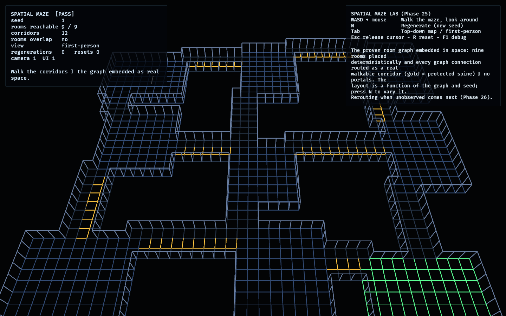

# Spatial Maze Lab

Phase 25 — the first lab of the **Hybrid maze arc**, which makes the coherence
mechanic *concrete*. The FPS arc (Phases 19–24) proved the observe/decohere game
over a deliberate scaffold: nine rooms on a fixed grid connected by **portal**
doorways (cross a doorway and you teleport to its current graph partner, with empty
space between modules). This lab replaces that with a real, navigable space.

It takes the proven room graph ([`observation_lab`](../observation_lab/src/model.rs)'s
`ObservationWorld`, with the [`constraint_lab`](../constraint_lab/src/model.rs)
spine) and **embeds it in space** ([maze.rs](src/maze.rs)): the nine rooms are
placed deterministically (seeded, with dynamic size/position), and **every graph
connection is routed as an actual walkable corridor** of tiles — no teleports. The
layout is a pure function of the graph + seed, so it is reproducible and varies by
seed. The graph stays the topology; this is its spatial *embedding*.

Corridor routing is a breadth-first search through non-room space, so it realizes
**any** connection — including the non-adjacent "impossible" ones a decohered graph
produces. That generality is what the rerouting (Phase 26) builds on.

The generated facility is now multi-level. Its three plot rows occupy flat floors
at 0.0 m, 0.9 m, and 1.8 m. Separator rows form deterministic 0.3 m stair bands,
below the shared controller's 0.45 m step limit. Any corridor crossing between
room bands therefore becomes a real staircase, while every room remains flat.

Room placement keeps a three-tile margin inside every plot. That deliberate empty
space supports a reusable route-choice generator: a corridor can retain its direct
line as a pressure-gate shortcut while carving a continuous side bypass that is
strictly longer and never crosses the gate tiles.

## Functionality evidence



The authored graph embedded as a maze, angled overview: nine rooms (the exit room
green) joined by twelve real corridors (the protected spine in gold), rendered as
walkable 3D geometry. The monitor reads `[PASS]`, `rooms reachable 9 / 9`, `rooms
overlap no` — a single connected, navigable maze. The lab itself is first-person;
the shot uses an angled camera so the whole layout is legible.

## What it demonstrates

- **The graph as concrete space** — rooms placed deterministically and each graph
  connection routed as a real corridor; you walk it, you do not teleport.
- **Connected & navigable** — BFS over floor tiles reaches all nine rooms from any
  room; a test asserts it, and you can walk room-to-room first-person.
- **Deterministic & seed-varied** — the same graph + seed always produces the same
  maze (tested); a different seed varies room sizes/positions while staying
  navigable. Press `N` to regenerate.
- **Embeds any graph state** — a decohered graph (non-adjacent connections) still
  embeds navigably, proving the routing generalizes for Phase 26's rerouting.
- **Spine preserved** — the protected-spine connections are routed and highlighted
  in gold, carrying the proven constraint into the spatial layout.

- **Elevation is simulation state** — integer stair units generate collision,
  camera height, debug rendering, replay state, and the assembled game's geometry.
  A controller test walks a real floor path from the lowest to highest room band.
- **Route-choice geometry** — generated corridors can expose a short risky line and
  a longer safe bypass; tests prove both paths are continuous and disjoint at the
  pressure gate.

## Controls

- `WASD` + mouse: walk the maze, look around
- `Shift` / `Space`: sprint / jump
- `N`: regenerate the layout (new seed)
- `Tab`: top-down map ⇄ first-person
- `Esc`: release the cursor · `R`: reset · `F1`: toggle debug

## Debug visualization

- Rooms as floor chambers (exit room green); corridors as floor (gold = protected
  spine); walls as 3D wireframe faces
- A gaze line on the floor showing facing (first-person)
- Monitor panel: seed, rooms reachable / total, corridor count, room-overlap check,
  view mode, regeneration/reset counts, entity health, and a `[PASS]`/`[FAIL]` flag

## Success conditions

1. The proven graph embeds as a connected, navigable maze (all nine rooms reachable
   on foot); rooms never overlap.
2. Every open graph connection becomes a real, 4-connected corridor (no portals);
   corridors never run through other rooms' interiors.
3. Generation is deterministic for a given graph + seed and varies across seeds
   while staying navigable.
4. A decohered graph still embeds navigably.
5. Route-choice generation produces a longer safe bypass around a full-width
   pressure gate.
6. Reset/regenerate rebuild the layout with no entity leaks.

## Manual verification

1. Run `cargo run -p fps_maze_lab`.
2. Walk the corridors with `WASD` + mouse — you cannot pass through walls, and you
   can reach every room on foot. Press `Tab` for the top-down map.
3. Press `N` a few times: the layout changes (room sizes/positions) but stays a
   connected maze with the gold spine routed. Press `R` to reset.

## Regenerating the evidence screenshot

```powershell
$env:OBSERVED2_CAPTURE = "docs/evidence/fps_maze_lab.png"
cargo run -p fps_maze_lab
```
