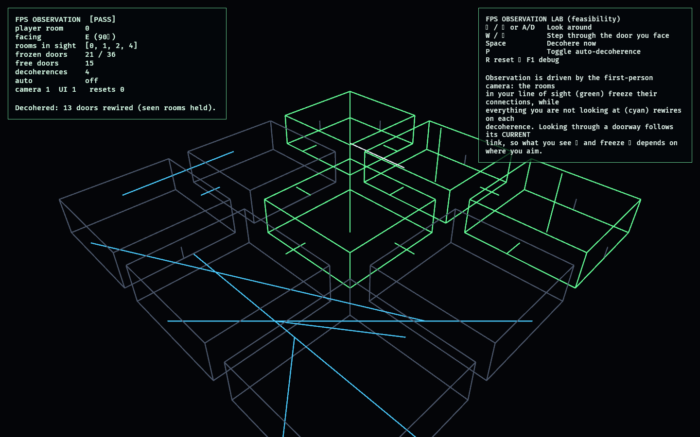

# FPS Observation Lab

The FPS Observation Lab is the **first 3D lab** and the feasibility probe that opens
the first-person path (see [ROADMAP.md](../../ROADMAP.md)). The 2D labs proved the
*game brain* — the observe/decohere graph, the constraint spine, competition, the
director, replay — entirely in the dimension-agnostic simulation layer. This lab
answers the single biggest unknown of going first-person:

> **Can the "observed set" be driven by the first-person camera's line of sight —
> freezing what you look at and letting the rest rewire — over the proven
> observation graph, deterministically?**

The answer is yes, and the integration is tiny. The only new logic
([vision.rs](src/vision.rs)) is a line-of-sight function: given the player's room
and where the camera points, it returns the rooms in view. The lab writes that set
into [`observation_lab`](../observation_lab/src/model.rs)'s `ObservationWorld::players`,
so the **proven pinning + deterministic decoherence machinery is reused wholesale** —
seen connections freeze, unseen ones rewire. Crucially, looking through a doorway
follows its *current graph link*, so you see (and freeze) whatever it leads to right
now, not the room physically next door — the impossible-geometry mechanic, in first
person.

## Functionality evidence



The player stands in the corner room looking **east** down an open corridor. The
rooms in line of sight (`[0, 1, 2, 4]`) are **green** with observation beams and
their doors are frozen; everything off-camera is grey and has **rewired** (cyan
links) across four decoherences — `21 / 36` doors frozen, `[PASS]`. The shot uses an
elevated angle so the whole facility is legible; the lab itself is first-person (the
observed set is computed from the in-room camera, shown in the monitor as
`facing E`).

## What it demonstrates

- **Line-of-sight observation** — the observer set is the set of rooms the camera
  can see, not the room the player stands in. Turning your head changes what is
  frozen; looking at a wall freezes only your own room.
- **Sight follows the graph, not geometry** — looking through a doorway observes
  whatever room it currently links to, so a rewired door can show you a far room.
- **Reuse of the proven core** — feeding the visible set into `ObservationWorld`
  means the existing pinning and deterministic decoherence freeze exactly the seen
  connections; nothing about the graph changed for 3D.
- **Deterministic** — visibility is a pure function of pose + graph; decoherence is
  seeded. The property that powers replay/netcode survives the move to 3D.
- **3D is viable here** — a first-person `Camera3d` walks the facility, looks
  around, and steps through doorways, with the invisible state shown as a 3D
  wireframe overlay.

## Controls

- `←` / `→` or `A` / `D`: look around (yaw)
- `W` / `↑`: step through the doorway you are facing (follows its current link)
- `Space`: decohere now
- `P`: toggle auto-decoherence
- `R`: reset · `F1`: toggle debug

## Debug visualization

- Rooms drawn as 3D wireframe boxes: **green** when in line of sight (frozen), grey
  otherwise; seen rooms also get a vertical observation beam
- Connections as 3D lines following their current links: **green** when frozen by
  sight, **cyan** when free (these rewire on decoherence)
- Sealed walls as short upright ticks; a white **gaze line** on the floor shows the
  facing direction
- Monitor panel: player room, facing, the rooms in sight, frozen vs free door
  counts, decoherence count, auto state, entity health, and a `[PASS]`/`[FAIL]` flag

## Success conditions

1. The player's own room is always observed; looking at a wall observes only it.
2. Looking through an open doorway observes the room it currently links to, and a
   clear line of sight carries down a corridor (to the configured depth).
3. A sealed wall blocks sight; a rewired door redirects it.
4. Feeding the visible set into the graph freezes exactly the seen connections under
   decoherence while the rest rewire.
5. Visibility is deterministic; reset restores the authored facility with no entity
   leaks.

## Manual verification

1. Run `cargo run -p fps_observation_lab`.
2. With auto-decoherence on, look around with the arrow keys: the rooms you face
   light green and hold steady, while the connections behind you flicker and rewire
   each tick.
3. Aim at a sealed wall — only your room stays green. Aim down an open corridor —
   the chain of rooms ahead freezes.
4. Press `W` to step through the doorway you face; press `Space` to force a
   decoherence; press `R` to reset.

## Regenerating the evidence screenshot

```powershell
$env:OBSERVED2_CAPTURE = "docs/evidence/fps_observation_lab.png"
cargo run -p fps_observation_lab
```
