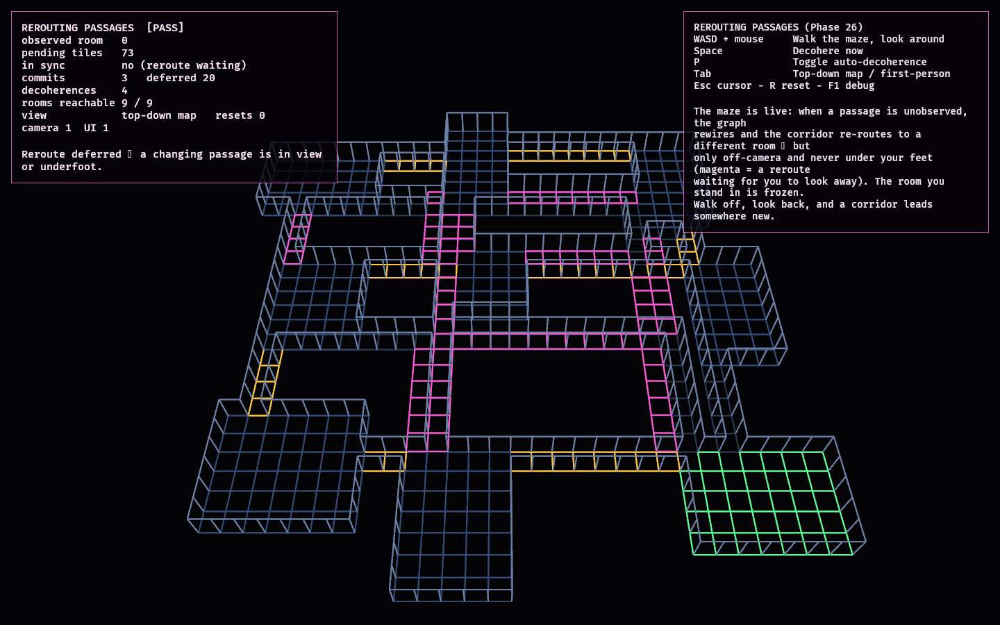

# Rerouting Passages

Phase 26 — the second lab of the **Hybrid maze arc**, and the moment the whole
hybrid concept is building toward. Phase 25 embedded the proven graph as a *static*
spatial maze (fixed rooms + real corridors). This lab makes the maze **live**: when
a region is unobserved and the graph decoheres, the affected corridors **re-route in
space** — a corridor that led to one room now leads to another.

It composes the two proven systems exactly:

- **The maze** — [`fps_maze_lab`](../fps_maze_lab/README.md)'s room placement and
  corridor routing (`place_rooms`, `route_corridor`), reused so rooms stay fixed and
  only corridors reroute.
- **The off-camera swap discipline** — [`fps_rewire_lab`](../fps_rewire_lab/README.md)
  (Phase 22): the spatial change is committed as **one atomic swap that only happens
  off-camera and never under the player's feet**.

The model ([reroute.rs](src/reroute.rs)) keeps a `rendered` layout (what you see)
and a `target` layout (what the current graph wants). Each decoherence updates
`target`; `try_commit` reconciles `rendered` to `target` atomically, but only when
every tile that would change is out of view and clear of the player. So you walk the
maze, look away, and a corridor leads somewhere new on return — no visible pop, no
stranding mid-passage. Two freezes apply: the room you stand in is **observed**
(its graph doors don't rewire), and any reroute you can *see* waits until you look
away.

The maze uses `fps_maze_lab`'s three-level height field. Reroutes change corridor
occupancy, not floor elevation, so an atomic swap cannot raise or drop the floor
under the player. Collision is rebuilt in the same commit as the rendered routes.

## Functionality evidence



Angled overview after the maze has rerouted three times off-camera (`commits 3`) with
a fourth reroute **pending** — the **magenta** tiles are passages waiting to swap,
held back because they are in view (`deferred 1`, `in sync: no`). The monitor reads
`[PASS]`, `rooms reachable 9 / 9`: every reroute leaves a navigable maze.

## What it demonstrates

- **Corridors reroute in space** — when the graph rewires an unobserved edge, the
  spatial corridor re-routes to the new room (a test confirms a corridor leads to a
  different room after an off-camera commit).
- **Off-camera, atomic, gated** — a reroute whose tiles are in view is deferred; it
  commits only once those tiles are unseen, in one swap (no half-changed maze).
- **Never strands the player** — a reroute that would change a tile under the player
  is deferred (tested).
- **Observation still freezes** — the room you stand in is pinned, so its passages
  do not rewire at all (tested), layered on top of the off-camera gate.
- **Always navigable & deterministic** — every committed reroute leaves all nine
  rooms reachable on foot; the same decohere/commit sequence reproduces the same
  maze.

- **Elevation remains stable** — rooms stay at their generated levels and rerouted
  passages continue to cross levels through climbable 0.3 m stair bands.

## Controls

- `WASD` + mouse: walk the maze, look around
- `Space`: decohere now · `P`: toggle auto-decoherence
- `Tab`: top-down map ⇄ first-person (the map "sees everything", so reroutes wait)
- `Esc`: release the cursor · `R`: reset · `F1`: toggle debug

## Debug visualization

- Rooms (exit room green), corridors (gold = protected spine), walls as 3D wireframe
- **Magenta** tiles: a reroute waiting to swap (in view or underfoot)
- Monitor panel: observed room, pending tiles, in-sync state, commit/deferred/
  decohere counts, rooms reachable, view mode, entity health, `[PASS]`/`[FAIL]`

## Success conditions

1. The authored maze is in sync and navigable.
2. Decoherence makes affected passages "want to reroute"; rendered stays put
   (navigable) until a safe commit.
3. A reroute in view, or under the player, is deferred; it commits only off-camera
   and clear of the player, atomically, leaving the maze navigable.
4. After an off-camera commit, a corridor leads to a different room.
5. An observed room's passages never rewire; rerouting is deterministic; reset
   restores the authored maze with no entity leaks.

## Manual verification

1. Run `cargo run -p fps_reroute_lab` (auto-decoherence is on).
2. Stand in a room looking at a doorway: press `Space` to decohere — the corridor
   you are watching shows magenta but does **not** change. Turn around, and it
   re-routes; look back and it leads to a different room.
3. Press `Tab` (top-down) to watch the whole maze: reroutes pile up as pending
   (everything is "in view"). Press `Tab` back to first-person and they commit as
   you look away. Press `R` to reset.

## Regenerating the evidence screenshot

```powershell
$env:OBSERVED2_CAPTURE = "docs/evidence/fps_reroute_lab.png"
cargo run -p fps_reroute_lab
```
