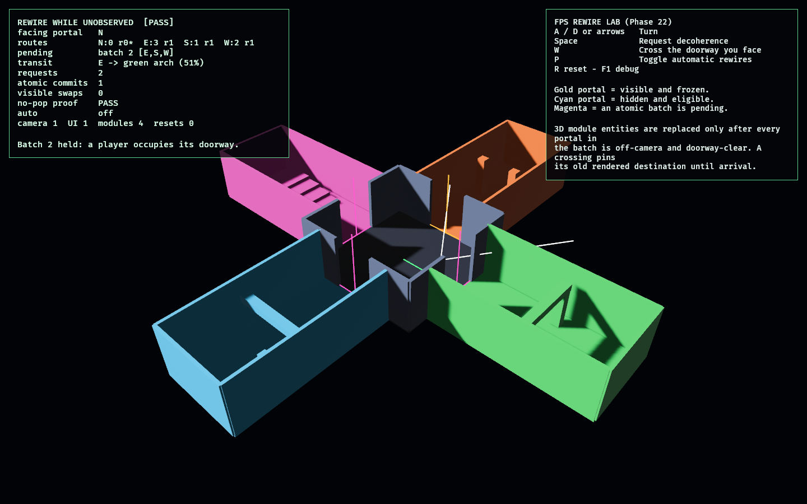

# FPS Rewire Lab

Phase 22 solves the first-person arc's signature rendering problem: changing
unobserved geometry without exposing a visible pop or removing a doorway while a
player is crossing it.

The lab uses the continuous visibility rules from Phase 21 and four real 3D module
sets around a central hub. Decoherence creates a deterministic, atomic replacement
batch from portals whose whole aperture is off-camera. The batch may install only
while every affected portal remains hidden and doorway-clear. The presentation
layer then despawns and replaces the corresponding 3D module entities.

Traversal captures the currently rendered destination. If that gateway belongs to
a pending batch, the entire batch waits until the crossing finishes, so the old
route remains physically and logically valid beneath the player.

## Functionality evidence



The diagnostic overview shows the four rendered module variants and the central
hub. One off-camera batch has already committed with `visible swaps 0` and
`no-pop proof PASS`. A second magenta batch is held while the green traversal
marker occupies its east doorway, demonstrating the anti-stranding gate.

The elevated camera is capture-only; visibility and swap eligibility still come
from the simulated first-person camera shown by the white frustum rays.

## Rendering contract

1. Portal visibility conservatively samples the full doorway aperture through the
   Phase 21 frustum and wall-occlusion test.
2. A decoherence request permutes only currently hidden portals.
3. Every affected portal is installed in one atomic batch; partial installation is
   forbidden.
4. Commit rechecks that every aperture remains hidden.
5. Commit rechecks that no affected doorway is occupied by traversal.
6. The 3D entity replacement runs only after that legal commit.
7. Transit follows the rendered destination captured at entry and pins it until
   arrival.

## Controls

- `A` / `D` or left / right arrows: turn
- `Space`: request decoherence
- `W`: cross the doorway currently faced
- `P`: toggle automatic rewires
- `R`: reset
- `F1`: toggle diagnostics

## Debug visualization

- Gold portal: visible and frozen
- Cyan portal: hidden and eligible for a later batch
- Magenta portal: included in a pending atomic batch
- Green line/marker: traversal currently pinning its old rendered route
- White rays: first-person visibility-frustum edges
- Monitor: route module and revision per portal, pending batch, transit progress,
  request/commit counts, visible-swap violations, no-pop proof, entity health, and
  reset count

## Success conditions

1. Facing a portal freezes its rendered module and entity identity through
   decoherence.
2. Turning away permits a later batch to replace that portal's module; turning
   back reveals the new world.
3. Every actual replacement has a commit record proving all affected apertures
   were hidden and clear.
4. Batches install atomically and preserve a valid permutation of the four
   modules.
5. Entering a doorway captures the old destination and blocks any batch touching
   that gateway until arrival.
6. The same turn/decoherence sequence produces identical batches and routes.
7. Repeated reset restores exactly four module roots, one camera, and one UI root
   without leaks.

## Manual verification

1. Run `cargo run -p fps_rewire_lab`.
2. Face east and note the colored geometry. Press `Space`: that visible route must
   not change.
3. Turn north, press `Space`, then turn east again. A different module is already
   present; `visible swaps` remains zero and the monitor reads `no-pop proof PASS`.
4. Press `W` to cross a route. During the crossing, let automatic decoherence run
   or press `Space` once the aperture moves behind you. A magenta batch may stage,
   but it must wait until arrival before replacing the route.
5. Press `R` repeatedly and confirm the monitor stays `[PASS]`.

## Regenerating the evidence screenshot

```powershell
$env:OBSERVED2_CAPTURE = "docs/evidence/fps_rewire_lab.png"
cargo run -p fps_rewire_lab
```
