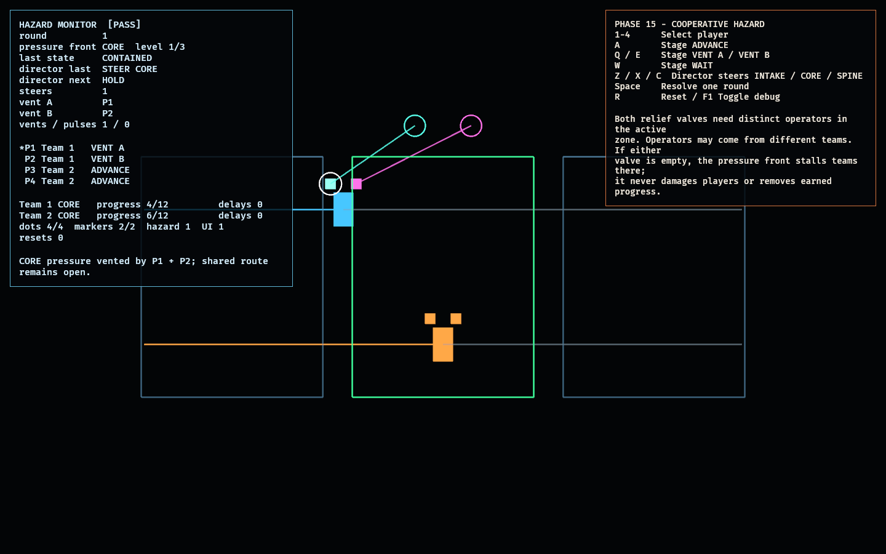

# Cooperative Hazard Lab

Phase 15 asks one technical question: can a shared environmental hazard require
real player coordination, accept deliberate steering from the facility director,
and interfere with a traversal race without becoming direct damage or deleting
earned progress?

This isolated feasibility lab answers that with a deterministic **pressure
front** across three authored route zones. Four players in two teams choose one
action per round. Two distinct operators in the active zone must staff `VENT A`
and `VENT B` together. They may come from different teams, so containment is a
genuinely shared action. If either role is missing, advancing teams in that zone
lose the round to a pressure pulse. Their progress never decreases and there is
no health or damage state.

The director can steer the pressure front to `INTAKE`, `CORE`, or `SPINE` before
the round resolves. This changes which occupants must coordinate and which route
progress is at risk, while preserving deterministic resolution.

## Functionality evidence



The captured showcase places both teams in `CORE`, steers the pressure front
there, and staffs both valves with Team 1 while Team 2 advances through the
contained zone. The monitor reports `CONTAINED`, one director steer, the two
operators, and `[PASS]` entity health.

## What it demonstrates

- **Coordination is mandatory** — one valve operator cannot contain the pressure;
  two distinct roles in the same active zone can.
- **Cooperation can cross team boundaries** — one player from each team may staff
  the two valves and protect both teams.
- **The director steers the environment** — a director action selects the active
  authored zone before each round.
- **Indirect consequences only** — an uncontained pulse stalls attempted
  advancement in its zone and increments a delay counter. Progress is monotonic;
  there is no damage or combat state.
- **Shared benefit and opportunity cost** — valve operators do not advance that
  round, but every team in the zone benefits from their containment.
- **Deterministic resolution** — player intents are keyed by stable `PlayerId`;
  reversing their input order produces the same world state.

## Controls

- `1`–`4`: select a player
- `A`: stage `ADVANCE`
- `Q` / `E`: stage `VENT A` / `VENT B`
- `W`: stage `WAIT`
- `Z` / `X` / `C`: director steers the pressure front to `INTAKE` / `CORE` /
  `SPINE`
- `Space`: resolve one round
- `R`: reset
- `F1`: toggle debug visualization

The staged actions persist between rounds; the director action returns to `HOLD`
after each resolution.

## Debug visualization

- Three authored zone bounds and one visible active pressure field
- Green pressure field after containment; red intensity when pulsing
- One route lane and monotonic progress line per team
- Four player intent dots, colored by staged role
- Lines from staged valve operators to the active `A` and `B` relief controls
- Monitor panel: pressure zone/level, containment, director steering, valve
  operators, vents/pulses, per-player intents, team progress/delays, entity
  counts, reset count, and `[PASS]`/`[FAIL]`

## Success conditions

1. One relief operator cannot contain the hazard and an advancing occupant is
   delayed.
2. Distinct `VENT A` and `VENT B` operators contain the hazard and leave the
   shared route open.
3. Operators from different teams can coordinate successfully.
4. Steering the hazard changes which authored zone and occupants are affected.
5. Hazards can stall progress but never reduce earned progress.
6. The same intents and director action always produce the same result,
   independent of intent ordering.
7. Repeated reset restores four player dots, two team markers, one hazard field,
   one UI root, and the exact authored logical state.

## Manual verification

1. Run `cargo run -p hazard_lab`.
2. With the authored `P1 VENT A`, `P2 VENT B`, `P3/P4 ADVANCE` staging, press
   `Space`. Confirm `CONTAINED`; Team 2 advances while Team 1 operates the valves.
3. Select P2 (`2`), press `W`, then `Space`. Confirm the pressure pulses and Team
   2 gains a delay without losing prior progress.
4. Put P1 on `VENT A`, P3 on `VENT B`, and the other players on `ADVANCE`.
   Confirm cross-team coordination contains the next pulse.
5. Use `Z`, `X`, and `C` before resolving rounds. Confirm the active pressure
   field moves to the chosen zone and only occupants there can operate its valves.
6. Press `R` repeatedly; the monitor must remain `[PASS]` and return to round 0.

## Regenerating the evidence screenshot

```powershell
$env:OBSERVED2_CAPTURE = "docs/evidence/hazard_lab.png"
cargo run -p hazard_lab
```
