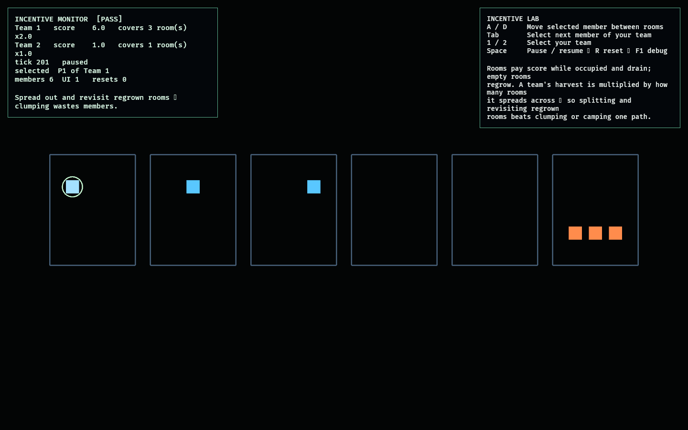

# Incentive Lab

This feasibility lab probes **splitting & backtracking incentives** — a scoring
scheme whose dominant strategy is to *divide* the team across rooms and *revisit*
rooms, never to funnel everyone down a single path.

Each room holds a `charge` that a present team harvests for score and that
regenerates only while the room is empty ([model.rs](src/model.rs)). Two rules do
the work:

- **Dispersion** — a team's harvest is multiplied by how many distinct rooms its
  members occupy, so splitting up both covers more rooms *and* scores each harder;
  clumping wastes members.
- **Regrowth** — a camped room drains to nothing while one you left behind
  regrows, so cycling back to a regrown room out-scores standing still.

There is no exit to rush — score is coverage over time — so no single path
dominates.

## Functionality evidence



The authored matchup after 200 ticks (captured via `OBSERVED2_CAPTURE`): Team 1
spread across three rooms (×2.0 multiplier) scored **6.0**; Team 2 clumped in one
room scored **1.0** — a 6:1 advantage to splitting, with the occupied rooms
drained behind them.

## What it demonstrates

- **Splitting pays** — a spread team out-scores a clumped team by more than 2×
  (a test asserts it).
- **Dispersion multiplier** — harvest scales with the number of distinct rooms a
  team covers.
- **Backtracking pays** — an abandoned room regrows, and cycling between rooms
  out-scores camping one (tests assert both regrowth and the cycle-vs-camp
  outcome).
- **No funnel** — score is coverage-over-time with no exit to rush, so no single
  path is optimal.
- **Deterministic** — the same movements reproduce the same scores.

## Controls

- `A` / `D` (or `←`/`→`): move the selected member between rooms
- `Tab`: select the next member of your team
- `1` / `2`: select your team
- `Space`: pause / resume · `R`: reset · `F1`: toggle debug

## Debug visualization

- Six rooms in a row, each with a **charge bar** that drains while occupied and
  regrows while empty (green → red as it depletes)
- Team-coloured member dots (team A upper row, team B lower) and a ring on the
  selected member
- Monitor panel: per-team score, rooms covered, dispersion multiplier, tick,
  and a `[PASS]`/`[FAIL]` flag

## Success conditions

1. A spread team out-scores a clumped team over the same ticks.
2. The dispersion multiplier scales with distinct rooms occupied.
3. An abandoned room regrows; cycling rooms beats camping one.
4. Repeated reset restores zero scores and a fresh layout with no leaked
   entities.

## Manual verification

1. Run `cargo run -p incentive_lab`.
2. Watch the authored start: Team 1 (spread) pulls ahead of Team 2 (clumped).
3. Select Team 2 (`2`) and spread its members (`Tab` + `A`/`D`); its score rate
   climbs as coverage rises.
4. Camp a member in one room and watch its charge bar drain to nothing; move it
   out, let the bar regrow, and move back to harvest again.

## Regenerating the evidence screenshot

```powershell
$env:OBSERVED2_CAPTURE = "docs/evidence/incentive_lab.png"
cargo run -p incentive_lab
```
