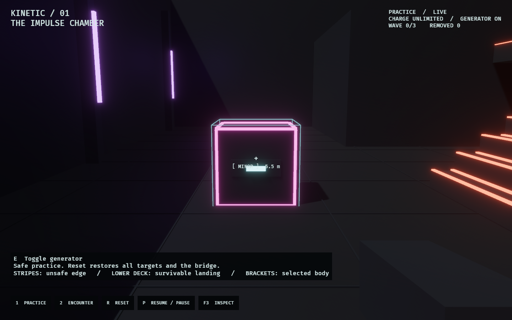

# Kinetic / The Impulse Chamber

A first-person playground for immediate push/pull, continuous momentum, and
eliminations caused by the environment. The old discrete schematic and generated
siege are replaced. Their implementation remains in Git history.

```bash
cargo dev-run -p kinetic_lab
cargo dev-run -p kinetic_lab --bin kinetic_fps  # same experience
cargo dev-run -p kinetic_lab -- --encounter
```

Start with **Practice**. Resume with `P`, then click the chamber to capture the
mouse. Line up a framed cube, push it, and watch where it actually goes. Try pulling
it back, moving a crate into another body, and walking up the staircase to the
unrailed catwalk. The lower shelf catches a fall; open void does not.



## Controls

| Input | Action |
|---|---|
| WASD / Shift / Space | Move / sprint / jump |
| Mouse | Look; the crosshair ray selects the first visible body |
| LMB / RMB | One immediate push / pull per press |
| E | Operate the nearby generator or bridge control |
| 1 / 2 | Reset into practice / encounter |
| R | Reset the current mode, all bodies, and the bridge |
| P / Escape | Pause or resume / pause and release the cursor |
| F3 / N | Toggle diagnostics / advance one paused tick |

The bottom buttons expose mode selection, reset, pause, and diagnostics without
requiring their keyboard shortcuts. Losing window focus pauses the simulation and
clears queued actions. Pausing freezes movement as well as opposition.

## Rules

The tool casts an eight-metre ray from the eye. It never selects an off-centre
body or reaches through architecture. Push follows the full three-dimensional
look direction; pull accelerates the selected body toward the eye. Both apply a
mass-scaled impulse, with nominal velocity changes of 10 m/s and 7 m/s respectively.
One press means one attempt; misses and refusals never spend charge. Cooldown is
15 fixed ticks (250 ms).

Minors and crates collide with the actual room and each other. Fast contact can
stagger a minor and transfer momentum, but ordinary walls and props never kill.
A minor remains disabled from pursuit for at least 27 ticks after a shove and
cannot resume pursuit until supported. Minors do not freeze when observed.
There are no major Guardians in this lab.

The bridge control starts a two-second warning. When it expires, both the bridge
mesh and its collider disappear, and navigation loses that crossing. Falling
onto surviving geometry is survivable. Crossing the true-void boundary at y=-12
removes the body; an Observer fall ends an encounter and resets the body in practice.
There is no ordinary-impact damage, health pool, or instant visual-only death.

- **Practice:** Stationary targets, unlimited charge, no capture. Reset restores
  the scene. The HUD explicitly labels the unlimited charge rule.
- **Encounter:** Three waves of two, three, then four pursuing minors. Five seconds
  precede the first wave and separate cleared waves. Clear all three to win;
  an active, supported minor catching the Observer ends the attempt.
- **Charge:** Encounter starts at 100. Each successful push or pull costs 10.
  Standing within 2.2 metres of a visible powered station restores 25 per second.
  The generator is operable within 2.5 metres. No passive regeneration exists.

## What owns the truth

`model` owns commands, target queries, fixed-tick rules, snapshots, events, and
stable actor IDs. `arena` supplies one authored list of cuboids to rendering and
collision. Navigation uses authored waypoints with wall, support, and step checks.
A traced priority behavior tree selects practice, stagger, airborne, pursuit, or
capture behavior; movement still resolves against geometry.

`physics` owns raw Rapier 0.34 with `enhanced-determinism`. The lab explicitly
steps it at 60 Hz, with CCD on dynamic targets and stable insertion order. The
player uses the shared production controller through its query-based entry point,
so movement and kinetic objects share the same collision scene. Rapier's disposable
pipeline scratch is rebuilt; durable solver/contact state is cloned with snapshots.

A `KineticWorld` clone is an in-memory continuation snapshot. `digest()` fingerprints
rules, tuning, geometry, actor and player state. Replaying commands and restoring a
mid-flight snapshot are tested for per-tick equality. This is a local repeatability
proof, not a claim of newly certified cross-platform networking.

`runtime` consumes abstract movement and tool commands, queues one-shot events
across frame catch-up, and owns pause/reset scheduling. `view` interpolates poses
and provides sound, recoil, muzzle/contact flashes, target brackets, and diagnostics.
The reticle reports the current selection and capability; it never promises a
future kill in a moving scene.

All colors come from `observed_style::kinetic`. Lit edges distinguish minors;
crates have contrasting structural bands; target brackets identify the selected
body. Broken edge stripes mean unsafe geometry, and the lower landing has its own
treatment. Generator loss changes recharge, while critical signals keep their
emission. Device labels name the generator, station, and bridge control.

## Verification and evidence

```bash
cargo fmt --all
cargo dev-clippy
cargo dev-test
OBSERVED2_CAPTURE=docs/evidence/kinetic_lab/overhaul/chamber.png cargo dev-run -p kinetic_lab
OBSERVED2_CAPTURE_SEQUENCE=/tmp/kinetic-frames cargo dev-run -p kinetic_lab
```

The capture sequence stages five initial snapshots and then submits ordinary
movement, aiming, and tool commands. It demonstrates prop contact, pull, a
recoverable player fall, a void shove, and bridge retraction. Its tests require
those physical outcomes. The generated `verification.txt` records events and final
digests; screenshots advance one tick per rendered frame and are sampled at 15 fps.

See [evidence and verification](../../docs/evidence/kinetic_lab/overhaul/README.md).
The automated checks establish physical behavior, replay, and lifecycle correctness.
Whether the tool feels satisfying still requires a person playing at the keyboard.

This lab does not integrate WFC, majors, teammate boosts, equipment manipulation,
Architect gameplay, or production multiplayer. Old siege, seed, and opposition
flags now fail explicitly with a pointer to `--help`.
