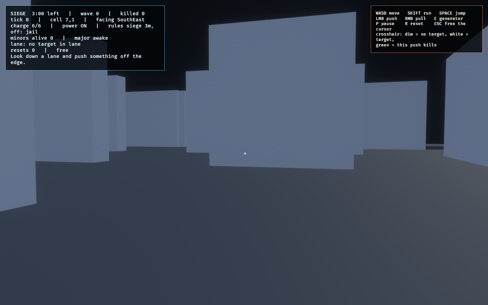

# Kinetic Tool

The first-person half of Architect Ascent's step B proof. One question:

> **Is a shove that commits a minor Guardian to void deterministic, readable,
> and fair?**

```bash
cargo dev-run -p kinetic_lab
```

## What the board is for

A single floor, each feature present to make one rule visible:

| Feature | The rule it proves |
| --- | --- |
| Void rim | A shove over the edge kills. The **edge** kills — the tool never does. |
| Ledge run (`5..7, 3`) | Unrailed geometry does not spend momentum, so a three-cell impulse carries a target past three cells and over the rim. |
| Retracting tile (`3, 5`) | A shove onto a doomed tile kills on a delay, not on contact. |
| Wall (`2, 2`) | Structure blocks a shove outright, and a blocked target does not move. |
| Recharge station (`2, 4`) | Charge returns only here, and only while the floor has power. |
| Generator (`1, 1`) | Cutting power kills the station and collapses observation to your own cell. |
| One major, two minors | The major freezes when you look at it. The minors do not care that you are looking. |

## Controls

`W`/`S` are absent on purpose: the lattice is hex, so movement is six-faced.

| Key | Action |
| --- | --- |
| `D` `C` `Z` `A` `Q` `E` | Step along East / SouthEast / SouthWest / West / NorthWest / NorthEast |
| `Space` | Push the first minor Guardian in the facing lane |
| `F` | Pull it one cell back toward you |
| `G` | Operate the generator (only while standing on it) |
| `P` / `N` | Pause / advance exactly one tick |
| `R` | Reset |

## The preview is the fairness argument

`KineticWorld::resolve_shove` is pure and side-effect free, so the lab runs the
*same* computation a tick would run and draws the result before the trigger is
pulled: the destination cell, the path to it, and the fate. Green means the
target ends in void, amber means it ends on a tile that is already retracting,
grey means it survives, red means structure blocks the shove. A lethal
destination also gets a second ring, so the outcome never rides on hue alone.

If the preview and the outcome ever disagree, that is a bug in the model, not a
rendering artifact — they are the same function.


The panel above reads `lane: Void after 4 cells` against a three-cell impulse:
the ledge run carried the target one cell further than the push itself could.
See [the evidence note](../../docs/evidence/kinetic_lab/README.md).

## First person

```bash
cargo dev-run -p kinetic_lab --bin kinetic_fps
```


The same board, the same rules, standing on the floor instead of looking down at
it. `WASD` move, `SHIFT` run, `SPACE` jump, `LMB` push, `RMB` pull, `E` operate
the generator, `P` pause, `R` reset, `ESC` release the cursor.

**The split that makes this safe.** `model.rs` owns every rule on whole lattice
cells and is untouched by embodiment. `embodied.rs` owns where the body
physically is, and each tick reports exactly two derived facts back: the cell it
stands on, and the face it looks down. Nothing else crosses. The shove therefore
still resolves in fixed-tick simulation on the lattice, never by a physics query,
while the player walks and aims continuously. The controller
(`observed_traversal::step_body`) is already pure and already runs at `FIXED_DT`,
which *is* this model's tick, so embodiment adds no new nondeterminism —
`identical_inputs_reproduce_identical_bodies_and_boards` holds both the board
digest and the body itself equal across 600 scripted ticks.

**Shape language.** Canon: original geometric constructs, with "Modron" a mood
reference only, never shipped terminology and never a copied design. What the
mood contributes is a principle that stands on its own — **rank reads as the
order of the solid**. A minor Guardian is a cube; the major is a tetrahedron,
the pyramidal silhouette canon already fixed. Everything of the facility crosses
between cells in a snap and then holds, because Guardians already moved in
quantised steps for determinism's sake. A compile-time assert keeps the snap
shorter than the step interval, so tuning one without the other cannot quietly
turn the clockwork into a glide.

**Floor plates are rectangles on purpose.** The lattice tiles exactly with 14x12
plates sheared 7 per row — no gaps, no overlaps, and void leaves an exact hole to
fall through. The hex lattice stays the connectivity and targeting structure. An
authored tile's geometry was never required to be a hex prism, and rendering
exactly what you collide with is what the Legibility Contract demands.

## The siege: a real facility, and a clock

```bash
cargo dev-run -p kinetic_lab --bin kinetic_fps -- --siege
cargo dev-run -p kinetic_lab --bin kinetic_fps -- --siege --minutes=5 --no-jail
```



Waves of minor Guardians on a clock, inside a board the **production WFC solver**
produced rather than the authored rectangle.

**What is real:** the layout. Cell occupancy, the void between structures, and
the per-face door mask all come from `HexWfcWorld` at a pinned seed, so walls are
where the solver put walls. That is not cosmetic — every rule now goes through
`KineticWorld::passable_neighbor`, so a shove stops at a wall, sight stops at a
wall, and a Guardian has to come through a doorway like everything else. The
authored board leaves every face open, which is exactly why it plays as an open
plain and why the screenshot above looks nothing like it.

**What is not real:** the geometry. Plates are still flat rectangles and walls
are face slabs on the six lattice faces. Projecting the authored tile *hulls*
needs a mesh collider and is separate work. Saying so here is cheaper than a
reader inferring otherwise from the picture.

The siege itself: a wave every 12 seconds after a 6-second grace, growing one
Guardian every second wave up to six, capped at `MAX_LIVE_MINORS` so presentation
can hold a fixed pool of shells rather than spawning entities mid-match. Spawns
are at least four plates away, never in void, never on top of you, and seeded per
wave so the same run reproduces. Outlast the clock and the overlay reads
SURVIVED with your wave and kill count; get caught and it reads OVERRUN.

## Launch flags

Both binaries take the same flags. Pass them after `--`:

```bash
cargo dev-run -p kinetic_lab --bin kinetic_fps -- --no-jail
cargo dev-run -p kinetic_lab --bin kinetic_fps -- --no-guardians
cargo dev-run -p kinetic_lab --bin kinetic_fps -- --help
```

| Flag | Effect |
| --- | --- |
| `--no-minors` | The minor Guardians are never spawned |
| `--no-major` | The major Guardian is out of play: never moves, never captures, never drawn, never blocks a shove |
| `--no-guardians` | Both of the above |
| `--no-jail` | A Guardian reaching you no longer ends the run |
| `--siege` | A solved WFC facility, and waves of Guardians to outlast |
| `--minutes=N` | How long the siege lasts (default 3) |

These are **authoritative**, not presentation toggles: they live on
`KineticWorld::rules`, ride in the determinism digest, and are obeyed identically
by the schematic view, the first-person view, and the headless runner. The HUD
names whatever is switched off, so a screenshot taken with the pressure removed
cannot be mistaken for one taken with it on.

They exist because feel is tuned by taking things away. `--no-jail` is the one to
reach for when studying the tool itself — a Guardian becomes something to shove
rather than a fail state, and you can stand in the open and watch a shove land
without a clock on you. `--no-guardians` leaves an empty facility, which is the
honest way to judge whether the board is too big.

## Recording the demo

```bash
OBSERVED2_CAPTURE_SEQUENCE=docs/evidence/kinetic_lab/frames \
  cargo run -p kinetic_lab --bin kinetic_fps
ffmpeg -y -framerate 60 -i docs/evidence/kinetic_lab/frames/frame_%04d.png \
  -c:v libx264 -pix_fmt yuv420p -crf 20 -movflags +faststart \
  docs/evidence/kinetic_lab/kinetic_shove.mp4
```

Result: [kinetic_shove.mp4](../../docs/evidence/kinetic_lab/kinetic_shove.mp4).
The scenario's opening positions are staged; every tick after that is a scripted
`PlayerIntent` + `ToolRequest` through the ordinary `Embodiment::step`, so the
video records the rules running rather than an animation of them, and the
deterministic model reproduces it frame for frame. Capture parks `FixedUpdate`
and advances one tick per rendered frame, because saving a PNG per frame is much
slower than the simulation and fixed-step catch-up would otherwise skip state.

## What this lab is not

It is not the economy proof. Disturbance waves, the Architect's hand, card
legality, and the wave/charge budget live at cell level in `architect_lab`; this
lab holds one Observer, a fixed pair of minors and one major, and asks only
whether the tool itself reads honestly.

And it does not close the *feel* question by itself. The first-person view puts
a body and a mouse behind the tool, which is what the design doc's step B asks
for, but whether a shove is **satisfying** is decided by a person at the keyboard
and remains the open human gate. What the two views establish is narrower and
still worth having: the rules are legible, reproducible, and identical across two
independent presentations of one simulation.

## Shoves are simulation, not physics

Travel is a discrete walk along hex faces inside the fixed-tick model, so an
identical snapshot and intent reproduce an identical impulse, destination, and
destroyed actor. Nothing here consults a physics engine, and nothing may start
to — see `rapier_determinism_lab` for why that boundary is drawn where it is.
`identical_intents_reproduce_identical_state_every_tick` compares a state digest
on all 600 ticks of a scripted run, so new state cannot quietly escape the
contract.

## Verification

```bash
cargo fmt --all
cargo dev-clippy
cargo dev-test
cargo run -p kinetic_lab   # OBSERVED2_CAPTURE=<path> writes a preview screenshot
```

Rust coverage includes every shove fate (void, ledge carry, rest, delayed
retraction kill, blocked), the observation asymmetry in both directions, power
gating on recharge and sight, tool refusals, pull, generator operation,
preview purity, the ledge-ring travel cap, single-keypress-single-shove through
the real Bevy schedule, and ten consecutive resets with no entity leak.
