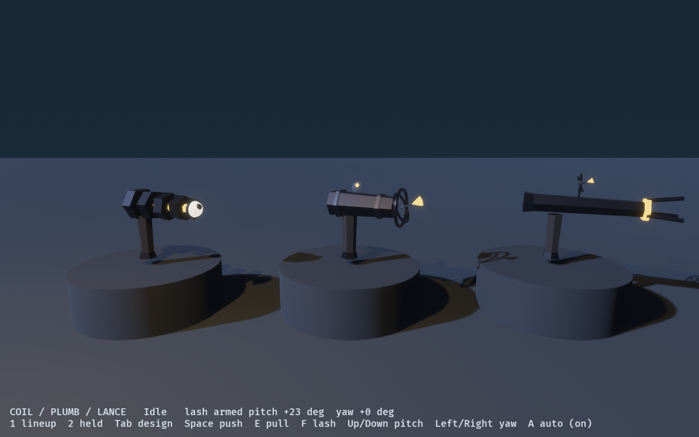
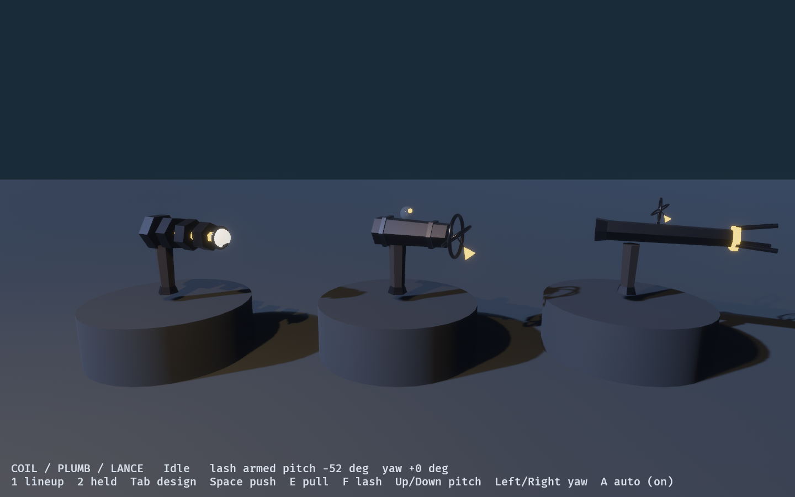
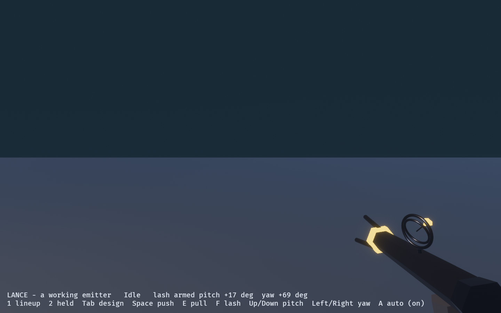
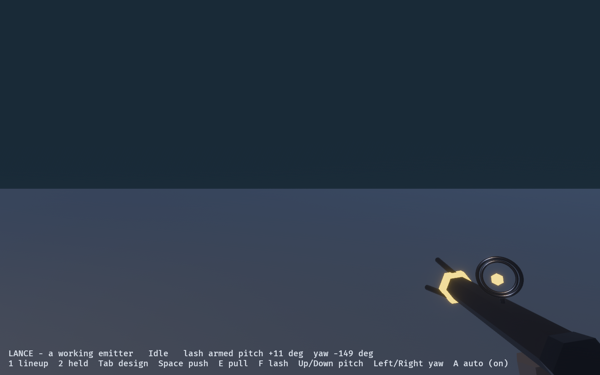
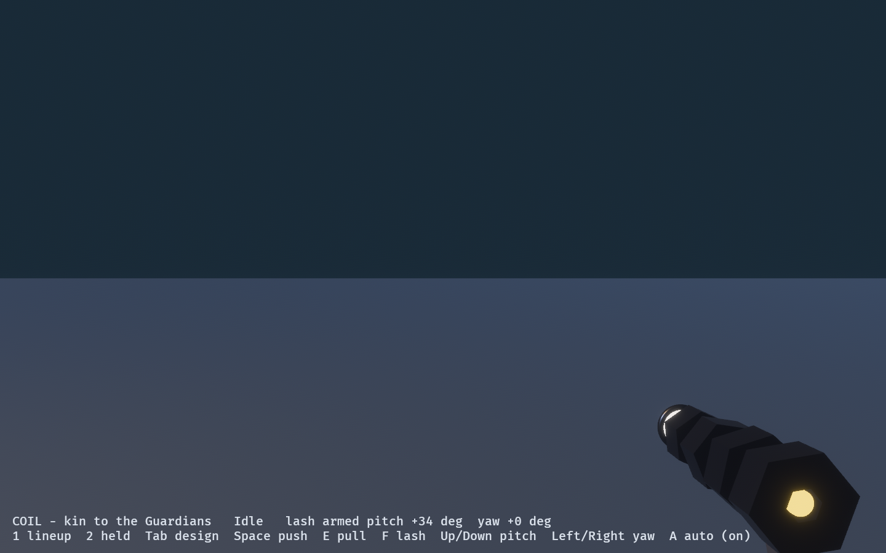
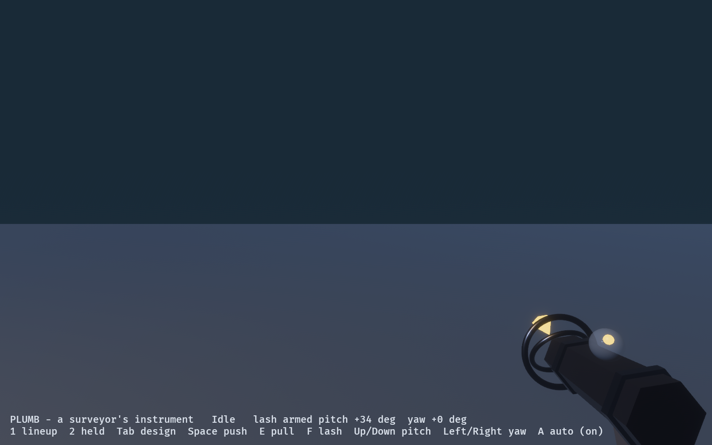

# Kinetic Tool Lab

Candidates for the Observer's kinetic tool. `kinetic_lab` still holds a placeholder,
two scaled cubes; `wfc_kinetic_lab` holds the Lance. Three designs stand side by side
on turntables, and the selected one is held in a first-person hand at the size the game
holds the observation torch.

```powershell
cargo dev-run -p kinetic_tool_lab
$env:OBSERVED2_CAPTURE = "docs/evidence/kinetic_tool_lab"; cargo dev-run -p kinetic_tool_lab
```



The designs live in the shared `observed_tool` crate, which carries their tests and is
built from the Guardians' own shape kit (`observed_guardian`). The chosen design goes
into the game unchanged.

## The candidates

- **Coil**, kin to the Guardians. A barrel of hex tiers that turn against each other like
  the Tumbler's, snap into line on a push or a lash, and spin hard on a pull. A lidded
  eye at the muzzle looks the way the lash will send things. The facility's own
  machinery, turned in the Observer's hand.
- **Plumb**, a surveyor's instrument. A banded body, a spirit vial whose bubble runs to
  the high end, and a gimballed plumb bob at the muzzle that hangs along the armed
  direction: the lash's new down, shown literally. It reads as measuring, not as a
  weapon, which suits a tool that damages nothing.
- **Lance**, a working emitter. A long hex barrel with three prongs that open to push
  and close to pull, and the Plumb's gimbal standing on top of the barrel as its
  sight. The plainest to read at a glance, and the most like a gun.

The Lance with the Plumb's gimbal is the chosen direction: the Plumb's front end
is the best directional measure of the three, and the Lance the best body.

## Why every design shows the armed direction

The armed lash turns with the Observer (see `wfc_kinetic_lab`): it keeps the pitch and
yaw it was armed at, relative to the way you face. Hold `Q` there and the mouse dials it
round. That direction is otherwise invisible, so each design carries it on the tool: the
Coil's pupil, and the gimbal on the Plumb and the Lance. The gimbal's outer ring turns
to the armed yaw, its inner ring tips to the pitch, and the bob hangs along the armed
direction, the lash's new down.




| Lance, armed right | Lance, armed back over the shoulder |
|---|---|
|  |  |

Armed back toward you, the bob faces the camera and foreshortens to a hex. It still reads,
but it is the weakest case.

## Held

| Coil | Plumb | Lance |
|---|---|---|
|  |  |  |

## Controls

| Input | Action |
|---|---|
| 1 / 2 | Lineup / held |
| Tab | Next design (held) |
| Space / E / F | Push / pull / lash |
| Up / Down | Armed pitch |
| Left / Right | Armed yaw |
| A | Automatic cycle on or off |
| P | Pause |
