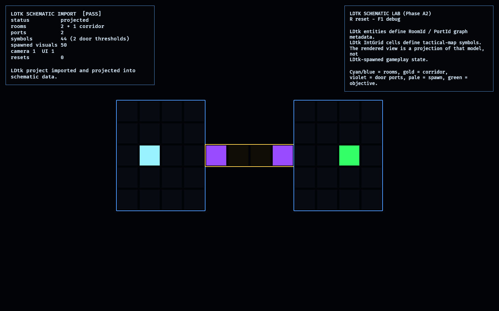

# LDtk Schematic Lab

**Phase A2** of the [Bevy asset-integration roadmap](../../docs/bevy_asset_integration_roadmap.md)
-- the 2D authoring fallback candidate, [`bevy_ecs_ldtk`](https://crates.io/crates/bevy_ecs_ldtk).

It answers one question: **is LDtk useful for tactical maps, route plans, or
room-graph sketches that do not need full 3D geometry?** The answer here is
yes, but as a fallback/schematic path: `bevy_ecs_ldtk 0.14` loads an authored
LDtk project, a pure projection turns layers/entities into stable `RoomId` and
`PortId` data plus schematic symbols, and the Bevy view renders that projected
model through `observed_style`. LDtk entities never become gameplay entities.

Compatibility gate: `bevy_ecs_ldtk 0.14.0` is the Bevy `0.18` line. The lab
uses `default-features = false` with only `internal_levels`, so LDtk tile
rendering is not adopted for the game. The dependency remains isolated to this
lab.

## Functionality Evidence



The generated LDtk project contains one level with the same topology as the
TrenchBroom lab: two rooms, one corridor, and two door/port thresholds. The
entity layer carries graph metadata (`RoomId`, `PortId`, room kind, socket type).
The IntGrid layer carries tactical-map symbols: room fill, corridor, door
threshold, spawn, and objective.

## What It Demonstrates

- **LDtk entities -> domain graph**: `Room` and `Port` entities project into
  stable `RoomId`/`PortId` values and room/corridor classifications.
- **LDtk IntGrid -> tactical symbols**: cells project into schematic symbols
  useful for a tactical map or design-time route sketch.
- **Projection boundary holds**: the runtime does not spawn LDtk entities as
  gameplay state; presentation is rebuilt from the pure schematic model.
- **Reset is clean**: resetting reparses and reprojects the authored LDtk source
  without leaking visual entities.

## Controls

- `R`: reset/reproject the schematic
- `F1`: toggle the debug overlay

## Success Conditions

1. The LDtk project loads through `bevy_ecs_ldtk` and projects to **3 rooms**, **2
   ports**, and non-empty schematic symbols.
2. The graph signature is the same two-room/one-corridor expectation proven by
   the TrenchBroom lab.
3. The output is visibly useful as a tactical-map/design schematic.
4. Reset leaves one camera, one UI root, and the same projected visual count.

## Decision

LDtk remains a **live fallback candidate** for 2D schematic authoring. It captures
top-down graph layout, route-plan symbols, and tactical-map annotations more
directly than TrenchBroom. It does **not** replace TrenchBroom for first-person
geometry because it cannot express 3D collision volumes, elevation, or authored
walkable passages without a separate interpretation layer.

Promotion is deferred. A production adapter is only justified if the assembled
game or another lab needs editable tactical-map/schematic data as a durable input.

## Regenerating The Evidence Screenshot

```powershell
$env:OBSERVED2_CAPTURE = "docs/evidence/ldtk_schematic_lab.png"
cargo run -p ldtk_schematic_lab
```
