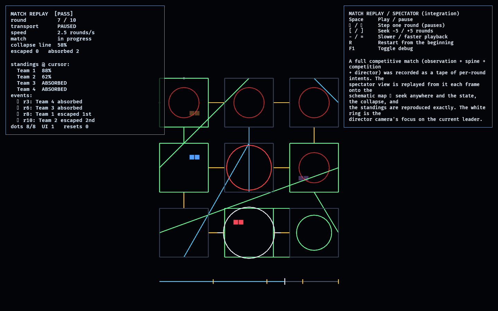

# Match Replay / Spectator

The Match Replay lab is the third **integration** lab (Phase 12) and the payoff of
the workspace's end-to-end determinism. Phase 11's
[`competitive_facility`](../competitive_facility/README.md) produced a full
competitive match — observation + the protected spine + competition + the facility
director, all in one loop. This lab **records that match as a tape and replays it
exactly**, with a spectator/director camera over the schematic map that reads
replayed simulation state, never live entities.

It is the same tape approach proven in [`replay_lab`](../replay_lab/README.md),
lifted from the scalar competition feasibility lab onto the graph-level integrated
match:

- [tape.rs](src/tape.rs) records a `CompetitiveFacility` match round by round,
  capturing the per-round intents (`competition_lab`'s `RaceAction`) plus markers
  for escapes and absorptions. `replay_to(round)` re-feeds those intents to a fresh
  match, reproducing the exact state at any round.
- The spectator view is a **projection**: each frame the cursor's round is
  replayed into a `View(CompetitiveFacility)` resource, and the schematic map,
  collapse, standings, and director focus are all drawn from it.

## Functionality evidence



Captured mid-scrub (`OBSERVED2_CAPTURE`, round 7 of 10, paused): the schematic map
shows the crimson leader near the green exit with the **white director-camera focus
ring** on it, the red collapse eating the back of the spine, and the rewired
structure (cyan). The scrubber timeline (bottom) sits partway with gold event
ticks; the monitor lists the recorded events with the two already passed (•) ahead
of the cursor's two upcoming (·). `[PASS]`, every dot present.

## What it demonstrates

- **Replay over the integrated match** — a full competitive match (three
  higher-level systems at once) records and replays, not just a feasibility lab.
- **Exact, seekable replay** — seeking to round *N* reproduces the state
  bit-for-bit; a test asserts seek == sequential playback and that the view equals
  `replay_to(cursor)`.
- **Presentation is a projection** — the schematic map, the collapse frontier, the
  standings, and the director focus are all read from the replayed simulation, so
  the spectator can scrub anywhere and the picture is always correct.
- **Spectator / director camera** — a non-player camera over the whole facility,
  with a focus ring tracking the current leader (read from sim state).
- **Scrubber with events** — escapes and absorptions are marked on the timeline and
  in the log, flipping from upcoming to passed as the cursor crosses them.

## Controls

- `Space`: play / pause
- `←` / `→`: step one round (pauses)
- `[` / `]`: seek −5 / +5 rounds (pauses)
- `-` / `=`: slower / faster playback
- `R`: restart from the beginning
- `F1`: toggle debug

## Debug visualization

- Schematic map (same projection `competitive_facility` draws live): rooms (green
  when observed), connections **gold** = spine / **green** = pinned / **cyan** =
  free, sealed-wall dots, green exit ring, red collapse rings (largest at the
  frontier)
- Teams: one colour each; escaped brighten, absorbed dim
- **White ring + crosshair**: the director camera's focus on the current leader
- Scrubber timeline: the played span (blue), the cursor (white), and gold event
  ticks
- Monitor panel: round / length, transport, speed, match status, collapse %,
  escaped/absorbed counts, standings at the cursor, the event log (• passed /
  · upcoming), entity health, and a `[PASS]`/`[FAIL]` flag

## Success conditions

1. A full competitive match is recorded to a non-empty tape with escape and
   absorption markers.
2. Replaying to any round reproduces the exact match state; seeking equals
   sequential playback; replaying past the end clamps.
3. The spectator view always equals `replay_to(cursor)` — rendering reads the
   projection, never live entities.
4. Playback, stepping, seeking, and restart all behave; the entity set is stable
   (no leaks across restart).

## Manual verification

1. Run `cargo run -p match_replay`.
2. Watch it play: teams advance the gold spine, the collapse climbs, slower teams
   dim as absorbed, the leader reaches the exit; the focus ring tracks the leader.
3. Press `←`/`→` to step single rounds and `[`/`]` to jump ±5 — the map, collapse,
   and standings update exactly; events flip to passed (•) as the cursor crosses
   them.
4. Press `R` to restart from round 0 and `=`/`-` to change speed.

## Regenerating the evidence screenshot

```powershell
$env:OBSERVED2_CAPTURE = "docs/evidence/match_replay.png"
cargo run -p match_replay
```
