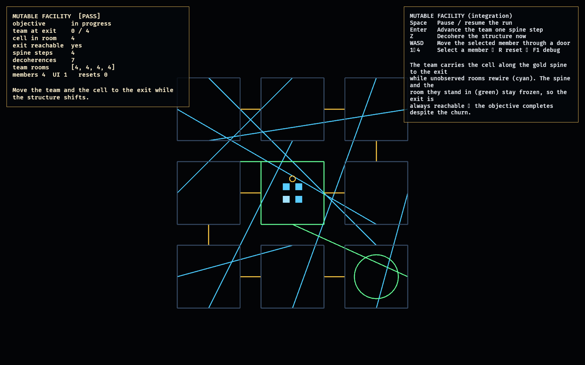

# Mutable Facility

The Mutable Facility is the first **integration** lab of the higher-level arc
(Phase 10). The foundation already proved the moment-to-moment game; the
feasibility labs each proved one risky idea in isolation. This lab folds two of
those proven systems together into a facility with a **win condition** and shows
they hold *as a single playable loop*: a team carries a power cell to the exit
while the megastructure rewires itself behind them.

It **reuses the connection layer wholesale** — [`constraint_lab::ConstraintWorld`](../constraint_lab/src/model.rs),
which itself reuses [`observation_lab`'s graph](../observation_lab/src/model.rs).
The new [model.rs](src/model.rs) adds only the *objective* on top: the team's
occupied rooms drive the observation set (so the rooms they stand in freeze), the
power cell rides with the lead member, and the protected spine guarantees the
exit stays reachable no matter how the rest decoheres. No new connection logic —
the integration is the point.

## Functionality evidence



Captured mid-run (`OBSERVED2_CAPTURE`): the team has walked four steps along the
spine and the structure has decohered seven times. The four members are clumped
in the **frozen green room they observe**, carrying the **gold cell**, while the
unobserved structure has rewired into the **cyan** tangle around them. The
monitor reads `[PASS]`, `exit reachable yes` — the objective is still completable
despite the churn.

## What it demonstrates

- **Integration, not a new mechanic** — observation + the constraint spine
  compose into one loop with an objective, reusing both labs as libraries.
- **Playable under churn** — the team reaches the exit (`team at exit 4/4`,
  `cell in room 8`) while the structure provably keeps rewiring (links differ
  from the authored layout). A test runs the full objective to completion.
- **Observation protects the team** — the rooms the team stands in freeze; the
  protected spine they follow never rewires, so "follow the gold path" always
  works. Tests confirm both the spine and the occupied room hold through
  decoherence.
- **Deterministic** — the same inputs produce the same run (load-bearing for
  replay / networking).

## Controls

- `Space`: pause / resume the auto-run
- `Enter`: advance the whole team one step along the spine
- `Z`: decohere the structure now
- `WASD` / arrows: move the selected member through a door (manual traversal)
- `1`–`4`: select a member · `R`: reset · `F1`: toggle debug

## Debug visualization

- Connection / doorway colours: **gold** = protected spine, **green** =
  observed/frozen, **cyan** = free/mutable, grey dot = sealed wall
- Room borders: green when observed (a team member stands there)
- Exit room: green ring; the power cell: gold ring above the lead member
- Team members: blue dots (the selected one brightens)
- Monitor panel: objective state, team-at-exit count, cell room, exit
  reachability, spine steps, decoherence count, per-member rooms, entity health,
  and a `[PASS]`/`[FAIL]` flag

## Success conditions

1. The team starts at the entrance with the exit reachable.
2. Auto-running (or pressing `Enter`/`Z`) walks the team to the exit while the
   structure rewires; the objective completes with all four members and the cell
   at the exit.
3. The protected spine never rewires, and the room the team occupies stays frozen
   through decoherence.
4. The exit is reachable after every decoherence.
5. The run is deterministic; repeated reset restores the authored entrance with
   no entity leaks.

## Manual verification

1. Run `cargo run -p mutable_facility`.
2. Watch the auto-run: the blue team clump advances along the gold spine; cyan
   connections churn each decoherence; `exit reachable` stays `yes`. The monitor
   ends at `objective COMPLETE`, `team at exit 4/4`.
3. Press `R` to reset, then `Space` to pause and step manually with `Enter`
   (advance) and `Z` (decohere) — the spine and observed rooms hold every time.
4. Select a member with `1`–`4` and nudge it with `WASD` to traverse by hand.

## Regenerating the evidence screenshot

```powershell
$env:OBSERVED2_CAPTURE = "docs/evidence/mutable_facility.png"
cargo run -p mutable_facility
```
