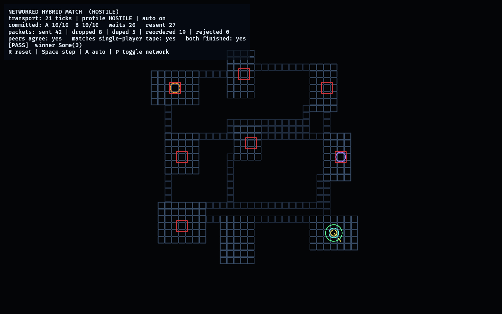

# Networked Hybrid Match

Phase 28 — the **networked first-person match**: the integration of deterministic
lockstep networking with the concrete first-person hybrid match. Run:

```powershell
cargo run -p net_match_lab
```

This is where two proven results meet:

- [`network_lab`](../network_lab/README.md) proved **deterministic lockstep over a
  hostile datagram transport** — loss, delay, duplication, and reordering cause
  stalls, never divergence — with its byte-generic `SimulatedNetwork`.
- [`fps_hybrid_match_lab`](../fps_hybrid_match_lab/README.md) proved the
  **first-person hybrid match is deterministic and replayable** from a stream of
  round actions.

Both peers run the *same* `HybridMatch` and exchange the local team's per-round
action over the hostile transport. The local team has two members (the proven
`MEMBERS_PER_TEAM = 2`), so each member is modelled as a peer that **owns alternate
rounds'** action. A peer commits a round only once it holds the authoritative
action for it — its own for owned rounds, or the **received** one for the
teammate's rounds — so advancing genuinely requires the network. Reliable
resend/ack then guarantees both peers converge on the identical match, maze, and
first-person pose, round-for-round, equal to the single-player tape.

The only new code is the per-round [`ActionPacket`](src/netmatch.rs) wire format and
the reliable action peer; the transport and the match brain are reused wholesale
([`SimulatedNetwork`] gained one public `step()` so a second consumer can drive it).

## Functionality evidence



The 2D map/spectator — the role CLAUDE.md gives the 2D view — driven by the
lockstep-replicated state. Over a **HOSTILE** network (8 dropped, 5 duplicated, 19
reordered packets, 20 waits, 27 resends) both peers committed all 10 rounds
(`A 10/10  B 10/10`); **peers agree: yes**, **matches single-player tape: yes**,
**both finished: yes**, `[PASS]`, winner team 0. The two peers' first-person poses
(the yellow dot with its facing line and the cyan ring over it) coincide exactly —
the same first-person pose reconstructed independently on both clients.

## What it demonstrates

- **A networked first-person match** — the concrete, rerouting maze match is driven
  by an action stream replicated over the network, not a single local sim.
- **Reliable lockstep carries the match** — over a hostile transport the action
  stream is resent until acknowledged; peers stall waiting for the teammate's round
  but never diverge, and eventually commit every round.
- **Frame-exact agreement** — both peers reconstruct bit-identical match state,
  rendered maze, safe/trap route tiles, elevation field, and first-person pose at
  every round (a test compares snapshots field-by-field).
- **Equal to single-player** — both peers' per-round snapshots equal the
  `fps_hybrid_match_lab` single-player tape: the network replicates, it does not
  alter.
- **The transport never changes the outcome** — a clean and a hostile network land
  on the identical final match state (a test asserts it), the networked analogue of
  the determinism the whole project relies on.
- **Live host-authoritative replication** — `LiveNetMatch` is the variant the
  assembled game runs: the host plays the match in first person (driving its body with
  the controller), and each round it resolves is replicated over the hostile transport
  to a remote peer that rebuilds the identical match. Because every resolved round ends
  in a canonical pose (the match places the body in the room centre), the replica's
  per-round snapshots equal the host's **regardless of how the player physically
  walked there** — so live first-person play is bit-exactly network-replicable.

## Controls

- `Space`: advance one transport tick (manual stepping)
- `A`: toggle auto-run
- `P`: toggle the network profile (HOSTILE ⇄ CLEAN) and restart the session
- `R`: reset

## Debug visualization

- The rerouting maze (rooms + corridors) as a top-down map.
- The green exit ring, red collapse rooms, and the four team markers (escaped teams
  brighten toward white).
- Peer 0's first-person pose as a bright dot + facing line; peer 1's pose as a ring
  over it (they coincide once synchronized).
- A stats panel: transport ticks, per-peer committed rounds, waits, resends, the
  raw packet loss/duplication/reorder counts, whether the peers agree and match the
  single-player tape, and a `[PASS]` / `[ ... ]` health line.

## Manual verification

1. `cargo run -p net_match_lab` — it auto-runs the HOSTILE network. Watch
   `committed` climb on both peers despite `dropped`/`duped`/`reordered` rising;
   the line settles on `[PASS]` with `peers agree: yes` and `matches single-player
   tape: yes`.
2. Press `R` — it restarts at tick 0 and re-converges.
3. Press `P` — it switches to CLEAN and converges in far fewer ticks with zero
   drops, landing on the identical final state.
4. Press `A` to stop auto-run, then `Space` to single-step the transport and watch
   one peer wait for the other's round before committing.

## Tests

`cargo test -p net_match_lab` covers the pure model and the Bevy lifecycle:

- the action packet round-trips and rejects corruption;
- a peer will not commit a teammate's round until it arrives (it waits);
- clean and hostile networks both converge to the single-player tape;
- hostile loss/delay/duplication/reordering still converge (with real adversity);
- both peers reconstruct the identical match, maze, and first-person pose;
- the networked match resolves to the competitive result (team 0 wins);
- the transport does not change the outcome (clean == hostile final state);
- live host play replicates to the remote over a hostile network, round-by-round
  (`LiveNetMatch`), with the replica's snapshots exactly equal to the host's;
- the lab boots with camera/UI, drives to convergence over frames, resets without
  leaks, and toggles the network profile.
