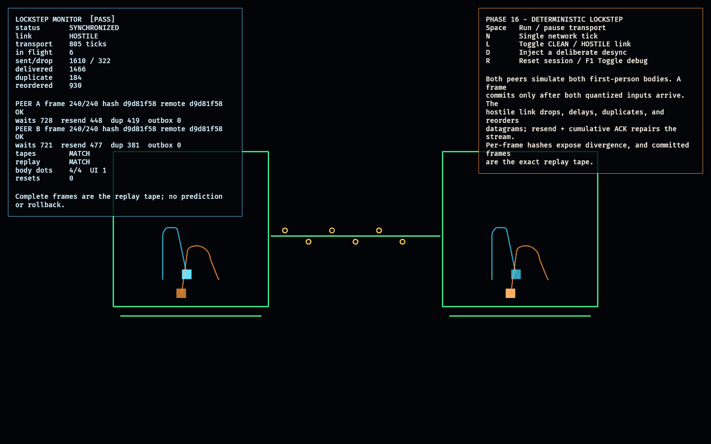

# Deterministic Lockstep Lab

Phase 16 proves the networking premise carried through the whole workspace:
deterministic simulation plus an input tape can become a reliable lockstep
protocol without changing gameplay systems.

Two peers each own one quantized `PlayerIntent`, but both peers simulate both
first-person bodies using Phase 20's fixed-step
`fps_controller_lab::step_body`. A simulation frame commits only when both peer
inputs for that exact frame are present. The committed frame is simultaneously
the replay tape entry.

The lab's hostile transport deterministically introduces delay, jitter, packet
loss, duplication, and reordering. Packets carry cumulative acknowledgements;
unacknowledged inputs are resent and duplicate frames are ignored. Every status
packet also carries the sender's latest committed-frame state hash. Peers compare
hashes for matching frames and expose a desync immediately.

The packet codec is manual and checksummed rather than using a serialization or
networking plugin. A focused test sends the encoded packet through real localhost
UDP sockets; the visible lab uses a deterministic transport emulator so adverse
conditions and their recovery are repeatable.

## Functionality evidence



The captured hostile run shows both peer projections at frame 240/240 with
matching local/remote hashes, matching tapes, and exact replay. The transport
monitor also shows non-zero drops, duplicates, reordering, resend counts, and
lockstep wait ticks before eventual synchronization.

## What it demonstrates

- **Complete-frame lockstep** — neither peer advances without both frame inputs;
  there is no speculative prediction hidden in the lab.
- **Reliable inputs over unreliable datagrams** — cumulative ACK plus resend
  repairs deterministic loss; duplicate inputs are idempotent.
- **Delay and reordering safety** — inputs are keyed by frame and commit only in
  ascending frame order.
- **Existing first-person simulation over the network** — wire inputs reconstruct
  the shared `PlayerIntent` and drive Phase 20's fixed-step controller.
- **Desync detection** — peers exchange hashes for committed frame numbers; the
  `D` control deliberately changes one peer and is detected.
- **Replay is the network history** — both peers produce the same committed frame
  tape, and replaying it from a fresh world reproduces the final state hash.
- **Real datagram compatibility** — the checksummed byte packet round-trips over
  standard-library UDP loopback in the test suite.

## Controls

- `Space`: run or pause transport
- `N`: process one network tick while paused
- `L`: reset and switch between `CLEAN` and `HOSTILE` link profiles
- `D`: inject deliberate state divergence on Peer A
- `R`: reset the session
- `F1`: toggle debug visualization

## Debug visualization

- One top-down projection per peer, each rendering both simulated FPS bodies
- Body trails generated independently from each peer's committed frames
- Per-peer frame progress bars
- Central link colored green while hashes agree and red on detected desync
- In-flight packet markers
- Monitor panel: peer frames and local/remote hashes, wait ticks, resend and
  duplicate counts, outbox depth, sent/dropped/delivered/duplicated/reordered
  transport totals, tape equality, replay equality, entity health, and
  `[PASS]`/`[FAIL]`

## Success conditions

1. A peer cannot commit a frame until both local and remote inputs exist.
2. A packet survives encode/decode exactly; corrupt or incompatible packets are
   rejected, and the encoding crosses UDP loopback.
3. Under hostile loss, delay, duplication, and reordering, resend/ACK eventually
   advances both peers to the target frame.
4. Both peers finish with identical frame counts, simulation hashes, and committed
   tapes.
5. Replaying either tape from a fresh world reproduces that peer's final state
   hash.
6. Deliberately changing one peer is reported as a desync for the matching frame.
7. Repeated reset restores a fresh session with four body projections and one UI
   root, without entity leaks.

## Manual verification

1. Run `cargo run -p network_lab`.
2. Watch the hostile run. Both frame bars pause at different moments while packets
   are missing, then catch up as resends arrive. It must finish `SYNCHRONIZED`,
   with tapes and replay reading `MATCH`.
3. Press `R` (the fresh session is paused), then `N` repeatedly. No peer should pass a frame
   whose remote input is still missing.
4. Press `L` to compare the clean link with the hostile link. Both must converge;
   only the hostile run should accumulate drops, duplicates, reorderings, waits,
   and resends.
5. After synchronization, press `D`. The central link and peer status must turn
   red and report `DESYNC` at the shared frame.
6. Press `R` repeatedly; entity health must remain `[PASS]`.

## Scope and known limitation

This phase proves the lockstep protocol and real UDP packet compatibility. It does
not solve internet relay/NAT traversal, lobby discovery, authentication, host
migration, or cross-version compatibility. Session formation belongs to Phase 17.
The exact floating-point hash is certified here for peers running the same build
and platform; cross-platform numerical certification remains a production hardening
step, not an assumption.

## Regenerating the evidence screenshot

```powershell
$env:OBSERVED2_CAPTURE = "docs/evidence/network_lab.png"
cargo run -p network_lab
```
