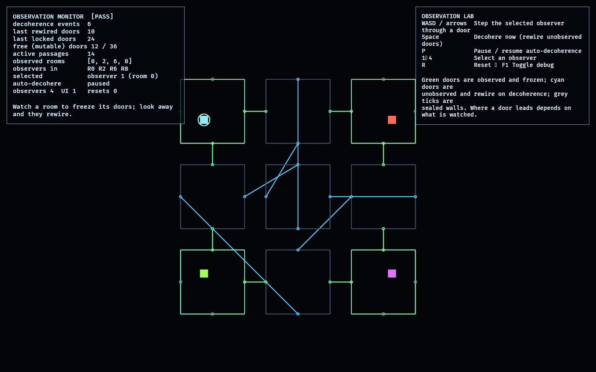

# Observation Lab

The Observation Lab is the **first feasibility lab beyond the 2D foundation** — it
isolates the game's defining concept: a megastructure whose connections change
**when unobserved** and collapse to a fixed state **when observed**.

The structure is a 3×3 grid of rooms, each with four doorways. Doorways are paired
into a perfect matching ([model.rs](src/model.rs)); a doorway linked to itself is a
sealed wall. A room is *observed* while an observer occupies it, which pins every
doorway of that room — and its partner — so observed connections are frozen. A
*decoherence* event re-matches only the unobserved, unpinned doorways,
deterministically from a seed, so the same observation reproduces the same
rewiring (replayable and testable). Walking through a doorway follows its current
link, so **where a door leads depends on what has been watched**.

This is a feasibility probe, not gameplay: it answers "can the mutable-graph /
observation mechanic be modelled cleanly, validly, and deterministically?" before
any of it is wired into the facility.

## Functionality evidence



Captured from the running lab (`OBSERVED2_CAPTURE`): four observers watch the
four corner rooms, so those connections stay **green and frozen**, while the
unobserved interior has been decohered six times — its doors have **rewired into
cyan chords** that cross the structure. The monitor reads `[PASS]` with the
observed rooms locked and the rest mutable.

## What it demonstrates

- **Collapse on observation** — every doorway of an observed room (and its
  partner) is pinned; observed connections never change between or during
  decoherence.
- **Decohere when unobserved** — unobserved, unpinned doorways are re-matched into
  a fresh valid perfect matching on each decoherence event.
- **Determinism** — decoherence is driven by a seeded PRNG, so the same state
  produces the same rewiring (a basis for replay/spectator later).
- **Validity** — the matching is always a symmetric involution; sealed walls are
  self-links.
- **Traversal through links** — stepping through a door moves to the linked room,
  so a wall watched today may be a passage once you look away.

## Controls

- `WASD` / arrows: step the selected observer through a door on that side
- `Space`: decohere now (rewire all unobserved doors)
- `P`: pause / resume auto-decoherence (on by default, every 2.5 s)
- `1`–`4`: select an observer
- `R`: reset · `F1`: toggle debug

## Debug visualization

- Room borders brighten when observed
- Doorway dots: green when pinned/frozen, cyan when free/mutable; grey for sealed
  walls
- Connection lines: green for observed/frozen passages, cyan for mutable ones
- Monitor panel: decoherence count, doors rewired / locked on the last event,
  free vs total doors, active passages, observed rooms, each observer's room, and
  a `[PASS]`/`[FAIL]` entity-health flag

## Success conditions

1. The matching is always a valid symmetric involution.
2. Observed rooms' doorways do not change across decoherence.
3. Unobserved doorways rewire; the same seed/state reproduces the same result.
4. Stepping through a door follows its current link; a sealed wall blocks.
5. Repeated reset restores the authored structure with no leaked entities.

## Manual verification

1. Run `cargo run -p observation_lab`.
2. Press `P` to pause auto-decoherence, then `Space` a few times: the rooms your
   observers occupy keep their (green) connections while the rest (cyan) rewire.
3. Select an observer (`1`–`4`) and step it with `WASD`; watch the now-vacated
   room start changing on the next `Space`.
4. Step into a door and note the destination room change after the connection
   rewires.
5. Press `R`; the monitor returns to the authored structure and stays `[PASS]`.

## Regenerating the evidence screenshot

```powershell
$env:OBSERVED2_CAPTURE = "docs/evidence/observation_lab.png"
cargo run -p observation_lab
```
