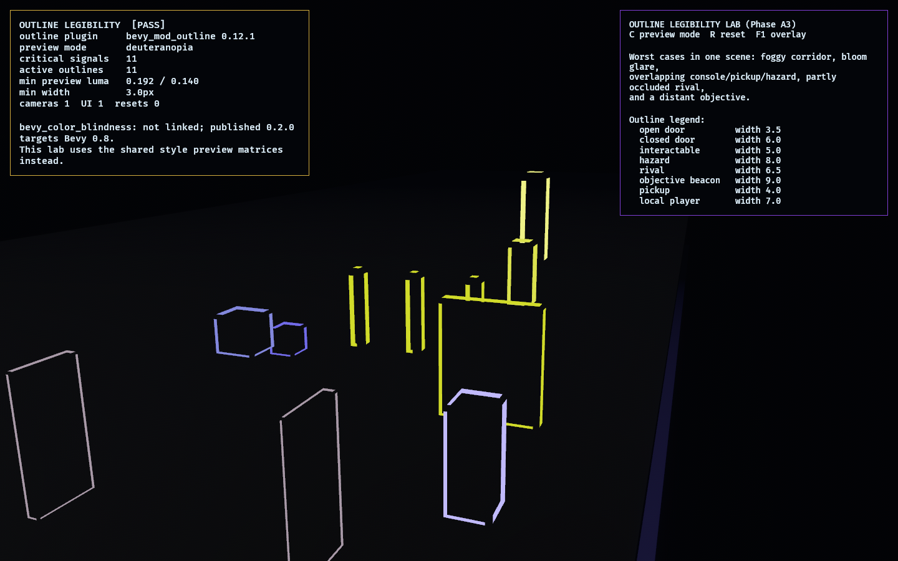

# Outline Legibility Lab

**Phase A3** of the [Bevy asset-integration roadmap](../../docs/bevy_asset_integration_roadmap.md):
the legibility overlay candidate, [`bevy_mod_outline`](https://crates.io/crates/bevy_mod_outline).

It answers one question: **can gameplay-critical state stay readable in
neon-noir presentation under fog, bloom, motion, overlap, distance, and
color-vision preview?** The lab uses `bevy_mod_outline 0.12.1` for actual mesh
outlines and drives every critical outline color and width from
[`observed_style`](../../crates/observed_style). No gameplay signal chooses a
local color or local outline width.

Compatibility gate: `bevy_mod_outline 0.12.1` depends on Bevy `0.18` and builds
against the workspace's pinned Bevy `0.18.1`. The researched
`bevy_color_blindness` crate is **not linked**: its only published version,
`0.2.0`, depends on Bevy `0.8.0`. This lab keeps color-vision checks as a
dev-only projection through pure `observed_style` preview matrices instead of
pulling an incompatible Bevy line.

## Functionality Evidence



The scene deliberately stacks worst cases: a foggy corridor, bright hazard bloom,
overlapping console/pickup/hazard signals, a partly occluded moving rival, and a
distant objective beacon. `C` cycles normal/protanopia/deuteranopia/tritanopia/
achromatopsia preview colors.

## What It Demonstrates

- **Semantic outlines**: doors, interactables, hazards, rivals, objective beacons,
  pickups, and the local player proxy use `observed_style::outline`.
- **Width is semantic**: roles differ by outline width as well as hue, so the
  preview does not rely on color alone.
- **Color-vision checks**: pure style tests assert every outline keeps minimum
  simulated luminance under the preview modes.
- **Reset is clean**: `R` despawns and rebuilds the scene without leaking cameras,
  UI roots, or outlined signal entities.

## Controls

- `C`: cycle color-vision preview mode
- `R`: reset/rebuild the scene
- `F1`: toggle the debug overlay

## Success Conditions

1. The overlay shows `[PASS]`.
2. All gameplay-critical objects are outlined with treatments from
   `observed_style`.
3. Preview modes keep all signal outlines above the style luminance floor.
4. Reset leaves one camera, one UI root, and the same spawned scene count.

## Decision

`bevy_mod_outline` remains a live candidate for promotion if another lab or the
assembled game needs the same semantic outline projection. Promotion is deferred
until a second consumer exists.

`bevy_color_blindness` is rejected for direct integration while the workspace is
pinned to Bevy `0.18.1`, because the published crate is Bevy `0.8`-only. Keep the
pure style preview path unless a compatible crate version appears.

## Regenerating The Evidence Screenshot

```powershell
$env:OBSERVED2_CAPTURE = "docs/evidence/outline_legibility_lab.png"
cargo run -p outline_legibility_lab
```
