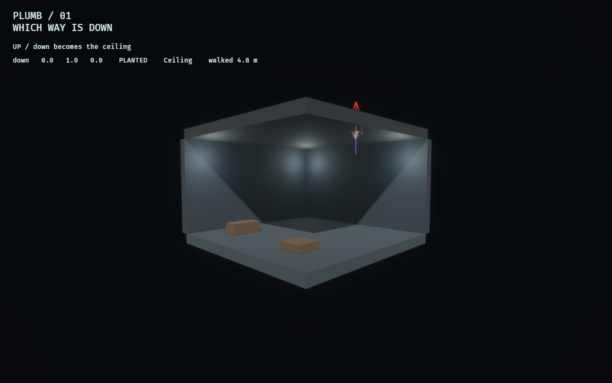

# Plumb / 01 — Which way is down

A prerequisite feasibility lab for the *plumb* — a tool that tells one body
that "down" is some other direction for a while.

One room, one Modron, and the same question asked five times: **if the subject
is told down is that way, does it fall to that surface, stay on it, and walk
along it?**

```bash
cargo dev-run -p plumb_lab            # watch it
cargo run -p plumb_lab -- --report    # the headless answer
```



## The answer

Yes, for a body that is not the Observer.

```
phase                                                 settled    surface    walked  verdict
DOWN / the control: a plumb that agrees with the world      16t      Floor      9.5m       ok
EAST / down becomes a wall                                  62t       Wall      9.5m       ok
UP / down becomes the ceiling                               59t    Ceiling      9.5m       ok
NORTH / down becomes the far wall                           51t       Wall      9.5m       ok
RELEASE / the plumb wears off and the floor takes it back    59t      Floor      3.6m       ok
```

It rests on all six kinds of surface, holds there for as long as the plumb
lasts, walks several metres along each one, and comes back to the floor when it
wears off. `walked` counts only motion *along* the surface, so a body that
merely slid under gravity would not accumulate it.

## Why it works

Two facts, and the lab is mostly the second one.

**Rapier gives you per-body gravity.** `set_gravity_scale(0.0)` takes the body
out of world gravity and `add_force` supplies the replacement. A user force
persists until `reset_forces`, so a plumb is applied once when it lands and
cleared when it expires — not re-applied every tick.

**Rapier's character controller takes `up` as a vector, not an assumption.**
`KinematicCharacterController { up, .. }` and its `grounded` result are both
relative to whatever up you give it, so the same controller that walks a floor
walks a wall if you tell it which way is up. That is the fact the whole concept
turns on, and it is why "walking on the ceiling" needed no new locomotion code.

Movement resolves through the controller and is applied as a *tangential*
velocity, leaving the component along the plumb to the plumb. Rotations stay
locked and the rig's attitude is driven from the plumb instead, because a body
that tumbles tells you nothing about whether it is standing on a wall.

## What had to be generalised

The grounded test. The kinetic labs ask `manifold.normal.y * sign > 0.5` — the
normal against `Vec3::Y` — which is exactly the assumption a plumb breaks. Here
it is compared against the current up, and it reports which room surface won, so
the report can say *which* surface the subject came to rest on rather than just
that it stopped falling.

## What this does not answer

**Lashing the Observer.** Rapier's controller would take it, but
`observed_traversal`'s wrapper does not expose `up`, and −Y is baked into jump,
ground-snap, the kinetic labs' `support_height`/`walkable` ray casts, the
navigation graph's height bands, and the fall-to-void rule. That is a separate
piece of work, and this lab deliberately does not pretend otherwise.

**Whether it is a weapon.** Nothing here kills anything. The neighbouring
finding is that the tile corpus seals every edge, so a shove has nowhere to send
a body; a plumb pointed at a ceiling or a wall does not obviously fix that,
because the room is closed in those directions too. What it plainly *does* give
is traversal and control — a body parked on a ceiling for a few seconds is out
of the fight. Whether that is worth a tool is the next question, not this one.

## Verification and evidence

```bash
cargo fmt --all
cargo dev-clippy
cargo dev-test
cargo run -p plumb_lab -- --report
OBSERVED2_CAPTURE_SEQUENCE=/tmp/plumb-frames cargo dev-run -p plumb_lab
ffmpeg -y -framerate 30 -i /tmp/plumb-frames/frame_%04d.png \
  -c:v libx264 -pix_fmt yuv420p -crf 20 -preset slow -movflags +faststart \
  docs/evidence/plumb_lab/plumb.mp4
```

Five tests carry the claim: every surface, walking on each, holding on the
ceiling past the point where a thrown body would have fallen off, expiry
returning the subject to the world, and tick-for-tick reproducibility including
a mid-flight clone. [Evidence and the recording](../../docs/evidence/plumb_lab/README.md).

The camera is a fixed cutaway from outside the room, with the two near walls
omitted from presentation only — the subject stands on one of them in the east
phase, so they exist in collision.
