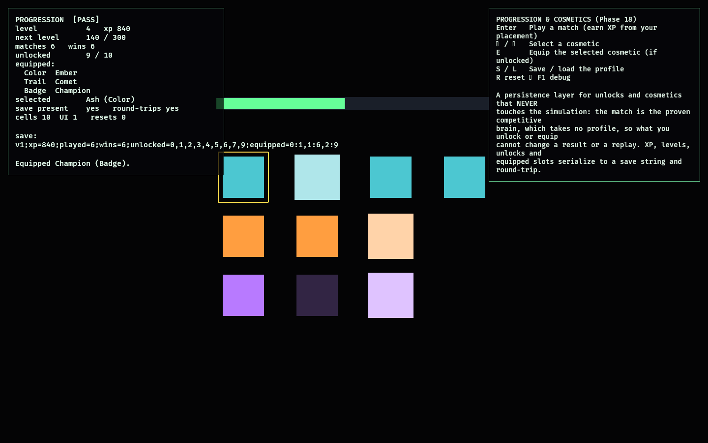

# Progression & Cosmetics

Phase 18 — the final carried-forward feasibility lab. It is a **persistence layer
for unlocks and cosmetics that, by construction, never touches simulation
determinism**.

A `Profile` ([model.rs](src/model.rs)) accrues XP from match placements, levels up,
and unlocks cosmetics by **level** or **win** thresholds; cosmetics are equipped one
per slot (Color / Trail / Badge); the whole profile **serializes to a compact save
string and round-trips**. The defining property is *orthogonality*: nothing here
feeds the match. The match is run by the proven
[`competitive_facility`](../competitive_facility/README.md) brain, which takes no
profile and reads no cosmetics — so what you unlock or equip cannot change a result
or a replay. A test plays the deterministic match before and after a fully
progressed, fully cosmeticized profile and asserts the outcome is identical.

## Functionality evidence



After six match wins: `level 4`, `xp 840`, `unlocked 9 / 10` (Veteran, a level-5
badge, is still the dim cell), with Ember / Comet / Champion equipped across the
three slots. The save string
`v1;xp=840;played=6;wins=6;unlocked=0,1,2,3,4,5,6,7,9;equipped=0:1,1:6,2:9` is shown
and `round-trips yes`. The monitor reads `[PASS]`.

## What it demonstrates

- **Earned progression** — placements award XP (better finishes pay more); crossing
  a level or win threshold unlocks the cosmetics gated on it.
- **Equip is validated** — only unlocked cosmetics can be equipped, one per slot;
  equipping replaces the slot.
- **Persistence** — the profile serializes to a deterministic save string and parses
  back to the same state; malformed saves are rejected.
- **Orthogonal to the simulation** — the match takes no profile, so progression and
  cosmetics provably cannot affect a result or replay (a test runs the match before
  and after a maxed profile and asserts the placements are identical).
- **Deterministic** — the same sequence of placements produces the same profile.

## Controls

- `Enter`: play a match (the proven competitive match) and earn XP from your placement
- `←` / `→`: select a cosmetic · `E`: equip the selected (if unlocked)
- `S` / `L`: save / load the profile (via the in-memory save slot)
- `R`: reset · `F1`: toggle debug

## Debug visualization

- A grid of cosmetic cells, one row per slot (Color / Trail / Badge): bright when
  equipped, full colour when unlocked, dim when locked; a gold outline marks the
  current selection
- An XP bar showing progress toward the next level
- Monitor panel: level, XP, next-level progress, matches/wins, unlocked count,
  equipped per slot, selection, the save string and whether it round-trips, entity
  health, and a `[PASS]`/`[FAIL]` flag

## Success conditions

1. Playing matches awards XP and raises the level; level/win thresholds unlock the
   right cosmetics.
2. Only unlocked cosmetics equip; equipping is per slot.
3. The profile serializes and round-trips; malformed saves are rejected.
4. The deterministic match result is identical regardless of profile or equipped
   cosmetics (progression never touches the simulation).
5. Reset restores a fresh profile with no entity leaks.

## Manual verification

1. Run `cargo run -p progression_lab`.
2. Press `Enter` several times: XP climbs, the level rises, and cosmetic cells light
   up as they unlock. Select with `←`/`→` and `E` to equip; try equipping a dim
   (locked) cell — it is refused.
3. Press `S` to save (the save string appears), `R` to reset, then `L` to load it
   back — the profile returns to the saved state.

## Regenerating the evidence screenshot

```powershell
$env:OBSERVED2_CAPTURE = "docs/evidence/progression_lab.png"
cargo run -p progression_lab
```
