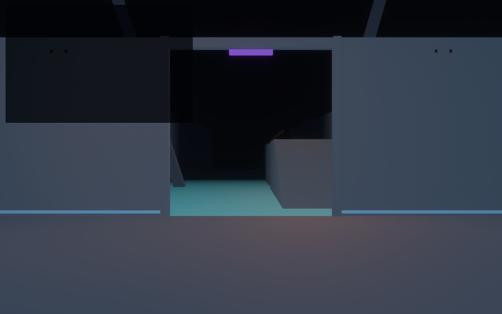
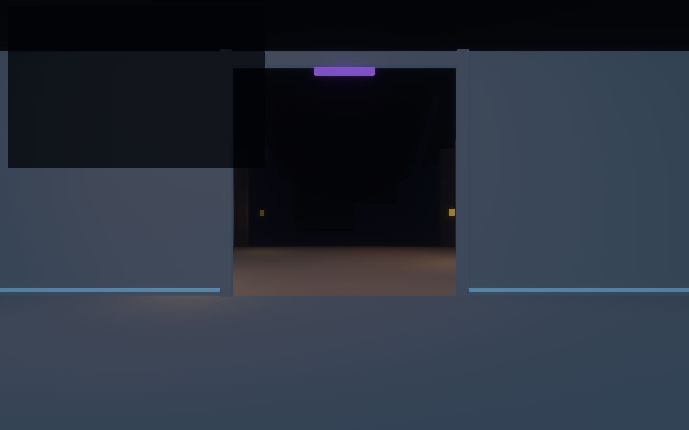

# Rapier Aesthetic Recreation Lab

This lab asks whether the authored TrenchBroom/Rapier/portal pipeline can retain the
game's already-proven visual identity instead of collapsing into generic greybox art.

| Archive Gantry / BLAME register | Reactor Colonnade / Silo register |
| --- | --- |
|  |  |

It reuses `rapier_portal_lab`'s verified Gantry + Colonnade composition and applies:

- The shared `observed_style` semantic treatments—never map-authored colours.
- A cool Archive/BLAME-like Gantry register: dark mass, cyan route structure,
  amber commitment edges, and a distant pale key.
- A warm Reactor/Silo-like Colonnade register: concrete darkness and separated
  pools of warm practical light.
- HDR, natural bloom, district fog, sparse ambient fill, and shadowed key lighting.
- Signal-kit markers that remain above the Legibility Contract's luminance floor.
- The corrected threshold rule: player observation freezes without changing the
  indicator; an anchor uses the shared Control treatment and lights it.

## Controls

- `WASD`, `Shift`, `Space`, arrow keys: move/look
- `B`: request BLAME while unobserved
- `E`: toggle anchor
- `R`: reset
- `F1`: toggle the legend

Capture a review image with:

```powershell
$env:OBSERVED2_CAPTURE = "docs/evidence/rapier_aesthetic_lab"
cargo run -p rapier_aesthetic_lab
```

Capture mode writes `rapier_aesthetic_gantry.png` and
`rapier_aesthetic_colonnade.png`, holding the anchor signal constant while the
unobserved WFC order changes between shots.
