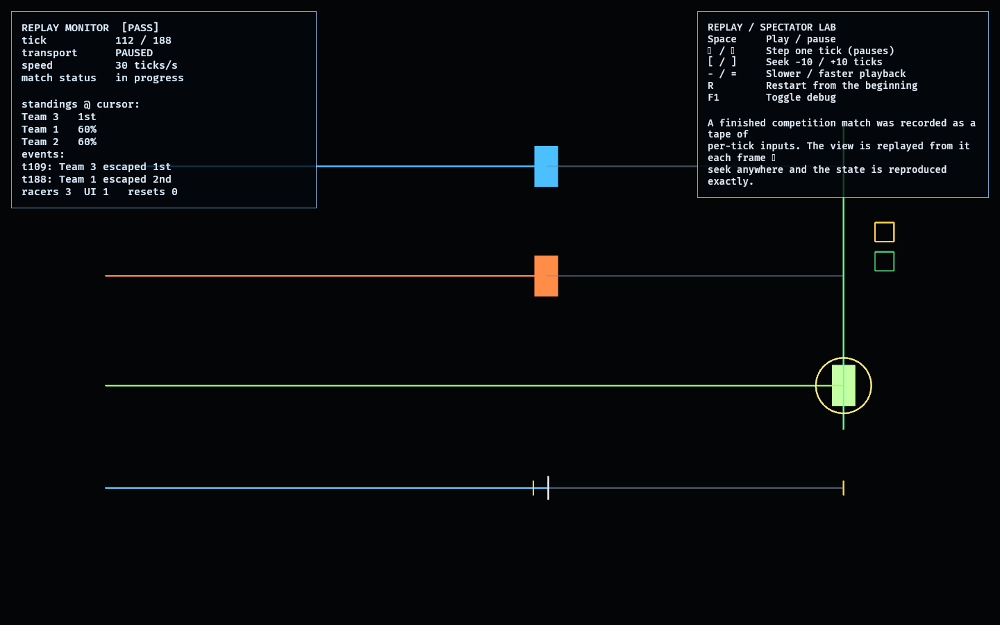

# Replay / Spectator Lab

The fifth feasibility lab beyond the foundation probes **replay and spectator
presentation**. It is the payoff of a property every model in this workspace was
built to have: **determinism**.

A match is recorded as a compact **tape** ([tape.rs](src/tape.rs)) — a fixed
timestep plus the per-tick inputs — and **replayed exactly** by re-feeding those
inputs to a fresh world. A spectator seeks to any tick by replaying up to it; the
rendered state is read straight from the simulation, never reconstructed from
rendering entities (per `AGENTS.md`). The recorded match reuses the deterministic
`competition_lab`, so this proves replay over a real system.

## Functionality evidence



The spectator parked mid-replay at tick 112 / 188, paused (captured via
`OBSERVED2_CAPTURE`). The standings shown are reproduced *at the cursor* (Team 3
already escaped 1st; Teams 1 and 2 at 60%), and the scrubber timeline carries the
two escape-event markers.

## What it demonstrates

- **Exact replay** — replaying the tape to tick N reproduces the simulation state
  bit-for-bit (a test asserts seek-to-N equals sequential playback to N).
- **Scrubbing / seek** — the spectator jumps to any tick; state is recomputed by
  replay, so it is always exact and consistent backward and forward.
- **Transport controls** — play/pause, single-step, ±10 seek, variable speed,
  restart.
- **State-driven presentation** — the renderer reads a replayed `CompetitionWorld`
  projection, never live gameplay entities.
- **Event markers** — notable ticks (escapes) are recorded for the scrubber.

## Controls

- `Space`: play / pause
- `←` / `→`: step one tick (pauses)
- `[` / `]`: seek −10 / +10 ticks
- `-` / `=`: slower / faster playback
- `R`: restart from the beginning · `F1`: toggle debug

## Debug visualization

- One lane per team with progress toward the exit, the control holder, and the
  capacity-limited exit slots — all read from the replayed view at the cursor
- A **scrubber timeline** with the play cursor and gold event markers
- Monitor panel: cursor tick / length, transport state, speed, match status,
  standings at the cursor, recorded events, and a `[PASS]`/`[FAIL]` flag

## Success conditions

1. Replaying to a tick reproduces the exact recorded state (deterministic).
2. Seeking to tick N equals stepping the world N times with the tape.
3. Replay past the end clamps; events are marked in tick order.
4. The presentation reads the replayed projection, not live entities.
5. Repeated restart/seek leaves the lab consistent with no leaked entities.

## Manual verification

1. Run `cargo run -p replay_lab`.
2. Let it play; press `Space` to pause, then `←`/`→` to step and `[`/`]` to seek.
3. Scrub back and forth across an escape marker and confirm the standings and
   racer positions reproduce exactly at each tick.
4. Press `R` to restart; the cursor returns to 0 and playback resumes.

## Regenerating the evidence screenshot

```powershell
$env:OBSERVED2_CAPTURE = "docs/evidence/replay_lab.png"
cargo run -p replay_lab
```
