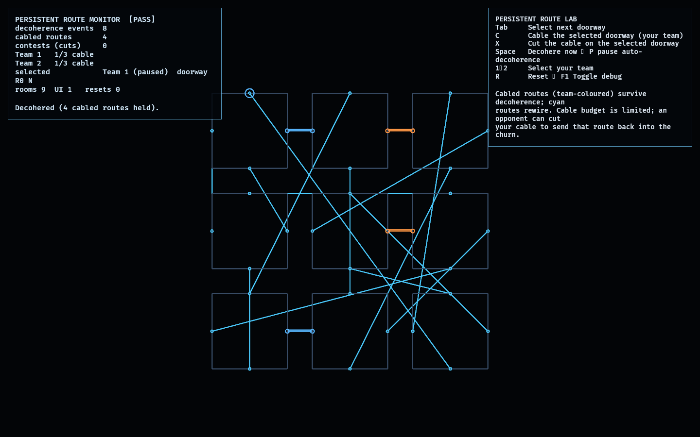

# Persistent Route Lab

This feasibility lab deepens "persistent route infrastructure" from the *authored*
spine proven in `constraint_lab` into routes the **players** build and defend.

The structure still rewires when unobserved (reusing `observation_lab`'s graph,
with no observers — persistence here comes only from cables). A team lays a
**cable** on a doorway to pin its current connection, so that route survives every
decoherence — a reliable highway through the churn ([model.rs](src/model.rs)).
Cables are budget-limited per team and **contestable**: an opponent can cut one,
sending those doorways back into the rewiring; the owner can recover their own
cable to reclaim the budget.

## Functionality evidence



Both teams laid cables and the structure decohered eight times around them
(captured via `OBSERVED2_CAPTURE`). The four team-coloured cabled routes held as
clean straight segments while every other connection (cyan) rewired into chords —
`cabled routes 4`, `decoherence events 8`, monitor `[PASS]`.

## What it demonstrates

- **Player-built persistence** — a cabled route survives every decoherence
  (a test pins one and decoheres 50 times; it never changes), while uncabled
  doorways keep rewiring.
- **Budget-limited** — each team has a fixed number of cables; deploys are denied
  once the budget is spent.
- **Contestable** — an opponent can cut a cable (counted as a contest), returning
  that route to the churn; the doorways were not the owner's to keep.
- **Recoverable** — cutting your own cable refunds the budget.
- **Deterministic** — the same cables + decoherence sequence reproduce the same
  structure.

## Controls

- `Tab`: select the next doorway
- `C`: cable the selected doorway for your team
- `X`: cut the cable on the selected doorway
- `Space`: decohere now · `P`: pause/resume auto-decoherence
- `1` / `2`: select your team · `R`: reset · `F1`: toggle debug

## Debug visualization

- The 3×3 room grid with every connection drawn: **team-coloured** (with a
  doubled strand) for cabled routes, **cyan** for free routes, grey for sealed
  walls
- A ring on the selected doorway in the selected team's colour
- Monitor panel: decoherence count, number of cabled routes, contests, each
  team's remaining cable budget, the selected doorway, and a `[PASS]`/`[FAIL]`
  flag

## Success conditions

1. A cabled route never changes across decoherence; uncabled routes do.
2. Cable budget is limited per team.
3. An opponent's cut frees the route and counts as a contest; recovering your own
   cable refunds the budget.
4. The matching stays a valid involution after every deploy/cut/decohere.
5. Repeated reset restores full budgets, no cables, and a fresh structure.

## Manual verification

1. Run `cargo run -p route_lab`.
2. `Tab` to a doorway with a useful connection, press `C` to cable it, then
   `Space` repeatedly — the cabled route holds while the rest rewires.
3. Switch to team 2 (`2`), `Tab` to the opponent's cabled doorway, and `X` to cut
   it; confirm `contests` rises and the route rejoins the churn on the next
   decohere.
4. Cable your own route and `X` it; confirm your budget is refunded.

## Regenerating the evidence screenshot

```powershell
$env:OBSERVED2_CAPTURE = "docs/evidence/route_lab.png"
cargo run -p route_lab
```
