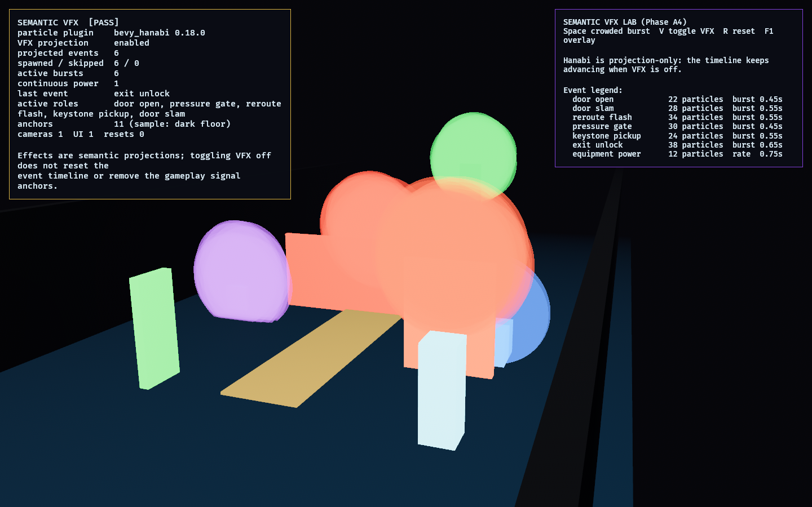

# Semantic VFX Lab

**Phase A4** of the [Bevy asset-integration roadmap](../../docs/bevy_asset_integration_roadmap.md):
the semantic particle-effects candidate, [`bevy_hanabi`](https://crates.io/crates/bevy_hanabi).

It answers one question: **can particle effects improve readability without
becoming decorative noise or nondeterministic gameplay state?** The lab keeps
`bevy_hanabi 0.18.0` isolated here, drives all effect colors from
[`observed_style`](../../crates/observed_style), and treats particles as a
projection of deterministic semantic events.

Compatibility gate: `bevy_hanabi 0.18.0` is the Bevy `0.18` line and builds
against the workspace's pinned Bevy `0.18.1`. The lab disables default features
and enables only `3d` integration.

## Functionality Evidence



The scene contains open/closed doors, a pressure gate, a rerouting route spine, a
pickup, an exit objective, a local player proxy, and powered equipment. The
`Space` key fires the crowded worst-case burst. `V` toggles VFX projection off:
the event timeline still advances and the gameplay signal anchors remain.

## What It Demonstrates

- **Event-projected effects**: door open, door slam, reroute flash, pressure
  gate, keystone pickup, exit unlock, and equipment power are named semantic
  roles in the pure model.
- **Style-owned color**: every effect uses `observed_style` treatments; the lab
  does not invent local gameplay colors.
- **Projection toggle**: VFX can be disabled without resetting or changing the
  semantic event timeline.
- **Readable limits**: tests cap effect particle size, count, and lifetime so
  the effects do not swallow doors, hazards, players, or objectives.
- **Reset is clean**: `R` despawns and rebuilds the scene without leaking
  cameras, UI roots, signal anchors, or effect instances.

## Controls

- `Space`: fire the crowded worst-case burst
- `V`: toggle VFX projection
- `R`: reset/rebuild the scene
- `F1`: toggle the debug overlay

## Success Conditions

1. The overlay shows `[PASS]`.
2. All seven semantic VFX roles are listed and mapped to shared style
   treatments.
3. Toggling VFX off stops particle projection but keeps event projection and
   gameplay signal anchors intact.
4. Reset leaves one camera, one UI root, one continuous equipment effect, and
   the same spawned scene count.

## Decision

`bevy_hanabi` remains a live candidate for readability-focused VFX, but it stays
lab-local. Do not promote a shared `SemanticVfx` presentation layer until a second
visible consumer, such as another lab or the assembled game, needs the same event
projection.

## Regenerating The Evidence Screenshot

```powershell
$env:OBSERVED2_CAPTURE = "docs/evidence/semantic_vfx_lab.png"
cargo run -p semantic_vfx_lab
```
