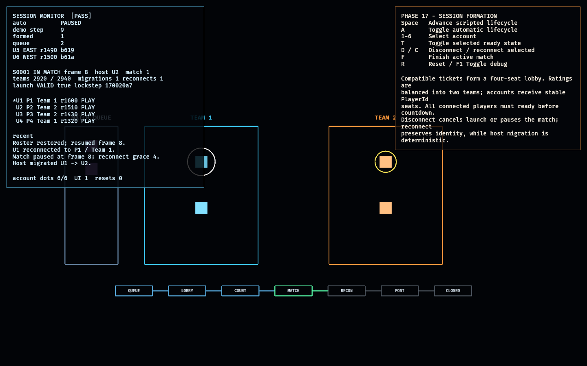

# Matchmaking / Session Formation Lab

Phase 17 proves the boundary between queued accounts and the deterministic
networked match. It deliberately does not run gameplay: its output is a validated
launch manifest containing stable `PlayerId`/`TeamId` assignments, protocol/build
compatibility, host, seed, and lockstep session identity.

The pure model covers two connected responsibilities:

1. A deterministic matchmaker chooses the oldest compatible four-player group.
   Region, build, and a bounded rating spread are explicit constraints.
2. The formed session owns lobby readiness, countdown, host migration, reconnect
   grace, match launch, post-match rematch, and terminal cleanup.

Accounts remain local session identities. Canonical gameplay identities are
assigned only after a roster exists: accounts sorted by stable `AccountId` receive
`PlayerId(0..3)`, while a deterministic rating-aware allocator creates two teams
of two with near-equal totals.

## Functionality evidence



The captured lifecycle has formed a West/build-compatible roster, left two
incompatible tickets queued, emitted a valid launch manifest, advanced to frame
8, migrated the host after a disconnect, and reconnected the original host
without changing its player seat or team. The monitor shows one migration, one
reconnect, balanced team totals, and `[PASS]` entity health.

## What it demonstrates

- **Deterministic matchmaking** — queue ordering is stable by enqueue time and
  account; reversing API arrival order does not change the selected roster.
- **Compatibility gates** — region, build, roster size, and skill spread are
  checked before formation; incompatible tickets remain queued.
- **Balanced, stable assignment** — four accounts receive unique `PlayerId`s and
  two full `TeamId`s; rating totals are balanced deterministically.
- **Readiness and countdown** — launch requires a complete connected ready roster.
  Unready or disconnect immediately cancels countdown.
- **Explicit network handoff** — countdown emits a validated manifest with build,
  protocol version, seed, host, lockstep session ID, and roster mapping.
- **Host migration** — if the host disconnects, the lowest connected account
  becomes host deterministically.
- **Reconnect continuity** — an in-match disconnect pauses at an exact frame;
  reconnect restores the same account/player/team and resumes that frame.
- **Lifecycle closure and rematch** — reconnect timeout closes cleanly; a completed
  match passes through post-match and returns to a fresh unready lobby where a
  second match can launch.

## Controls

- `Space`: advance one scripted lifecycle step
- `A`: toggle automatic lifecycle playback
- `1`–`6`: select an account
- `T`: toggle selected roster member ready/not-ready
- `D` / `C`: disconnect/reconnect selected member
- `F`: finish an active match
- `R`: reset the complete queue/session model
- `F1`: toggle debug visualization

## Debug visualization

- Queue lane with unmatched tickets; incompatible region/build tickets are tinted
- Two team lobby panels with participant dots
- Gold ring around the current host; white ring around selection
- Ready/connected/disconnected participant colors and offline cross
- Lifecycle rail: queue → lobby → countdown → match → reconnect → post → closed
- Monitor panel: queue compatibility, session/phase, host, match count, balanced
  team ratings, migrations/reconnects, launch-manifest validity, full account to
  player/team mapping, recent lifecycle events, entity counts, and `[PASS]`/`[FAIL]`

## Success conditions

1. Matchmaking is deterministic and forms only a compatible four-player roster.
2. Duplicate accounts are rejected and incompatible tickets remain queued.
3. The roster has four unique stable player seats and two balanced teams of two.
4. Launch cannot occur until every roster member is connected and ready;
   readiness loss or disconnect cancels countdown.
5. Countdown emits a valid networking/gameplay launch manifest.
6. Host migration chooses the same successor on every peer.
7. Reconnect preserves account, player, team, and paused match frame.
8. Reconnect timeout closes the session; normal completion returns to lobby and
   supports a second launch.
9. Replaying the same lifecycle actions produces identical session state.
10. Repeated reset restores six account dots, one UI root, the authored queue,
    and no active session without leaks.

## Manual verification

1. Run `cargo run -p session_lab`. The automatic demonstration forms a match,
   readies the roster, launches, disconnects the host, migrates host, reconnects,
   finishes, and returns to lobby.
2. Press `R`, then `Space` once. Confirm four compatible West/current-build
   tickets enter the lobby while the East and wrong-build tickets remain queued.
3. Select roster members with `1`–`4` and press `T`. Countdown begins only after
   all four are ready.
4. During countdown, press `D` on a selected member; confirm countdown returns to
   lobby. Press `C`, ready that member again, and launch.
5. In match, disconnect the gold-ring host. Confirm the next connected account
   gains the host ring and the phase becomes `RECONNECT`. Reconnect the old host;
   its `P#` and team remain unchanged and the frame resumes.
6. Press `F`, advance through post-match, and confirm the same session returns to
   an unready lobby. Press `R` repeatedly; health must remain `[PASS]`.

## Scope and known limitation

This phase proves deterministic queue policy and in-session lifecycle. It does not
provide a production account service, geographic latency measurement, persistent
party invites, internet lobby discovery, relay allocation, authentication, or
skill-rating updates. Those require deployment and product policy rather than
changing the launch/session boundary proven here.

## Regenerating the evidence screenshot

```powershell
$env:OBSERVED2_CAPTURE = "docs/evidence/session_lab.png"
cargo run -p session_lab
```
