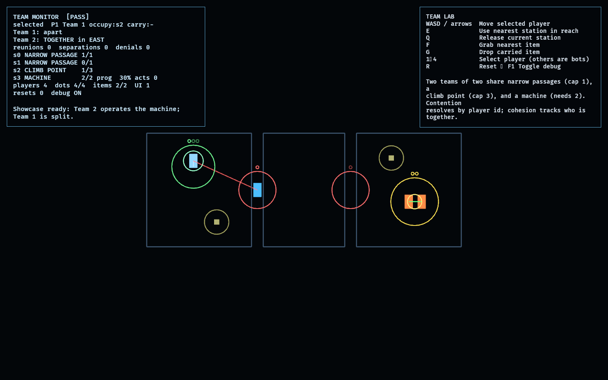

# Team Lab

The Team Lab puts **four players in two teams** into one world and proves the
multiplayer-shaped assumptions hold under contention. Every shared resource is
contended by independent intents — human, bot, or scripted — and the simulation
([model.rs](src/model.rs)) never assumes a single player or hard-codes keyboard
ownership.

This lab is the first consumer of `observed_core::TeamId`.

## Functionality evidence



The authored showcase (captured via `OBSERVED2_CAPTURE`) shows, in one frame:
Team 2 operating the cooperative machine together (`s3 MACHINE 2/2`), Team 1
split across the world (one player on the capacity-3 climb point, one in a
capacity-1 narrow passage — a red cohesion line marks them apart), and the
monitor reading `[PASS]`.

## What it demonstrates

- **Independent intents and distinct ownership** — every player carries its own
  `TeamId`/`PlayerId` and its own intent each tick.
- **Item contention** — when several players reach for one item in the same
  tick, exactly one wins; the rest are denied.
- **Narrow passages** — capacity-1 stations; only one player passes at a time.
- **Multiple players climbing at once** — a capacity-3 climb point.
- **Multiple players operating machinery at once** — a machine that only makes
  progress while two operators occupy it, and completes cycles.
- **Separation and reunion** — per-team cohesion tracks whether members share a
  zone; reunions and separations are counted as they happen.
- **Deterministic contention** — all requests resolve in ascending `PlayerId`
  order, so simultaneous users resolve the same way regardless of arrival order.

## Controls

- `WASD` / arrows: move the selected player
- `E`: use the nearest station in reach
- `Q`: release the current station
- `F`: grab the nearest item
- `G`: drop the carried item
- `1`–`4`: select a player; the other three are driven by bots
- `R`: reset the showcase
- `F1`: toggle the debug overlay

## Debug visualization

- Zone bounds; a station circle per shared resource sized by its reach radius
- Capacity dots above each station (filled per current occupant)
- A growing inner ring for machine progress
- A line from each player to the station it occupies and to any carried item
- A per-team cohesion line — green when the team is together, red when apart
- Monitor panel: per-team cohesion, reunion/separation/denial counters, per-station
  occupancy and machine progress, and a `[PASS]`/`[FAIL]` entity-health flag

## Success conditions

1. A capacity-1 passage admits exactly one player; simultaneous requesters are
   denied deterministically (lowest `PlayerId` wins).
2. The climb point holds several players at once.
3. The machine makes progress and activates only while two operators occupy it.
4. Item contention awards the item to one player; the rest are denied.
5. Leaving a station's range frees it for the next player.
6. A team that splits across zones registers a separation; regrouping registers a
   reunion.
7. Repeated reset restores four player dots, two item dots, and one UI root.

## Manual verification

1. Run `cargo run -p team_lab`.
2. Select P1 (`1`) and walk into a passage a bot is already in; confirm the
   monitor's denial counter rises and you do not enter.
3. Drive two players onto the machine and watch `s3` progress and activate; step
   one off and watch progress decay.
4. Walk both of a team's members into the same zone and confirm the cohesion line
   turns green and `reunions` increments; split them and watch `separations`.
5. Press `R` several times; the monitor must stay `[PASS]`.

## Regenerating the evidence screenshot

```powershell
$env:OBSERVED2_CAPTURE = "docs/evidence/team_lab.png"
cargo run -p team_lab
```

With `OBSERVED2_CAPTURE` set, the bots are frozen so the authored showcase stays
legible, the lab renders it, writes the PNG, and exits.
