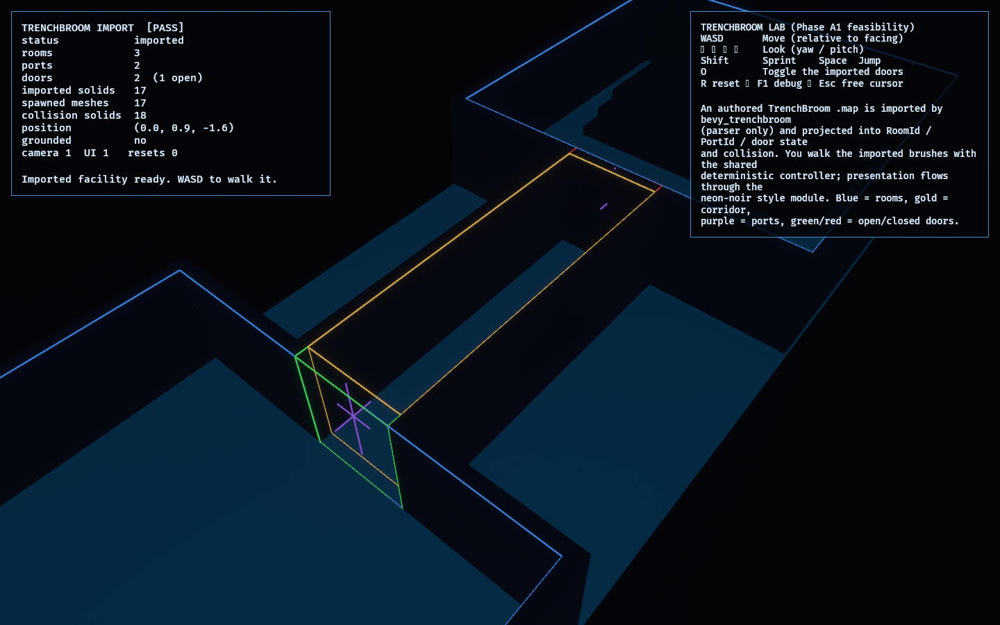

# TrenchBroom Lab

**Phase A1** of the [Bevy asset-integration roadmap](../../docs/bevy_asset_integration_roadmap.md)
— the first, top-ranked candidate, [`bevy_trenchbroom`](https://crates.io/crates/bevy_trenchbroom).

It answers one question: **can an authored TrenchBroom `.map` become this game's
room / corridor / door topology *without the editor's entities becoming the game
model*?** The answer here is yes, with a deliberate boundary: `bevy_trenchbroom 0.13`
is used as the **importer/parser only**. It parses the authored map into brush
geometry + entity properties; a pure [`project`](src/project.rs) function turns that
into stable [`observed_core`](../../crates/observed_core) IDs (`RoomId`, `PortId`),
door state, and collision AABBs; and the presentation is a *projection of that domain
model*, rendered through the shared [`observed_style`](../../crates/observed_style)
visual language so map materials never introduce ad-hoc colours. The player walks the
imported collision with the shared deterministic controller
([`observed_traversal`](../../crates/observed_traversal)).

Compatibility was the roadmap's hard gate: `bevy_trenchbroom 0.13.0` (with
`bevy_materialize 0.10`) **compiles and runs against the pinned Bevy `0.18.1`** — the
crate's own support table lists Bevy 0.18 ↔ bevy_trenchbroom 0.12–0.13. Only the
default `client` feature is enabled (no `bsp`/qbsp/ericw-tools, no physics
integration). Every brush is textured `__TB_empty`, which the importer's
`auto_remove_textures` skips, so it does **zero** material work while still parsing
the geometry we read.

## Functionality evidence



An authored `.map` — two rooms joined by a corridor, two door thresholds, and a
three-step stair onto a raised platform — imported by `bevy_trenchbroom` and rendered
entirely from the projected domain model in neon-noir (HDR + bloom + fog). Gizmo
overlays show the imported metadata: room bounds (blue) and the corridor (gold), the
two ports (purple) where rooms connect, and each door's threshold coloured by its
*model* state (green open / red closed). The `[PASS]` line confirms the import:
3 rooms, 2 ports, 2 doors, 17 collision solids.

## What it demonstrates

- **Authored map → domain topology** — `project` reads `bevy_trenchbroom`'s parsed
  `QuakeMapEntities` and emits `RoomId`/`PortId`s, room/corridor classification, door
  state, and collision boxes. Editor entities never become the game model; they are
  imported *data* the projection owns.
- **Imported collision is traversable** — each box brush becomes an `Aabb3` (via the
  importer's `as_cuboid`, already in Bevy space), fed to the proven fixed-step AABB
  controller. You walk through the corridor, climb the imported stairs, and are
  blocked by walls and closed doors.
- **Door state is model-driven, not material-driven** — a door leaf is imported
  geometry, but whether it blocks the gap is decided by the projected `DoorState`
  (toggle with `O`); the map's texture names decide nothing.
- **Presentation flows through `observed_style`** — surfaces come from
  `style::surface`, never the imported textures, so the Legibility Contract holds.
- **Reset is clean** — re-projecting to the authored state despawns and respawns all
  imported geometry with no leaks (a test cycles it five times).

## Controls

- `WASD`: move (relative to facing) · `←` `→` `↑` `↓`: look
- `Shift`: sprint · `Space`: jump
- `O`: toggle the imported doors (collision follows the model)
- `R`: reset to the authored map · `F1`: toggle debug · `Esc`: free the cursor

## Debug visualization

- Room bounds as wireframes — **blue** rooms, **gold** corridor
- **Purple** vertical markers at the two ports (room↔room connections)
- Door threshold outlines — **green** when open (passable), **red** when closed
- A spawn cross and a vertical marker at the player
- Monitor panel: import status, room / port / door / solid counts, spawned mesh
  count, live collision-solid count, position, grounded, entity health, resets, and a
  `[PASS]`/`[FAIL]` flag

## Success conditions

1. The authored `.map` loads and projects to **3 rooms (2 + corridor), 2 ports, 2
   doors, 17 collision solids** — `[PASS]`.
2. Every box brush reconstructs to a non-inverted, correctly-sized Bevy-space AABB
   (the winding gate).
3. The first-person controller traverses the imported collision: through the open
   door, along the corridor, up the imported stairs; walls and the closed door block.
4. Toggling a door (`O`) adds/removes its leaf from collision — state is driven by the
   door model, not the map material.
5. Reset returns to the authored state with no leaked entities.

## Manual verification

1. Run `cargo run -p trenchbroom_lab` (first build is heavy — it compiles
   `bevy_trenchbroom` + `bevy_materialize`).
2. The facility appears. Walk forward with `WASD`: through the open first door into
   the corridor. The second door is **closed** — you are blocked.
3. Press `O` to open it, walk into the second room, and climb the imported stairs onto
   the platform. Press `O` again near the first door and confirm it now blocks you.
4. Press `R` to reset to the authored state (first door open, second closed).
5. Press `F1` to toggle the overlay; confirm the `[PASS]` line and the counts.

## How the map is authored

The `.map` is a real Quake-format text file at
[`assets/maps/facility.map`](assets/maps/facility.map) — it could be opened and edited
in TrenchBroom. It is generated from a typed layout in [`map_source`](src/map_source.rs)
so every axis-aligned box brush has provably-correct face winding (an inverted winding
would corrupt the reconstructed AABB). The lab materialises the file on startup only
when its content differs from the generator, so the committed artifact stays
authoritative but can never drift.

## Dependency impact

`bevy_trenchbroom 0.13` (feature `client` only) pulls `bevy_materialize 0.10`,
`quake-map 0.6`, and a handful of small support crates (`jzon`, `ndshape`,
`disjoint-sets`, `enumflags2`, `float-ord`, `image`). The dependency is **isolated to
this lab** — no production crate or the assembled `game` depends on it. `quake-map` is
a `dev-dependency` only, used so the projection tests can parse the authored map
synchronously (no async asset server, no GPU).

## Regenerating the evidence screenshot

```powershell
$env:OBSERVED2_CAPTURE = "docs/evidence/trenchbroom_lab.png"
cargo run -p trenchbroom_lab
```
