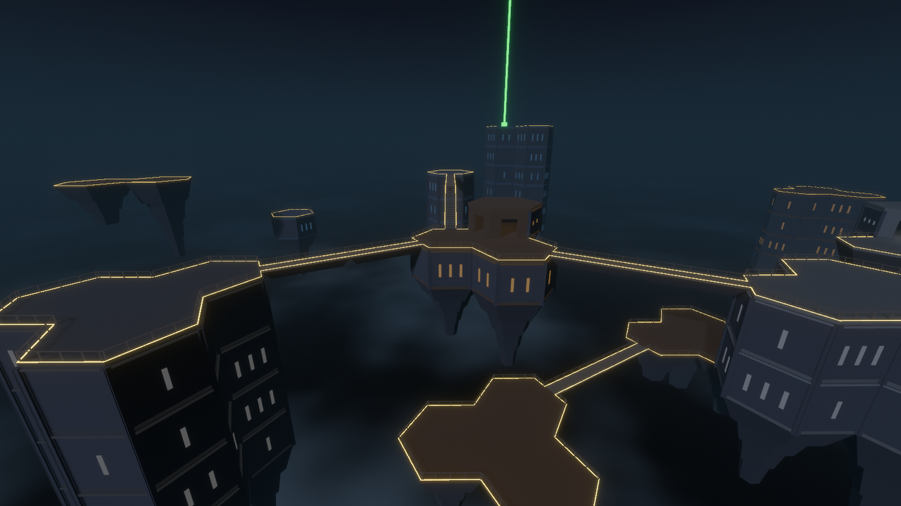
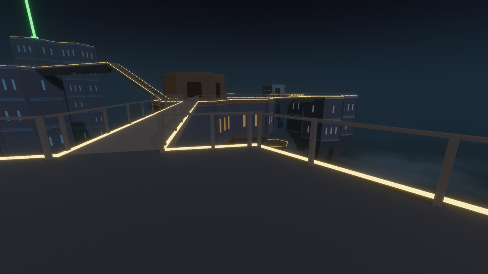
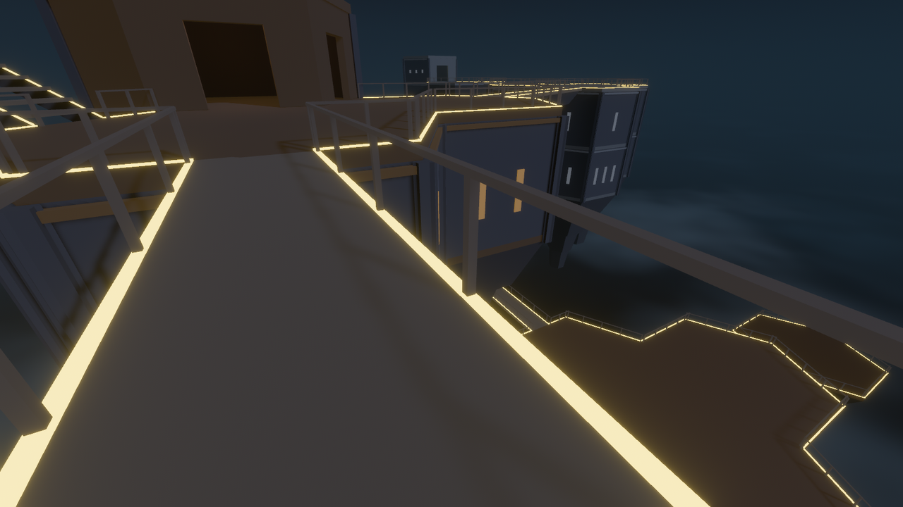
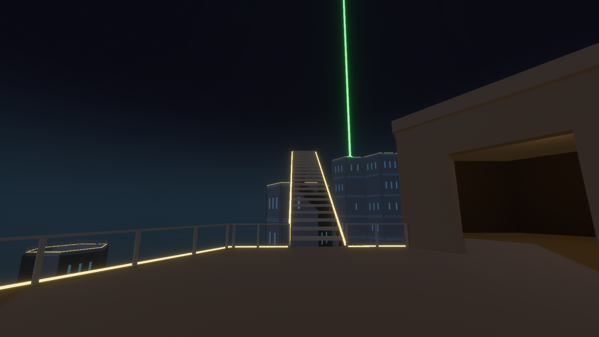
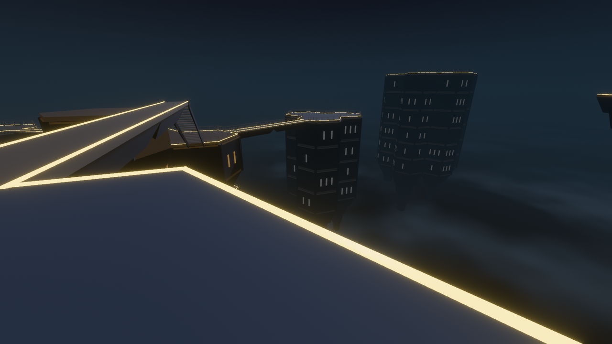
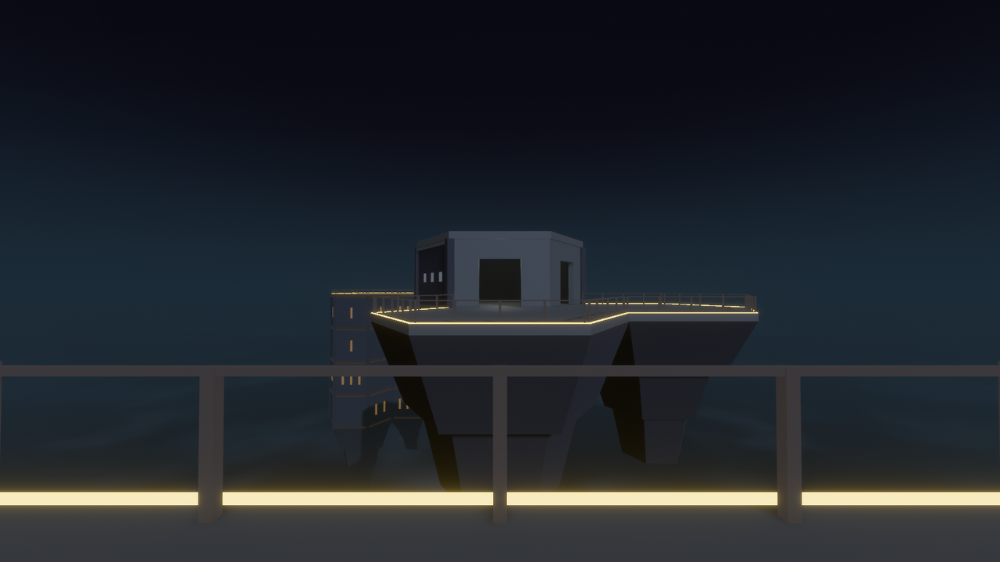
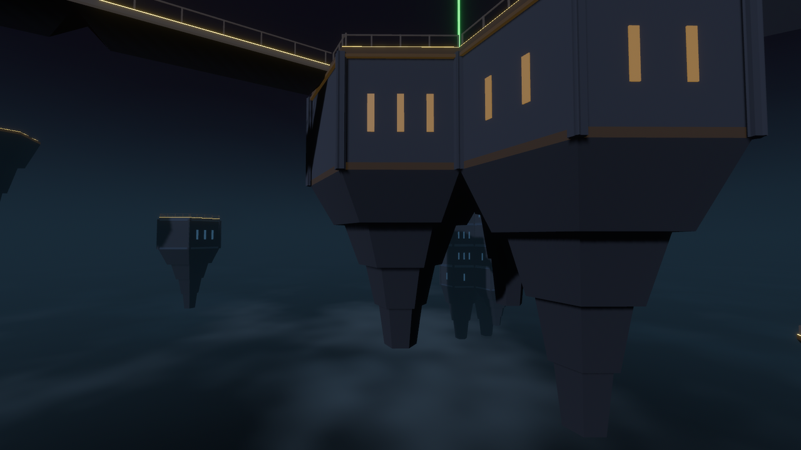

# Vista Lab

What the facility looks like from **inside open air**.

`HexSpace::Air` gave the facility a sky: sight crosses it, bodies fall through it,
and the Architect's cutaway draws it as a well under a floating deck. This lab asks
the first-person half of that question. Standing at a deck edge, does open air read
as *height*? That means sheer faces, structures hanging over nothing, and walkways
with air on both sides, while every drop stays legible.



```powershell
cargo dev-run -p vista_lab
```

## Controls

| Key | Does |
| --- | --- |
| `WASD` / mouse, `Shift`, `Space` | walk, run, jump (the production controller) |
| `T` | walk the tour: railed span → isle → open stair → unrailed span → the Needle |
| `1`–`7` | authored vantages (1–5 on foot, 6–7 flying) |
| `F` | fly / walk (`Space` / `Ctrl` rise and sink while flying) |
| `R` | back to the Bastion terrace |
| `Backspace` | rebuild the lab from source; the HUD reports the entities removed |
| `F1` | HUD and legend |
| `F3` | exposure survey overlay: sheer faces, drops, walkway axes |
| `Esc` / click | free / grab the cursor |

Step off an unrailed edge and you fall. Land on lower structure and the HUD names
it and the distance. Miss everything and you fall through into true void, and the
controller puts you back on the Bastion.

## The composition

Hand-authored on the real 14 m × 8 m hex lattice (22 × 18 × 8 cells), in
[`composition.rs`](src/composition.rs):

| Landmark | What it shows |
| --- | --- |
| **The Bastion** | four sealed storeys and a terrace: a 40 m cliff, and where you start |
| **Lantern Isle** | a storey and a deck with a pavilion, floating over nothing |
| **Railed span** | two cells of 2.6 m walkway, Bastion to Isle, at level 4 |
| **Open stair** | an open-riser flight climbing one storey to level 5 |
| **Unrailed span** | level 5 and up is unsafe architecture: no rails, only the lit lip |
| **The Needle** | a one-cell tower, four storeys of sheer face under a bare deck |
| **The Gallery & far shore** | two islands one cell of air apart, with no bridge: you can see it but you cannot reach it |
| **The understory** | two low decks and a walkway 24 m below the spans, which catch a fall |
| **The Summit** | a seven-storey tower carrying the green beacon |
| **The distance** | a western massif and floaters at the edge of the fog |

## How it is built

The layout is not solved. It is placed by hand, because the question is what
air *looks like*, not what air the corpus happens to produce. Everything
downstream of placement is borrowed from the real facility:

1. The cells load into a real `HexWfcWorld`, with typed doors and ramp ports.
2. **`HexWfcWorld::mark_open_air` alone decides what is sky.** The renderer never
   guesses.
3. [`hex_wfc::exposure`](../../crates/observed_facility/src/hex_wfc/exposure.rs)
   is the lab's whole architectural judgement, and it is a pure function of the
   world. Proven here, it now lives in `observed_facility` for the game to share:
   - a face that borders air (or the lattice edge) is **sheer**;
   - a face against rock is **buried**;
   - a cell with nothing beneath it **hangs**, with its drop measured to whatever
     would catch a fall, or to true void;
   - a straight hall with air on all four flanks is a **span**.
4. [`geometry.rs`](src/geometry.rs) turns that survey into convex hulls and blocks
   tagged with a semantic `Look`, never a colour. Colliders come from the same
   pieces, so the body collides with exactly what is drawn.
5. The view asks `observed_style` how each look is drawn. Structure uses the
   facility shell's own `hex_shell_look`. The fall edge is the shared
   `SurfaceRole::GantryEdge` and the beacon is `MarkerRole::Exit`. The sky, the
   cloud sea and the open-air fog live in the new `observed_style::open_air`,
   which shares its horizon and its nadir with the cutaway's sky, and its cloud
   texture with the cutaway's cloud layer.

## What the tests prove

- Every door meets a matching door, and the flight's ramp ports pair.
- Every unbuilt cell is air, and exactly as many as `mark_open_air` reported.
- A face against rock is buried, not sheer. Entombing one neighbour removes one
  sheer face.
- All eight walkway cells are spans with four sheer flanks, and the flight and
  its head are recognised.
- The Bastion's west face is sheer at every level from 0 to 4.
- The Isle, the Needle, the understory and the Gallery hang over true void. The
  Gallery span's fall is caught by the understory, 24 m down floor to floor.
- Railings stop at level 5. The flight is judged at the level it arrives at.
- **The facility's own router takes exactly the authored tour.**
- The far shore is one cell of air away and unreachable.
- Every drop edge is lit, and each span has lips on both flanks.
- Keels never reach what they hang over.
- The build is deterministic.
- **The production controller walks the whole tour** without dipping below the
  Bastion terrace or needing recovery.
- **An unrailed span lets you walk off it. A railed span holds you.**
- On the production facility: every sheer face really borders air, and no door
  opens onto it (`production_tests.rs`).
- A rebuild replaces every lab entity and leaks none. Only the invisible guard
  colliders go undrawn. The HUD finds the cell under your feet.

## Findings

1. **Under the current classification, rock can never border the sky.**
   `mark_open_air` floods from the lattice edge through *every* unbuilt cell, so
   any unbuilt cell touching air becomes air. Sealed rock only exists fully
   entombed in structure, which means no open vantage can ever see it. Every
   sheer face in a real facility is therefore built structure against air, never
   a rock cliff. If the design wants visible bedrock (mass that is not rooms),
   rock has to become a placed state rather than a derived one. That is a design
   decision, not a rendering one.
2. **Raw structural treatments wash out in open air.** The first capture fed
   `architecture_surface` and `surface(Wall | GantryDeck)` treatments straight
   into materials, and every wall and walkway read as pale plastic under the moon.
   The facility's `hex_shell_look` exists for exactly this reason. Anything that
   draws facility structure must go through it.
3. **Bevy's unlit path discards emission.** The fall edge's albedo is dark by
   design (the glow is the signal), so drawing signals `unlit` made every lip
   vanish. Signals are drawn lit, with HDR emission far above anything the moon
   adds.
4. **A railing needs two pieces.** The collider that stops a body must be the
   railing's full height, and drawn at that size it reads as a parapet wall. The
   lab separates an invisible `Guard` collider from the visible posts and rail.
   The open-riser stair uses the same split: solid steps for the body, thin
   treads with air between for the eye.
5. **Spans are a presentation of existing cells.** The facility has no walkway
   type. A span is a `Straight` hall whose four flanks happen to be air, so a
   production renderer could draw one without a new tile.
6. **The production facility is dense, walled in, and half of it touches the sky.**
   Solved exactly as a match solves it (the 24 × 17 × 8 arc lattice, the
   committed composition profile, six seeds; `production_tests.rs`):

   | | per facility |
   | --- | --- |
   | built / air / rock | ~2,480 / ~680 / ~105 cells (76% / 21% / 3%) |
   | built cells with a face open to air | ~1,230, carrying ~2,540 sheer faces |
   | cells hanging over air | ~600, ~407 of them the bottom layer over true void |
   | spans (straight halls, air on all four flanks) | 7 to 11 |
   | doors that open onto air | **0** |

   Sealed rock exists at production scale, always entombed and invisible, as
   finding 1 says it must be. The sky wraps half the building, but no door ever
   opens onto it and every face that borders it is a tile wall. **From inside the
   facility the game plays, nobody can see out.** Bringing this lab's vista into
   the game is therefore not only a renderer: something has to open onto the air.

## What this lab deliberately is not

- **Not solved.** No WFC, no corpus tiles, and no doors opening onto air (the
  real facility treats those as unmatched ports).
- **Not a load model.** Keels are presentation. Whether hanging structure should
  need support is `suspension_lab`'s second question, and nothing here answers it.
- **Not sight.** The far shore is *visible* across air, but Observer sight and
  warding are not modelled here. `architect_lab` owns that.

## Evidence

```powershell
$env:OBSERVED2_CAPTURE = "docs/evidence/vista_lab"; cargo dev-run -p vista_lab
$env:OBSERVED2_CAPTURE_WALK = "scratch/vista_walk"; cargo dev-run -p vista_lab
```

The first writes one still per vantage and a `manifest.json` with the survey
counts. The second walks the tour on the production controller and writes
`walk_0000.png`… at thirty frames of simulated time a second, frame-locked to
the simulation rather than to the renderer, so playback is smooth and real time. Encode them as MP4 (see the
`capture-evidence` skill):

```powershell
ffmpeg -y -framerate 30 -i scratch/vista_walk/walk_%04d.png -c:v libx264 -pix_fmt yuv420p -crf 20 -movflags +faststart docs/evidence/vista_lab/walk.mp4
```

| | |
| --- | --- |
|  |  |
|  |  |
|  |  |

**[walk.mp4](../../docs/evidence/vista_lab/walk.mp4)**: the tour on the production controller, from the
Bastion over the railed span, up the open stair and along the unrailed span to the Needle.
