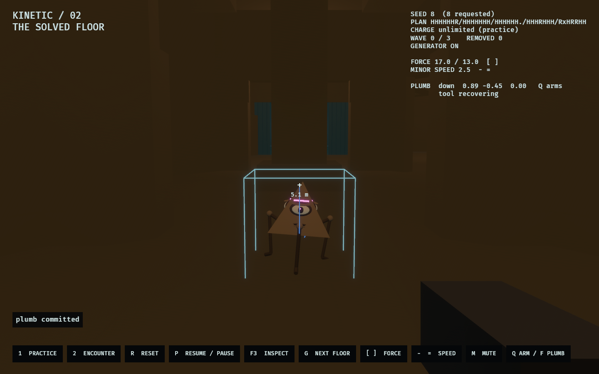
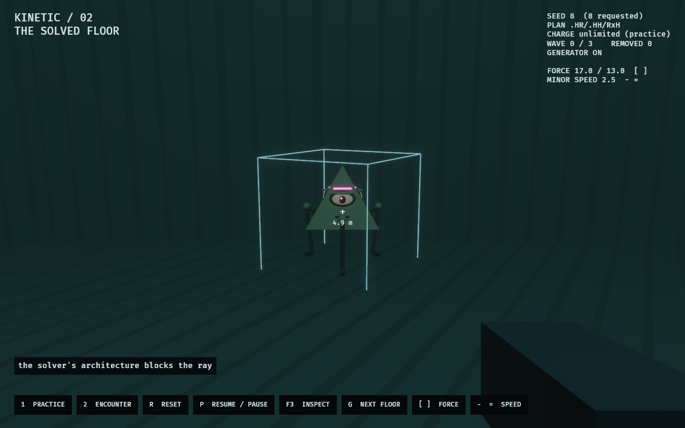

# WFC Kinetic / 02 — The Solved Floor

The kinetic tool, inside a floor the production WFC solver actually built.

[`kinetic_lab`](../kinetic_lab/README.md) proved the tool against an authored
chamber — a rectangle whose every ledge was placed by hand to be shoved off.
This lab asks the next question: does any of that survive contact with
architecture nobody arranged for it?

```bash
cargo dev-run -p wfc_kinetic_lab
cargo dev-run -p wfc_kinetic_lab -- --encounter
cargo dev-run -p wfc_kinetic_lab -- --seed 1234
```


## The floor

Around thirty cells on a 7×5 lattice, from a real solve of the production tile
catalogue. The holes are the point: not cells the solver failed to fill but
floor-less volume the collapse declined to build, placed by the same pass that
placed the walls around them.

It began as a seven-cell arena and grew for one measured reason — **bounded
relayout needs somewhere to happen.** The solver permanently pins `spawn` and
`exit`, gives *every* pin a one-cell halo, and adds a pin for each cell the
Observer occupies or can see. On a small board that saturates: a 3×3 floor never
offered a selectable pocket at all, and a 4×4 floor protected fourteen of its
sixteen cells with one cell visible, leaving only a void cell whose re-collapse
faithfully produced void. Pockets that actually change something, over
twenty-five seeds — 6×5: eleven, 7×5: fifteen, 8×6: seventeen.

That trade is worth knowing before anyone designs a room around the mechanic.

`site.rs` solves, projects, and derives every gameplay anchor from the result.
Nothing in this lab authors a room. The two rooms become the Observer's spawn
and the generator; the halls take the recharge station and the tile control;
navigation waypoints are sampled from the projected geometry and discarded
unless a body can actually stand on them.

The seed is a lab control. `Site::solve` searches forward from whatever is
requested until it finds a seven-cell floor, so every seed works; `G` deals the
next floor along without restarting. About one seed in three qualifies.

One departure from the shipped composition profile: `route_corridors` is off.
On, the solver routes a minimal corridor skeleton between spawn and exit and
voids the rest, which on a 3×3 board produces a ribbon — a hallway with two
rooms on the ends. A hallway is a bad place to test a tool whose subject is
spatial commitment.

## What this lab found

**The corpus rails everything.** The design says a shove commits a minor "off
unrailed geometry". On this tile catalogue there is no unrailed geometry to use.
Every face onto void comes back parapeted — clear at eye height and walled solid
from the floor to about 1.2 m — and the solver never points a door at a cell it
declined to build. Across every seed sampled, a solved floor offers **zero**
faces a body can be shoved through.

This was not obvious and the lab got it wrong first. An earlier ledge probe cast
at eye height, found the open air above the railings, and reported five ledges on
the default floor; the shove that followed bounced a minor off a wall the lab had
promised was not there. `site::ledges` now samples the whole height a body
occupies, and it is still measured — kept as a falsifiable claim in
`the_corpus_seals_every_face_onto_void`. If that number ever moves, the design's
assumption has become satisfiable and the test should be read as good news.

**So the Observer's ledge is one the Architect makes.** Retract a tile and the
doorways into it stop leading anywhere. That is the only drop a solved floor
offers, it is floor-level and shovable because it was a threshold between two
built cells a moment earlier, and it is exactly the loop the design asks for:
*an Observer's best weapon is a hole their Architect built.*


## Sound

The lab uses the shared `kinetic_lab::sound` design rather than a second copy:
the palette, the distance falloff, the occlusion damping, the motion cues and
the mixer all live there, behind a `SoundWorld` a lab implements for its own
simulation. What belongs here is only what is particular to a solved floor —
which of this lab's events map to which cue, and where in the facility each one
happens.

That last part is the difference worth having. The authored chamber plays its
retraction at a bridge control; here the warning plays at the panel and the
retraction plays *at the tile*, so a floor losing a cell is heard where the cell
was. A body committed to void is heard at the cell it went over, which is the
same cell the event reports.

The ear rides the camera, so a Guardian behind a wall is behind it. `M` mutes.
`playing_the_loop_spawns_voices` drives the recorded encounter and counts the
voices it produces, so the lab cannot go quietly silent.

## The plumb

A second tool, promoted from [`plumb_lab`](../plumb_lab/README.md), which
established that a redirected gravity is cheap for anything that is not the
Observer: Rapier gives per-body gravity, and its character controller takes
`up` as a vector rather than an assumption.

Arming is separate from firing, and deliberately so. `Q` points the plumb along
the current look direction; `F` commits it to whatever the crosshair has. You
decide which way down will be *before* you commit it to something — fold the two
together and it is a shove with extra steps. The armed vector is on the HUD and
drawn at the muzzle, and every plumbed body carries an arrow along its own down,
because a body falling sideways is otherwise indistinguishable from a body that
was thrown.

It costs 25 against the shove's 10, holds for four seconds, and takes the body
out of world gravity entirely for that time. A plumbed minor is physics-owned
and stops pursuing: this lab's pursuit is a Y-up navigation graph, and a minor
whose down points at a wall has no business being steered by it. Plumbed bodies
are also allowed to tumble, which locked-upright minors are not.

What it buys is reach. A shove has to be lined up through a minor *at* the hole
and carries a body about three metres; a plumb only has to reach the minor, and
then gravity does the work from wherever it happens to be standing. The
walkthrough's last scene is exactly that: a minor in the doorway the retraction
opened, a down pointed through it, and a body that agrees.



It is not a wall-walking tool for the opposition, and it cannot be turned on the
Observer, and both are scope decisions rather than oversights. Self-plumb is the
next arc and is recorded in [ROADMAP.md](../../ROADMAP.md) under step 3: Rapier
would take it, but -Y is baked into the shared controller and into this lab's
support rays, navigation bands and void rule. `plumb_lab` is where the cost was
measured.

## Two verbs, and why both

**Decoherence is the legal one.** Operating the panel telegraphs a pocket and
then asks the solver to re-collapse it — `begin_frontier_relayout_sized`,
`advance_driven_relayout` under an `encourage_decay` bias, and
`commit_relayout_delta` against the observation frame at commit time. The
geometry delta is projected from the same catalogue the solve used and swapped
into the live collision world, the snapshot and the navigation graph.

The refusal is the mechanic. `commit_relayout_delta` re-derives what is
protected from the *latest* frame, so **walking into the pocket, or simply
turning to look at it, saves the floor.** That is observation-freezing made into
a first-person verb, and it is the thing a 2D lab structurally cannot ask.

A telegraph only fires on a pocket that would actually differ. Roughly half the
pockets a floor offers re-collapse into themselves — a run of void re-collapses
faithfully into void, and a cell bounded by frozen neighbours often has exactly
one legal answer — and spending the warning, the sound and the player's
attention on a floor that was never going to move is worse than saying so.
`Inert` says so.

**Retraction is the illegal one, and the lab needs it.** A legal relayout can
*never* open a door onto void: that is precisely the invariant the corpus
enforces, and it holds after a rewrite exactly as it held before. So rewriting
alone can never produce a hole a body can be put through — the recorded director
decohered eleven pockets in a row without ever creating one. Canon already
separates the two: contradictions "retract implicated tiles toward void until a
compatible play repairs the constraint". Retraction is that, it is deliberately
not a state the solver would produce, and it is why the lab tracks retracted
cells beside the facility rather than feeding them back into it.

## Guardians

Minors wear the shared `kinetic_lab::guardian` rig — the pyramidal body, lidded
eye and three jointed limbs — rather than a second copy of it. The rig is
decorative and stateless: it is handed a `RigSample` per Guardian each frame and
poses itself, so it never touches aim, motion, collision or elimination, and its
feet stay inside the existing collision envelope.



## Controls

| Input | Action |
|---|---|
| WASD / Shift / Space | Move / sprint / jump |
| Mouse | Look; the crosshair ray selects the first visible body |
| LMB / RMB | One immediate push / pull per press |
| Q | Arm the plumb along the current look direction |
| F / MMB | Commit the armed plumb to whatever the crosshair has |
| E | Operate the nearby generator or tile control |
| 1 / 2 | Reset into practice / encounter |
| R / G | Reset this floor / solve the next one |
| `[` / `]` | Weaken / strengthen the tool, push and pull together |
| `-` / `=` | Slow / speed up pursuing minors |
| P / Escape | Pause or resume / pause and release the cursor |
| F3 / N | Toggle diagnostics / advance one paused tick |
| M | Mute |
| L | Inspection lighting — the studio's fill, for looking at the floor |

## Rules

Eight-metre reach, nominal 17 m/s push and 13 m/s pull, 10 charge per use,
15-tick cooldown, 27-tick stagger. One press is one attempt; misses and refusals
never spend charge.

Force and minor speed are adjustable while the lab runs (`[` `]` and `-` `=`,
shown in the HUD and kept across resets), because finding those numbers is part
of what the lab is for. The starting values are not the authored chamber's, and
the difference is itself a finding: that chamber is a room you cross in a few
strides, while a solved floor is 14 m cells whose doorways sit 7 m from the
centre. The 10 m/s shove that sent a body clear across the chamber barely moved
one out of the tile it was standing in. Everything else is unchanged, so a
difference in feel is still the architecture talking.

- **Practice:** stationary targets, unlimited charge, no capture.
- **Encounter:** three waves of two, three, then four pursuing minors, mustered
  on solved cells away from the Observer. Charge starts at 100 and is restored
  only within 2.2 m of a visible powered station.
- **Generator:** operable at the tile by anyone. With it off the station supplies
  nothing; there is no passive regeneration.
- **Decoherence control:** telegraphs a pocket of one to six cells, waits two
  seconds, then offers it to the solver against the observation the Observer
  actually finished the warning with. See below.
- **Demolition control:** retracts its tile toward void — geometry only, mesh
  and colliders together. Anything standing on it loses its floor on the same
  tick, and the doorways into it start opening onto nothing.
- Crossing y = −12 removes a body. An Observer's fall ends an encounter and
  resets the body in practice.

## What owns the truth

The Observer stands up in the **best-lit room** on the floor, and in the pool
rather than at the geometric centre of it. This used to be whichever room came
first in lattice order, which on the default floor was Megastructure — the
darkest register present, ambient 40 against the brightest's 180 — with one
practical in the cell and the Observer six and a half metres from it. The first
thing anyone testing the lab saw was a dark room. Rooms are interchangeable for
every other purpose here, so choosing the lit one costs nothing.

One knock-on, recorded rather than hidden: the best-lit room is not chosen for
its proximity to anything, so the recorded director's walk to the demolition
control grew from eleven seconds to twenty-five. That is poor pacing and is
worth addressing when the recorded loop is next worked on.

`site` owns the deal — the solve, its projection and the anchors — and is
immutable once built. The live facility lives in the model, because relayout
changes it; `site` stays the floor as it was dealt. `model` owns commands, fixed-tick rules, snapshots, events and stable
actor IDs; it reads the projected colliders and never the renderer. `runtime`
adapts Bevy scheduling; `view` interpolates and draws, and decides nothing.

Raw Rapier stepping, the deterministic stable-ID ray and the minor's walk query
come from `kinetic_lab::physics` rather than a second copy kept in sync. The
structural pass is the same one `hex_wfc_lab` uses for its walkthrough — the same
projected hulls, the same per-register shell surface, the same weave — because a
lab that reproduced the solver's geometry and then painted it in its own greys
would be previewing a different building. Light budgets come from
`observed_style::hex_practical_light`; the kinetic legend's colours come from
`observed_style::kinetic`.

Atmosphere follows the game's shell rather than being invented here, and that is
a correction: this lab used to light the facility with a neutral ambient and a
directional sun, which reads flat and faintly outdoors and loses the hue that
separates one district from another. There is no sun in a facility. The shell
zeroes it, `daydream_lab` — where the tiles' look was developed — never had one,
and every photon comes from the district's ambient, its distance fog, one key
spotlight over the Observer's own cell, and the tiles' authored practicals. All
four now come from `observed_style::architecture_for_composition` for whichever
cell the Observer is standing in, eased on a district change and snapped on the
first frame of a floor, because an initial state is not a transition.

Sight, support and navigation query the broad phase through a predicate that
sees only tagged structural colliders. That is not an optimisation detail so
much as the difference between the lab running and not: walking the collider
list linearly and re-solving the route per minor per tick cost 18 ms a tick with
two minors on the floor, and froze for 134 ms whenever a retraction rebuilt the
graph. The route is now solved once per tick and shared, and
`a_full_wave_of_minors_fits_inside_a_frame` holds the budget.

A `WfcKineticWorld` clone is an in-memory continuation snapshot, and `digest()`
fingerprints the site, the rules and every body's physical state. Replaying
commands and restoring a mid-flight snapshot are tested for per-tick equality.
This is a local repeatability proof, not a claim of certified cross-platform
networking.

## Verification and evidence

```bash
cargo fmt --all
cargo dev-clippy
cargo dev-test
OBSERVED2_CAPTURE=docs/evidence/wfc_kinetic_lab/floor.png cargo dev-run -p wfc_kinetic_lab
OBSERVED2_CAPTURE_SEQUENCE=/tmp/wfc-kinetic-frames cargo dev-run -p wfc_kinetic_lab
OBSERVED2_CAPTURE_LOOP=/tmp/wfc-kinetic-loop cargo dev-run -p wfc_kinetic_lab
ffmpeg -y -framerate 30 -i /tmp/wfc-kinetic-loop/frame_%04d.png \
  -c:v libx264 -pix_fmt yuv420p -crf 20 -preset slow -movflags +faststart \
  docs/evidence/wfc_kinetic_lab/gameplay-loop.mp4
```

`OBSERVED2_CAPTURE_LOOP` records one continuous encounter played by a
deterministic director rather than five staged moments — see
[the gameplay loop](#the-gameplay-loop) below. It captures every second tick, so
30 fps plays back in real time, and it stops shortly after the encounter
resolves rather than holding on a finished world.

The capture sequence stages five snapshots and then submits ordinary movement,
aiming and tool commands — nothing reaches into the simulation mid-scene, so a
recording is a thing that happened rather than a thing that was drawn. It shows
the floor, a wall refusing the ray, a shove that fails against a parapet, a
retraction, and a minor committed to void through the doorway that retraction
opened. The generated
[verification.txt](../../docs/evidence/wfc_kinetic_lab/verification.txt) records
the events and final digests.

Automated checks establish the geometry, the physical outcomes, replay and
lifecycle correctness. Whether the tool *feels* good in solver-built space still
requires a person at the keyboard.

## The gameplay loop

On a solved floor the loop has a shape the authored chamber does not, and it
falls out of the parapet finding: **until a tile is retracted there is no way to
remove a minor at all.** The tool only staggers them, the wave never clears, and
the encounter cannot progress. So the loop is: make the hole, then work minors
into it, and feed the tool between waves.

The recorded director is a fixed priority policy in those terms — retract, then
recharge below a third, then stand on the far side of the nearest minor from the
hole and shove when the shot actually lines up on it. It emits the same
`Command` a keyboard does and reads nothing it could not see, so the recording
is a thing that happened.

[gameplay-loop.mp4](../../docs/evidence/wfc_kinetic_lab/gameplay-loop.mp4) is
one such encounter, 33 seconds, ending the way it ended: wave one lands, the
panel is operated at 0:09, two minors go through the doorway into the hole at
0:19 and 0:23 with a recharge between them, and wave two catches the Observer at
0:30. Losing is a legitimate outcome and the director is deliberately simple —
it is a floor with one hole in it and no teammates.

`the_director_plays_the_loop` asserts the beats before any of it is rendered, so
a recording cannot quietly become footage of somebody walking around.

## Not in scope

Majors, teammate boosts, equipment, Architect card play, multiple floors, ascent,
and production multiplayer. The staged walkthrough is current and includes the plumb. The **recorded
gameplay loop** (`gameplay-loop.mp4`) is still stale: it was cut on the
seven-cell arena, and the director reaches the demolition control on this floor
but gets caught crossing it before it clears a wave.
`the_director_reaches_the_beats_the_floor_has` pins what it does still do.
