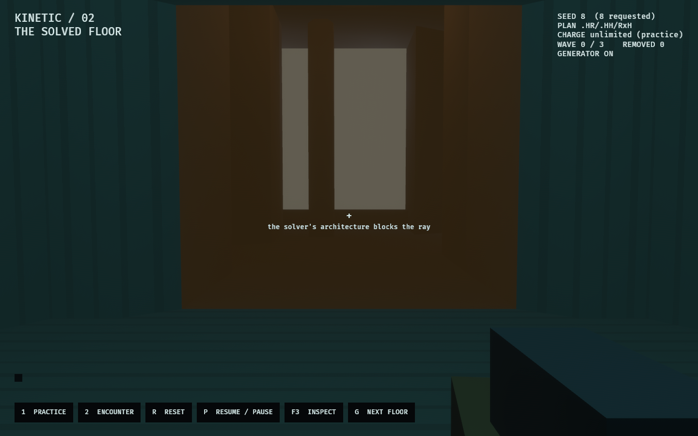
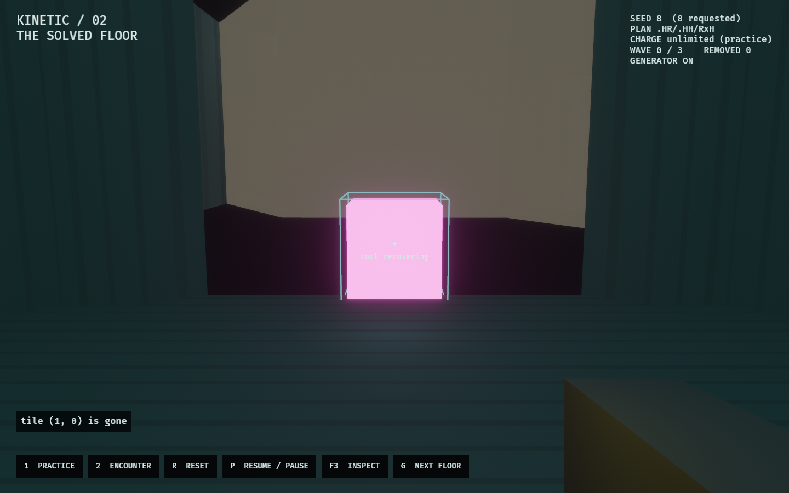

# WFC Kinetic / 02 — The Solved Floor

The kinetic tool, inside a floor the production WFC solver actually built.

[`kinetic_lab`](../kinetic_lab/README.md) proved the tool against an authored
chamber — a rectangle whose every ledge was placed by hand to be shoved off.
This lab asks the next question: does any of that survive contact with
architecture nobody arranged for it?

```bash
cargo dev-run -p wfc_kinetic_lab
cargo dev-run -p wfc_kinetic_lab -- --encounter
cargo dev-run -p wfc_kinetic_lab -- --seed 1234
```



## The floor

Seven cells, from a real solve of the production tile catalogue.

A 3×3 rhombus is the smallest lattice the solver accepts (`cols >= 3`,
`rows >= 3`, `min_rooms >= 2`). Asking it for seven of those nine cells leaves
exactly two holes, and the holes are the point: they are not cells the solver
failed to fill but floor-less volume the collapse declined to build, placed by
the same pass that placed the walls around them.

`site.rs` solves, projects, and derives every gameplay anchor from the result.
Nothing in this lab authors a room. The two rooms become the Observer's spawn
and the generator; the halls take the recharge station and the tile control;
navigation waypoints are sampled from the projected geometry and discarded
unless a body can actually stand on them.

The seed is a lab control. `Site::solve` searches forward from whatever is
requested until it finds a seven-cell floor, so every seed works; `G` deals the
next floor along without restarting. About one seed in three qualifies.

One departure from the shipped composition profile: `route_corridors` is off.
On, the solver routes a minimal corridor skeleton between spawn and exit and
voids the rest, which on a 3×3 board produces a ribbon — a hallway with two
rooms on the ends. A hallway is a bad place to test a tool whose subject is
spatial commitment.

## What this lab found

**The corpus rails everything.** The design says a shove commits a minor "off
unrailed geometry". On this tile catalogue there is no unrailed geometry to use.
Every face onto void comes back parapeted — clear at eye height and walled solid
from the floor to about 1.2 m — and the solver never points a door at a cell it
declined to build. Across every seed sampled, a solved floor offers **zero**
faces a body can be shoved through.

This was not obvious and the lab got it wrong first. An earlier ledge probe cast
at eye height, found the open air above the railings, and reported five ledges on
the default floor; the shove that followed bounced a minor off a wall the lab had
promised was not there. `site::ledges` now samples the whole height a body
occupies, and it is still measured — kept as a falsifiable claim in
`the_corpus_seals_every_face_onto_void`. If that number ever moves, the design's
assumption has become satisfiable and the test should be read as good news.

**So the Observer's ledge is one the Architect makes.** Retract a tile and the
doorways into it stop leading anywhere. That is the only drop a solved floor
offers, it is floor-level and shovable because it was a threshold between two
built cells a moment earlier, and it is exactly the loop the design asks for:
*an Observer's best weapon is a hole their Architect built.*



## Controls

| Input | Action |
|---|---|
| WASD / Shift / Space | Move / sprint / jump |
| Mouse | Look; the crosshair ray selects the first visible body |
| LMB / RMB | One immediate push / pull per press |
| E | Operate the nearby generator or tile control |
| 1 / 2 | Reset into practice / encounter |
| R / G | Reset this floor / solve the next one |
| P / Escape | Pause or resume / pause and release the cursor |
| F3 / N | Toggle diagnostics / advance one paused tick |

## Rules

Tool tuning is unchanged from the authored chamber — eight-metre reach, nominal
10 m/s push and 7 m/s pull, 10 charge per use, 15-tick cooldown, 27-tick stagger
— deliberately, so that anything that feels different here is the architecture
talking rather than a retuned tool. One press is one attempt; misses and refusals
never spend charge.

- **Practice:** stationary targets, unlimited charge, no capture.
- **Encounter:** three waves of two, three, then four pursuing minors, mustered
  on solved cells away from the Observer. Charge starts at 100 and is restored
  only within 2.2 m of a visible powered station.
- **Generator:** operable at the tile by anyone. With it off the station supplies
  nothing; there is no passive regeneration.
- **Tile control:** a two-second warning, then one cell's geometry is removed —
  mesh, colliders and all. Anything standing on it loses its floor on the same
  tick, and the navigation graph loses the crossing. The cell is chosen so that
  removing it actually severs the route between the spawn room and the generator
  where the floor has such a cell.
- Crossing y = −12 removes a body. An Observer's fall ends an encounter and
  resets the body in practice.

## What owns the truth

`site` owns the solve, the projection and the anchors, and is immutable once
built. `model` owns commands, fixed-tick rules, snapshots, events and stable
actor IDs; it reads the projected colliders and never the renderer. `runtime`
adapts Bevy scheduling; `view` interpolates and draws, and decides nothing.

Raw Rapier stepping, the deterministic stable-ID ray and the minor's walk query
come from `kinetic_lab::physics` rather than a second copy kept in sync. The
structural pass is the same one `hex_wfc_lab` uses for its walkthrough — the same
projected hulls, the same per-register shell surface, the same weave — because a
lab that reproduced the solver's geometry and then painted it in its own greys
would be previewing a different building. Light budgets come from
`observed_style::hex_practical_light`; the kinetic legend's colours come from
`observed_style::kinetic`.

A `WfcKineticWorld` clone is an in-memory continuation snapshot, and `digest()`
fingerprints the site, the rules and every body's physical state. Replaying
commands and restoring a mid-flight snapshot are tested for per-tick equality.
This is a local repeatability proof, not a claim of certified cross-platform
networking.

## Verification and evidence

```bash
cargo fmt --all
cargo dev-clippy
cargo dev-test
OBSERVED2_CAPTURE=docs/evidence/wfc_kinetic_lab/floor.png cargo dev-run -p wfc_kinetic_lab
OBSERVED2_CAPTURE_SEQUENCE=/tmp/wfc-kinetic-frames cargo dev-run -p wfc_kinetic_lab
```

The capture sequence stages five snapshots and then submits ordinary movement,
aiming and tool commands — nothing reaches into the simulation mid-scene, so a
recording is a thing that happened rather than a thing that was drawn. It shows
the floor, a wall refusing the ray, a shove that fails against a parapet, a
retraction, and a minor committed to void through the doorway that retraction
opened. The generated
[verification.txt](../../docs/evidence/wfc_kinetic_lab/verification.txt) records
the events and final digests.

Automated checks establish the geometry, the physical outcomes, replay and
lifecycle correctness. Whether the tool *feels* good in solver-built space still
requires a person at the keyboard.

## Not in scope

Majors, teammate boosts, equipment, Architect card play, multiple floors, ascent,
and production multiplayer. Retraction here deletes one cell's projected
geometry; it does not run the solver's observation-safe relayout, so the floor
never re-collapses around the hole.
