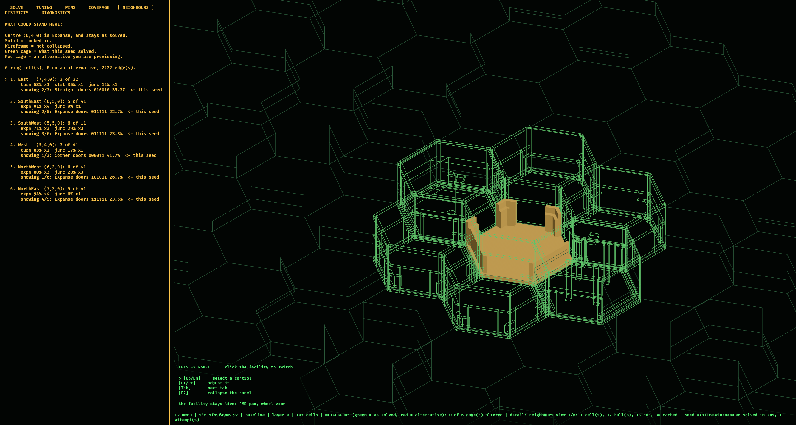
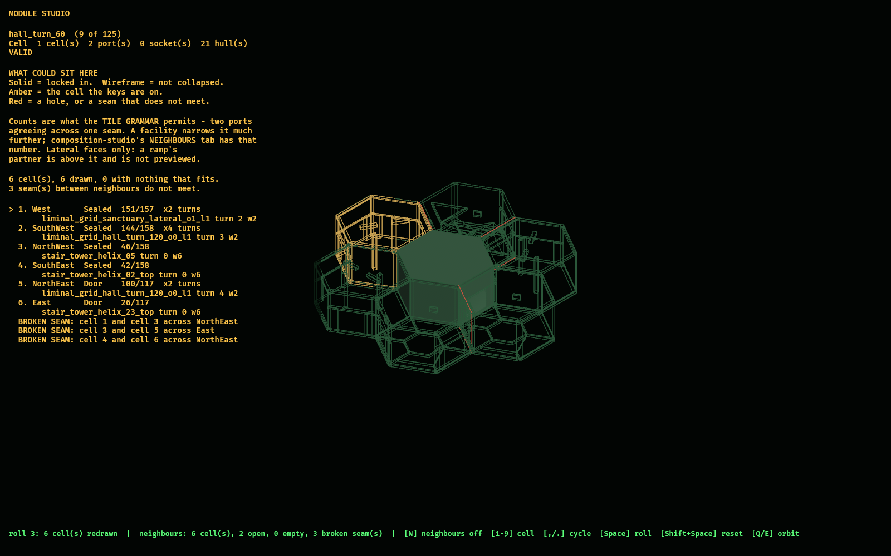
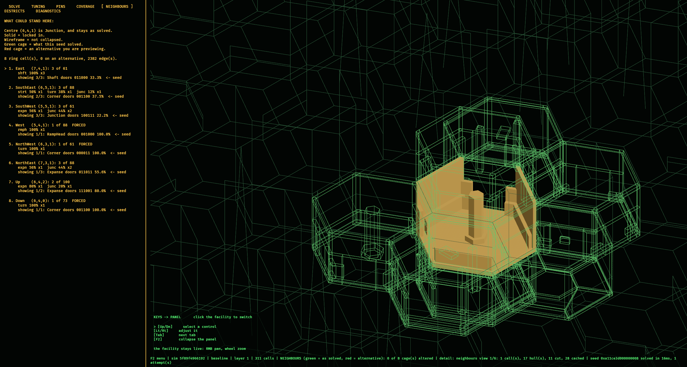
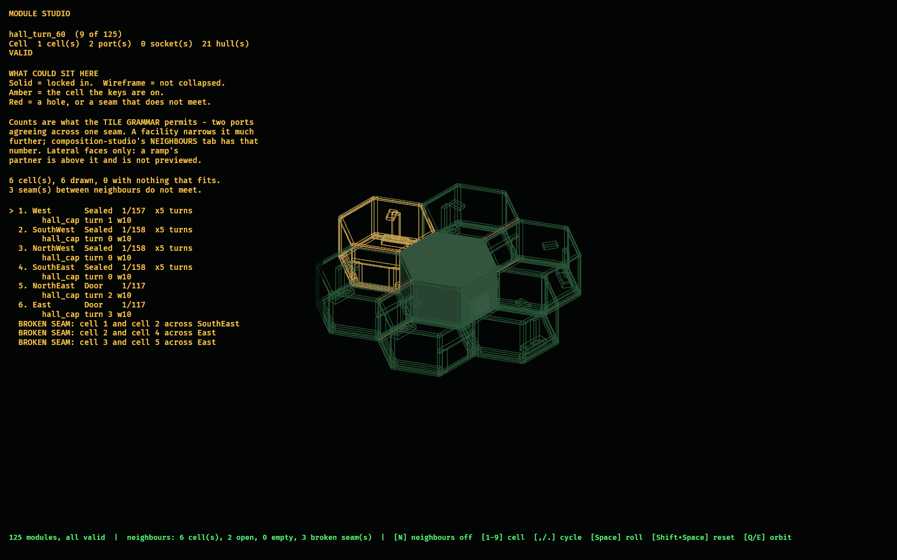
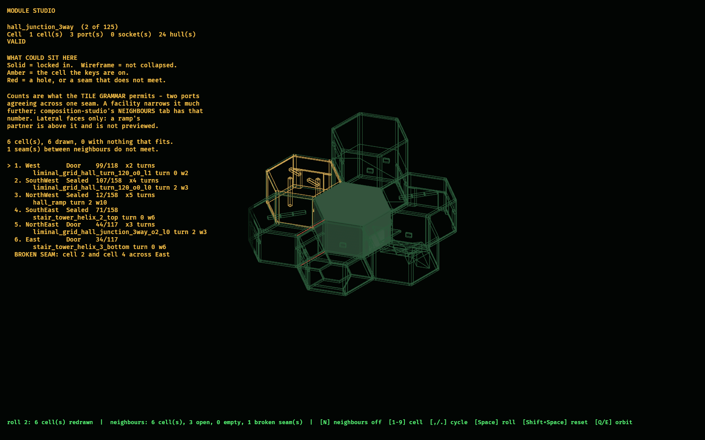

# `composition_studio`

Author the WFC composition profile and watch the facility answer.

Tiles say what the solver *may* build; the composition profile says what it
*tends* to build. Arc R Slice 0 made that profile authorable content and folded
it into the simulation content hash. This is where a person turns the knobs.

## Usage

```bash
cargo dev-run -p composition_studio
```

Headless, for evidence — describe a view in JSON and get a deterministic PNG:

```bash
cargo dev-run -p composition_studio -- --script scratch/studio/fit.json
```

```json
{
  "seed_index": 0,
  "levels": 4,
  "layer": 0,
  "zoom": 1.0,
  "compare": true,
  "hide_menu": true,
  "archetype_bias": { "junction": 4.0, "corner": 0.25 },
  "output_image": "docs/evidence/composition_studio/junction_heavy.png"
}
```

Every field is optional. An unparseable script is a hard error rather than a
fallback: a capture that silently photographed the wrong view is worse than one
that did not run. (Write the file without a BOM — PowerShell 5.1's
`Out-File -Encoding utf8` adds one. The loader strips a leading BOM anyway.)

## What the viewport shows

| Colour | Meaning |
| --- | --- |
| dim green outline | the cell floor plan — the lattice itself |
| green wall band | a face you cannot pass through |
| **red** wall band | in compare mode (`B`), a cell whose placement differs from the same seed solved at the *baseline* profile — the direct answer to "what did my tuning change?" |
| amber ring | the selected cell |

Colours come from `observed_style`; a ratchet test fails the build if this crate
invents one. A second ratchet fails on non-ASCII in a rendered string, because
the tool ships no font asset and Bevy's default subset is all it can draw.

## Keys

| Key | Action |
| --- | --- |
| `F2` | open/close the tool menu. While open it **owns the keyboard**, so a key never means two things at once. |
| `Tab` / `Shift+Tab` | menu open: cycle tabs. Menu closed: cycle the drawn layer. |
| `PageUp` / `PageDown` | step the drawn layer |
| `[` / `]` | previous / next preset seed |
| `L` / `Shift+L` | more / fewer floors in the working facility (re-solves) |
| `Up` / `Down` | select a tunable (TUNING tab) |
| `Left` / `Right`, `+` / `-` | move the selected tunable |
| `R` | re-solve |
| `Ctrl+R` | reload the profile from disk and re-solve, keeping zoom/pan/layer |
| `G` | show/hide wall bands (plan-only view) |
| `B` | toggle the baseline compare overlay |
| `A` | run the whole-catalog seam audit (slow; recompiles every `.map`) |
| `F` | detail: focus (selected cell + what it connects to) |
| `Shift+F` | detail: whole current layer (refused on "all layers") |
| `N` | neighbourhood: what could stand around the selected cell |
| `Up` / `Down`, `1`-`8` | neighbourhood: pick a face |
| `Left` / `Right` | neighbourhood: cycle that face's candidate |
| `Space` | neighbourhood: roll one whole consistent ring |
| `Shift+Space` | neighbourhood: back to what the seed solved |
| `C` | cutaway on/off |
| `Q` / `E` | rotate the view one 60-degree detent |
| `Home` / `0` | reset zoom and pan |
| `Ctrl+S` | save to the working path (`scratch/composition/`) |
| `Ctrl+Shift+S` | promote to the corpus — asks for confirmation first |
| `Ctrl+Z` | revert to the last saved profile |
| `,` / `.` | cycle the pin brush |
| `Delete` | unpin the selected cell |
| `Ctrl+Delete` | clear every painted pin |
| right / middle drag | pan |
| scroll | zoom |
| **left drag** | **paint the active brush** |
| shift + left drag | inspect without painting |

## Two rules this tool does not soften

**It never displays a hash it did not compute.** The status line shows the
folded simulation content hash because editing a profile locks out LAN peers who
have not taken the same edit. When the compiled catalog's sidecar cannot be
read, it prints `unavailable` — a placeholder digest folds into a
plausible-looking wrong answer, which is worse than a blank.

**It never silently falls back to the baseline profile.** Slice 0 made a missing
profile a hard error precisely because a quiet fallback is what the content hash
exists to catch. If the corpus profile cannot be read the tool says so, keeps
saying so, and refuses to promote over it.

## Saving vs shipping

`Ctrl+S` writes to `scratch/composition/`, which nothing ships from. Putting a
profile into `assets/tiles/` is a separate confirmed action that names the
simulation hash before and after, because every LAN peer must take the same
change to stay joinable.

## Detail view — seeing the actual tiles

The schematic answers *topology*. It cannot answer *craft*: do these two tiles
meet, is the doorway where the solver thinks it is, does this seam line up.
`F` renders the real authored hulls instead.

A tile drawn whole from a fixed isometric shows you its ceiling and the three
walls between you and its interior, so three tests decide what survives:

1. **Floor always stays** — anything topping out at or below the slab. Cull it
   and cells appear to float.
2. **Ceiling goes** when a hull's *lowest* point is above head clearance.
   Deliberately min-Y and not the centroid: a pillar spanning floor to ceiling
   has a high centroid, and culling it would delete structure while calling it
   roofing.
3. **Near walls go** — a perimeter hull whose plan azimuth is within 90 degrees
   of the camera. At any bearing that is three of six, which falls out of hex
   geometry rather than being tuned.

`Q`/`E` rotate in **six 60-degree detents**, matching the six faces, so each
stop has one unambiguous set of near walls instead of geometry popping at
arbitrary angles. Detent 0 is the historical 45-degree camera, so every capture
taken before this feature is still framed identically.

**Two scopes.** *Focus* (`F`) draws the selected cell plus everything it shares
an open port with — the connection set, bounded at eight cells, so it costs the
same on a 5,600-cell facility as on a hundred-cell one. *Layer* (`Shift+F`)
draws the whole current layer and is refused on "all layers": one production
layer is around 18,000 hulls, which is heavy but drawable, while ten layers is
roughly 120,000, which is not a diagram. Two scopes mean no LOD system is needed.

Solid massing takes each cell's **district accent**, because this view shows the
geometry that will really be built and should look like it; the cell under
inspection takes the selection amber. The schematic keeps drawing on top, lifted
just clear of the floor slab — those lines are the *solver's* topology and the
solid is the *authored* geometry, and a disagreement between them is a real bug
worth seeing rather than hiding behind whichever drew last.

## The neighbourhood explorer (`N`) — what you can expect to see

The detail view answers *what did this seed build*. `N` answers the question an
author actually tunes against: **what could it have built here, and how likely
is each option?** Select a cell, press `N`, and the cell you selected stays
solid — it is locked in — while every cell touching it becomes wireframe,
because as far as this view is concerned they are not collapsed yet.

**Solid means settled. Wireframe means it could be otherwise.** The wireframe
takes two colours, and they are the schematic's existing ones:

| Colour | Meaning |
| --- | --- |
| green cage | this neighbour is showing what the seed **actually** solved |
| red cage | this neighbour is showing an **alternative** the solver could equally have chosen |

So the mode opens as an all-green cage matching the facility, and every key you
press to explore turns one cage red. `Shift+Space` puts it all back.

### The ring is re-opened, not looked up

The cheap version of this question — every variant compatible with the selected
tile across a face — flatters the corpus badly, because most of the constraint
is *everything else*: the neighbour's own other neighbours are already placed,
faces at the lattice edge must be sealed, a blueprint may own the cell outright,
and the six lateral ring cells are neighbours of each other. Tuning against that
set means tuning against variety that cannot occur.

So the selected cell and everything outside its ring are held exactly as solved,
every ring cell goes back to its starting domain, and the **solver's own AC-3
propagation** runs over them. The panel reports both numbers — `4 of 37` means
four things can stand there in this facility where thirty-seven could if only
the selected tile mattered — because the gap says how much of a cell's character
comes from its own tile and how much from where it happens to stand. A face
reading `1 of 30` is **FORCED**, and that is usually more useful than any bias.

`Space` rolls a whole ring rather than each face independently: a hex ring's
cells constrain each other, so picking per face would routinely compose rings
that cannot exist. The roll is a real weighted min-entropy collapse over the
re-opened ring, the same lottery the solver runs.

### What it is for

The archetype spread per face is a **distribution**, and the weights are
`effective_weight` — the function the collapse lottery itself calls, with
position, district, and your archetype bias all applied. It moves live as you
drag a slider. Seeing `shft 62%` on four of six faces is the shaft bias being
too high, stated as a number rather than inferred from a layout.

Two things it refuses to do:

- **It never reports a domain it could not derive honestly.** Stamped blueprints
  and the forced spawn→exit route come from the attempt's own RNG and are not
  recoverable from a solved world by inspection, so they are replayed and then
  checked against the world's own blueprints. A replay that disagrees says so
  and shows nothing, because an over-reported domain is exactly the failure this
  view must not have.
- **It never draws geometry it made up.** A previewed candidate's hulls come
  from the production projector, asked about a world that does not exist
  (`project_hypothetical_cell`). A candidate the corpus cannot build draws
  nothing and is *counted* — that is a cell the solver may legally place and a
  match would then fail to load, reported at the tile, in front of the person
  who can go author it.

`the_previewed_wireframe_is_the_same_geometry_the_solid_pass_draws` fails the
build if the preview and the snapshot ever disagree about the same placement,
and `the_solvers_own_answer_is_always_in_the_domain` fails it if a reported
domain ever excludes what the solver actually did.

While the mode is open the schematic steps back to the dim `Grid` colour. Its
own green and red answer *is this cell pinned*, which is a different question in
the same two colours, and a hundred cells of pin-mode red is enough to hide the
half-dozen cages that carry the answer.

Evidence, from `scratch/studio/neighbours_*.json`:

| | |
| --- | --- |
|  | how the mode opens: every cage green, matching the facility |
|  | after three `Space` rolls: every cage red, all six showing something else the solver could have built |
|  | at four floors: **eight** faces, and three of them FORCED — including a `West` that can only be a `RampHead`, because the centre is its partner |

### Floors (`L`)

The studio ran at one level for its whole life, which was fine while it only
answered questions about lateral composition. This mode made it a real gap: two
of a cell's eight faces are up and down, and on a one-level lattice they are not
empty but *unreachable* — so the tool could not be asked about ramps or shafts
at all, which is the part of this grammar with the most rules in it. `L` and
`Shift+L` change the working scale (capped at the production ten), and a script
sets `"levels"`. It re-solves, and it clears the selection rather than clamping
it: a selection silently landing on a different cell is worse than none.

The ring is drawn on every floor it touches, regardless of which layer the
schematic is showing. A neighbourhood is a neighbourhood; hiding half of it
because of a view control would defeat the point of having reached for it.

## Pins — saying "here", not "please"

Sliders bottom out at `PROFILE_MIN` (0.25), never zero, and are labelled *bias*.
A zero weight would silently degrade solvability with nothing checking. A pin is
the checked form: left-drag paints one, and the solver is **required** to honour
it rather than merely made likely to.

Pins live in the profile, so painting one is an ordinary profile edit — it marks
the profile unsaved, moves the simulation hash, and re-solves. Clearing them all
returns the profile to byte-identical baseline, so a stray empty pin set never
moves the hash for nothing.

Three things the PINS tab will tell you:

- **unsatisfiable** — a pin that can never work on this lattice (a door facing
  off the edge, a room painted onto fabric). Reported *before* the first solve
  attempt, so it names the mistake instead of surfacing as
  `RetryBudgetExhausted` a hundred attempts later.
- **conflict** — which pin, added in order, first made the facility unsolvable.
  Costs a run of solves, so it happens at authoring time only, but it answers
  the question an author actually has: *which pin do I change?* A failed solve
  with pins present leads with this instead of the retry count.
- **blueprint collision** — a stamped room landed on your pin. Room footprints
  are a frozen contract, so the blueprint wins and the pin is ignored there.
  That override is *reported* rather than silent.

One consequence worth knowing: a pin filters a cell's initial domain, which
changes the min-entropy tie-break, which changes the RNG walk. So unlike every
other part of a profile, **a pin set produces a different layout for the same
seed**. That is intended — pins are hashed content, so a layout is still
reproducible from `(seed, profile)`.

Relayout is taught about pins too: the solved world carries them and refuses a
pinned cell as a mutation site. Without that, runtime rewiring would quietly
erase authored intent mid-match.

## The COVERAGE tab

Answers "does the authored catalog cover what the solver can ask for?" *before*
a match dies at load with `MissingTile`.

It works by mirroring the projector's own selection rule — register from
`world.architecture` (except `stair_tower`, which resolves at level 0 so a whole
column agrees), then exact `(archetype, register, signature)`, then the
`generic` kit, then failure. A coverage report that reasoned differently would
confidently contradict the thing it predicts, so the panel also shows what the
*real* projector returned, and `coverage_agrees_with_the_projector` fails the
build if the two ever disagree.

What it reports:

- **projector verdict** — the authoritative "would this layout load?"
- **uncovered demands** — archetype, register, signature, cell count, and an
  example coordinate to go look at
- **generic fallbacks, heaviest first** — legal, but those districts have no
  geometry of their own there; this is the authoring to-do list
- **room variety** — authored modules per role. Note the distinction:
  `runtime_catalog` expands one module with `register_scope: ["all"]` into ten
  prototypes, so the prototype count looks like variety and is not. Every role
  in the committed corpus sits on exactly **one** authored module, which is
  `bug_backlog.md` #25 stated as a number.
- **never placed** — weight-zero prototypes (unselectable by construction,
  almost always an authoring bug) and how much of the catalog this layout skips
- **seams** (`A`) — the real `tilec audit-seams` elevation audit

## The tile viewer's neighbour ring (`module-studio`, `N`)

The sibling binary in this crate views **one authored module**:

```bash
cargo dev-run -p composition_studio --bin module-studio
```

Its ordinary question is *is this tile correct in itself*. `N` adds the other
one an author has while drawing a doorway: **does it meet anything?** The module
stays solid in the middle and the six cells touching it become wireframe, each
showing a module that could legally sit there. Seven cells.

| Colour | Meaning |
| --- | --- |
| solid mass | the module you are authoring — locked in |
| dim green cage | a neighbour that could sit there — not collapsed |
| amber cage | the cell the keys are on |
| red | a cell nothing fits, or a seam that does not meet |

| Key | Action |
| --- | --- |
| `N` | open/close the ring |
| `1`–`9` | pick a cell |
| `,` / `.` | cycle that cell's candidate |
| `Space` | roll every cell |
| `Shift+Space` | back to the heaviest candidate everywhere |

Entering the mode **closes the cutaway** and pulls the camera back three cells.
Both are mode defaults rather than edits to your settings: a cut-away centre is
a thin shell of far walls and floor, and ringed by six full cages it reads as a
hole rather than as the subject. `C` still opens it.

### What the counts mean, and what they do not

`West  Door  99/118` is *the 99th of 118 modules whose ports mate across this
face*. That is the **tile grammar** — two ports agreeing across one seam — and
nothing else. A real facility narrows it enormously; the `N` mode in the
facility studio above is where that narrowed number lives, and this one is the
same quantity it calls `from_centre` and describes as "the flattering one". The
panel says so every time, because an author who read these as "what the game
will build here" would tune against variety that cannot occur.

Three things the ring will not do:

- **Offer a module the game cannot build.** Turns are expanded only where the
  module declares `RotationPolicy::SixFold`, through
  `observed_authoring::rotation` — the same transform the compiled catalog uses,
  not a second copy of it. Rooms and modules that fail validation are not
  offered at all: a room cannot be dropped into one cell, and its
  `TilePrototype::signature` describes only its origin cell.
- **Draw a shape the solid pass would not.** Wireframes come from
  `observed_traversal::structural_edges`, which triangulates through the same
  `ConvexRenderMesh` the solid renderer uses.
- **Invent a ring around a module that does not parse.** It refuses and says
  why. A plausible ring around a broken module would look like an answer.

Candidates come from the **watched directory**, not `compiled_catalog.ron`. This
tool is a file watcher; sourcing from a build artifact would give a live centre
and a stale ring, and a module saved five minutes ago would not appear at all.
The catalog's extra breadth is mostly illusory anyway — it stores the same
rotated hulls once per architecture register, so registers multiply the entry
count without adding a shape. What it genuinely adds is the six turns, and
those are recovered locally.

### The ring cells are neighbours of each other

Around a single cell they form a closed chain of six, and each is chosen against
the centre alone — so a combination no facility could contain is the *normal*
case, not a rare one. Disagreeing pairs are drawn in red and named in the panel
rather than avoided. That is the point: seeing the contradiction is what makes
the next step — a controlled solve over the ring — a narrowing of this same
number rather than a rewrite.

Evidence, captured with `OBSERVED2_MODULE`, `OBSERVED2_MODULE_NEIGHBOURS=1` and
`OBSERVED2_MODULE_ROLL`:

| | |
| --- | --- |
|  | `hall_turn_60` as the mode opens: the heaviest candidate on every face, which for this corpus is `hall_cap` six times — a true and rather bleak answer |
|  | the same ring after three `Space` rolls: six different modules at six different turns, and three seams between them that do not meet |
|  | `hall_junction_3way`: three open faces, `hall_ramp` and two stair-tower halves among the neighbours |

## Deliberately not here

- **`search.candidates > 1`** — Slice 4. The field is shown read-only.
- **Geometry authoring** — Slice 5, and a separate binary in this crate.
- **`observed_match::hex_wfc::trim`** — written, tested, and uncalled.
  Activating it needs per-face `PortClass` on `HexStructurePiece`, which changes
  the shape of `HexWfcGeometrySnapshot`, a determinism surface with ~1100 lines
  of tests. It is left dead **on purpose**, not forgotten.
- **Neighbourhoods past the first ring.** `N` re-opens the eight cells touching
  the selection and stops. Two rings is twenty-six cells whose domains are
  mostly decided by cells outside *that* ring in turn, so the numbers get
  weaker as the picture gets bigger — and at that size the honest tool is a
  re-solve, which `R` already is.
- **Vertical neighbours in the tile viewer's ring.** It previews the six lateral
  faces. A ramp's real partner is above it, and the plan lattice cannot show a
  cell at another level without becoming a different view; the panel states the
  omission rather than letting six cells read as a complete neighbourhood.
- **A geometric mating check in the tile viewer's ring.** Two tiles agreeing on
  `PortClass` can still have a 30 cm step at the doorway.
  `observed_authoring::seam_auditor::faces_compatible` is the real test — class
  *plus* floor height *plus* headroom, within 5 cm — but `sample_face_signature`
  is private and takes compiled hulls plus a `ModuleCellRef` rather than a
  `TilePrototype`. That is the correct next narrowing, after arc-consistency
  across the ring.
